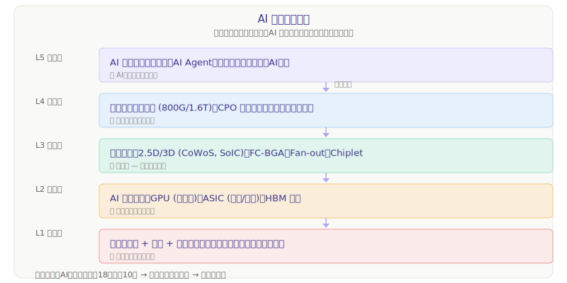

# AI 主线投资地图

> **把 AI 看作一条纵贯线，从底层的沙子（硅）到顶层的智能（应用），每个环节都有自己的投资逻辑。**

AI 大模型参数量每 18 个月翻 10 倍，算力需求指数增长。这个增速像一台引擎，从产业链最顶端的芯片需求一路传导到最底层的材料设备——**所有环节都受益于同一个驱动力**。本文件的作用是用 AI 这条主线把各个板块串起来，让你知道每个板块在整个链条中站在什么位置、为什么重要、什么时候优先学。

---



---

## 五层架构详解

### L5 — 应用层：「为什么要造这么多芯片？」

AI 最终的价值必须通过应用落地才能兑现。如果应用起不来，下面的芯片/封装/设备就是无源之水。

| 赛道 | 核心驱动 | 成熟度 |
|------|---------|--------|
| 大模型（LLM） | GPT/Claude/DeepSeek 等，参数量持续增长 | 已进入激烈竞争期 |
| AI Agent | 自主决策与执行，对推理算力的消耗远超训练 | 2025 年起从概念走向落地 |
| 自动驾驶 | 端到端大模型上车，每辆车的算力需求（TOPS）快速增长 | L4 量产冲刺期 |
| 机器人 | 人形机器人+工业机器人智能升级 | 产业化初期 |
| AI 终端 | AI PC、AI 手机带来的端侧推理芯片需求 | 2024 年起换机周期启动 |

> **投资逻辑**：应用层不是直接投大模型公司（多数未上市），而是投被 AI 应用拉动的上游——谁受益于"更多 AI 应用 → 更多算力消耗 → 更多芯片需求"这条因果链。

> ✅ **已覆盖**：AI 应用层板块（[→ 进入](./AI应用层/AI应用层行业研究.md)），含 5 章主干 + A股/港股/美股 3 个子文件 + 7 张 SVG 图表。它验证前面 L1–L4 堆出的算力有没有真实需求承接。

> ✅ **已覆盖**：人形机器人 / 具身智能板块（[→ 进入](./人形机器人/人形机器人行业研究.md)），含 5 章主干 + A股/港股/美股 3 个子文件 + 4 张 SVG 图表。它是 AI 从「软件」走向「物理世界」的落地——既消耗端侧算力（与 L2 芯片 / 存储互补），又拉动精密制造（丝杠/减速器/电机/传感器）。投资上「整机在港股/美股，A 股赚零部件放量+国产替代双击」。

---

### L4 — 互联层：「芯片算得再快，信号传不出去也白搭」

当一颗芯片的算力越来越高，芯片之间的通信带宽就成了新瓶颈。光模块和高速互联是整个 AI 集群的"神经系统"。

| 方向 | 当前焦点 | 未来趋势 |
|------|---------|---------|
| 光模块 | 800G 已量产、1.6T 导入期 | 3.2T 研发中，每代速率翻倍周期约 2 年 |
| CPO（共封装光学） | 把光模块从面板搬到芯片封装内部，降低功耗和延迟 | Nvidia / 博通 / 台积电都在布局 |
| 高速交换机 | 51.2T 交换机芯片已出 | 102.4T 才是 AI 集群标配 |

> **为什么紧随先进封装**：CPO 本质上是一种特殊的光电合封（将光子芯片和电子芯片封装在一起），是先进封装技术在光互联方向的分支。
>
> ✅ **已覆盖**：光模块/高速互联板块（[→ 进入](./光模块/光模块行业研究.md)）

---

### 算力基础设施层（部署层）：「把芯片变成能用的算力」

芯片（L2）造出来、封装好（L3）、用光模块连起来（L4），还得**装进服务器、放进数据中心、靠液冷散热、用 PCB 连通、靠电源供电**——这一整套物理系统就是算力基础设施，是整条 AI 主线上此前唯一没写的**结构性缺口**。补上它，AI 主线才真正闭环（芯片 → 封装 → 互联 → **部署** → 应用）。

| 细分 | 内容 | 状态 |
|------|------|------|
| AI 服务器 / 整机 | 工业富联、浪潮、超微、戴尔——把 GPU 攒成整车 | ✅ 已覆盖 |
| 数据中心 IDC | 润泽、Equinix、万国数据——算力的「车库」 | ✅ 已覆盖 |
| 液冷 | 英维克、Vertiv——高功率机柜的「空调」，增速最快 | ✅ 已覆盖 |
| 高阶 PCB | 沪电、胜宏——服务器内的「神经网」 | ✅ 已覆盖 |
| 电源 / 供配电 | 欧陆通、Vertiv、Eaton——「卖水人里的卖水人」 | ✅ 已覆盖 |

> ✅ **已覆盖**：算力基础设施板块（[→ 进入](./算力基础设施/算力基础设施行业研究.md)），含 5 章主干 + A股/港股/美股 3 个子文件 + 7 张 SVG 图表。
>
> **核心认知**：这一层离「订单兑现」最近——云厂商 AI capex 直接变订单。投资上分环节：服务器整机营收大毛利薄，液冷/PCB/电源是稀缺部件、利润更厚；美股买供配电/IDC REIT 的确定性，A 股买服务器/液冷/PCB 的弹性。✅ 财务数据已核对（neodata · 东方财富，2025 年报 + 2026Q1 口径，2026-07-11）。

---

### L3 — 封装层：「只靠造更大芯片已不够，拼在一起才是出路」

摩尔定律放缓后，先进封装成为延续性能增长的关键手段。AI 芯片（尤其是 GPU+HBM 的组合）严重依赖 2.5D/3D 封装。

> ✅ **已覆盖**：先进封装板块（[→ 进入](./先进封装/先进封装行业研究.md)）

---

### L2 — 芯片层：「AI 的发动机」

GPU、ASIC、HBM 共同组成 AI 算力的核心。这是整条 AI 产业链价值量最大、技术壁垒最高的环节——钱最终都流向了芯片厂。

| 细分 | 内容 | 状态 |
|------|------|------|
| GPU/AI 加速器 | 英伟达（绝对霸主）、AMD、国产（寒武纪/海光） | ✅ 已覆盖 |
| HBM | 高带宽内存，AI 芯片的"命门"，全球仅 SK 海力士/三星/美光三家 | ✅ 已覆盖 |
| ASIC | Google TPU、博通定制 ASIC、华为昇腾——推理时代的破局者 | ✅ 已覆盖 |

> ✅ **已覆盖**：AI 算力芯片板块（[→ 进入](./AI算力芯片/AI算力芯片行业研究.md)），含 5 章主干 + A股/美股/港股子文件
>
> **核心认知**：英伟达靠 CUDA 生态通吃训练；HBM 三寡头垄断是命门；推理爆发将打破一家独大，ASIC 和国产芯片的机会在推理。A 股投资核心是寒武纪 + 海光信息。

---

### L1 — 基底层：「一切芯片的物理基础」

晶圆代工、半导体设备、半导体材料，是所有芯片的制造基础。先进封装本身的材料与设备也可以归入这一层的子集。

| 细分 | 内容 | 状态 |
|------|------|------|
| 晶圆代工 | 台积电、三星、中芯国际等 | ✅ 已覆盖 |
| 半导体设备 | 光刻、刻蚀、沉积、检测——全球被美日荷垄断 | ✅ 已覆盖 |
| 半导体材料 | 硅片、光刻胶、电子特气、靶材等 | ✅ 已覆盖 |

> ✅ **已覆盖**：半导体（制造+设备+材料）板块（[→ 进入](./半导体/半导体行业研究.md)），含 5 章主干 + A股/港股/美股 3 个子文件 + 7 张 SVG 图表。
>
> 先进封装中的材料与设备分析（[→ A股材料](./先进封装/A股/材料与耗材.md) | [→ A股设备](./先进封装/A股/设备.md)）可以作为学习半导体材料/设备的切入点——封装材料设备和前道半导体材料设备有大量技术交叉。

---

## 学习路线建议

按 AI 主线的「驱动力传导」逻辑，推荐学习顺序为：

```
第 1 步：先进封装 ← 已完成
    ↓
第 2 步：光模块 / 高速互联 ← 已完成（5 章主干）
    ↓
第 3 步：AI 算力芯片（GPU / HBM / ASIC） ← 已完成（5 章 + 3 子文件）
    ↓
第 4 步：半导体制造 + 设备 + 材料 ← 已完成（5 章 + 3 子文件）
    ↓
第 5 步：算力基础设施（服务器/IDC/液冷/PCB/电源，部署层） ← 已完成
    ↓
第 6 步：AI 应用（需求端验证） ← 已完成（5 章 + 3 子文件）
```

**为什么是这个顺序**：先进封装是 AI 芯片的"瓶颈"——台积电 CoWoS 产能决定了英伟达 GPU 出货量。先从最紧俏的环节开始，然后向外扩展。学完芯片本身（L2）后，下一站深入到芯片的物理基础——半导体制造、设备、材料（L1）。

---

## 当前板块总览

| 板块 | 状态 | 说明 |
|------|------|------|
| 先进封装 | ✅ 已完成 | [→ 行业研究](./先进封装/先进封装行业研究.md)，含 5 章 + 子文件 |
| 光模块 | ✅ 已完成 | [→ 行业研究](./光模块/光模块行业研究.md)，5 章 + 6 个子文件 |
| AI 算力芯片 | ✅ 已完成 | [→ 行业研究](./AI算力芯片/AI算力芯片行业研究.md)，5 章 + 3 子文件（A股/美股/港股）|
| 存储芯片 / HBM | ✅ 已完成 | [→ 行业研究](./存储芯片/存储芯片行业研究.md)，5 章 + 3 子文件（A股/港股/美股）|
| 半导体（制造+设备+材料） | ✅ 已完成 | [→ 行业研究](./半导体/半导体行业研究.md)，5 章 + 3 子文件（A股/港股/美股）|
| 算力基础设施 | ✅ 已完成 | [→ 行业研究](./算力基础设施/算力基础设施行业研究.md)，5 章 + 3 子文件（A股/港股/美股）|
| AI 应用 | ✅ 已完成 | [→ 行业研究](./AI应用层/AI应用层行业研究.md)，5 章 + 3 子文件（A股/港股/美股）|
| 人形机器人 / 具身智能 | ✅ 已完成 | [→ 行业研究](./人形机器人/人形机器人行业研究.md)，5 章 + 3 子文件（A股 12 / 港股 1 / 美股 1）+ 4 张 SVG|

---

> **版本**：2026-07-11 · 算力基础设施（部署层）板块已核对（v1.0，neodata 口径）· 存储芯片/HBM 板块已完成（延伸 AI 主线，补全 HBM 缺口）· 人形机器人/具身智能板块已完成（AI 主线向物理世界延伸）· 全链路（芯片→封装→互联→部署→应用）闭环完成
