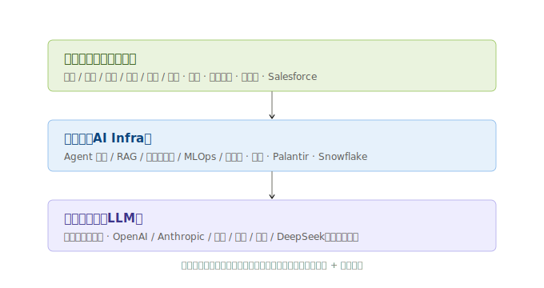
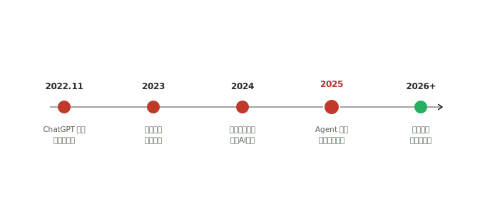

# 01 · 技术体系与发展脉络

> **给投资者的第一句话**：前面四层（芯片/封装/光模块/半导体）拼的是「算力供给」；这一层拼的是「算力需求」。本节先把几个绕口的概念用大白话讲清楚——因为应用层的投资，本质是投「这些概念能不能变成真金白银的收入」。

---

## 1.1 一个类比：发电厂 vs 用电终端

把整条 AI 产业链想成「电力体系」：

| 产业链环节 | 电力体系类比 | 在 AI 里是什么 |
|------------|--------------|----------------|
| 半导体设备/材料（L1） | 造发电机的机床 | 造芯片的设备和硅片 |
| 晶圆代工（L1） | 发电厂 | 台积电把沙子变成芯片 |
| AI 算力芯片（L2） | 发电机组（汽轮机） | GPU/ASIC，算力的源头 |
| 先进封装/光模块（L3/L4） | 电网、变压器 | 把算力连起来、传出去 |
| **AI 应用层（L5）** | **工厂、家庭、电动车——用电终端** | **用算力干活、并为此付费的人/企业** |

**投资含义**：发电厂建得再多，如果没有终端用电，电费收不回来，整条链路都会停摆。所以应用层是「需求验证」——它回答一个致命问题：**「我们造了这么多 GPU，到底谁在用它、愿不愿意付钱？」**

---

## 1.2 AI 应用的三层结构

应用不是铁板一块，它分三层。理解这三层，才知道「钱到底流向谁」。

| 层 | 干什么 | 典型玩家 | 投资属性 |
|----|--------|----------|----------|
| **基础模型层** | 训练通用大模型（LLM），像「造发动机」 | OpenAI、Anthropic、Google、Meta、百度、阿里、讯飞、DeepSeek | 多数未上市；A 股无纯标的 |
| **中间层（AI Infra）** | 把模型接进业务：Agent 框架、RAG/知识库、向量数据库、MLOps、推理云 | 微软（Azure AI）、Palantir、Snowflake、各类创业公司 | 美股最集中，A 股少 |
| **应用层** | 直接给终端用户/企业用：办公、金融、医疗、营销、电商、游戏 | 金山办公、同花顺、腾讯、Salesforce、ServiceNow | **本模块核心** |

> **关键认知**：基础模型层基本不上市（OpenAI 没上市、DeepSeek 没上市），所以**二级市场能投的 AI，九成在中间层 + 应用层**。这也是为什么「AI 应用层」是散户最该懂的一层。

---

## 1.3 从「训练」到「推理」：一个被忽视的常识

大模型的生命分两段，对投资极其重要：

- **训练（Training）**：一次性把模型「教出来」。像**盖一座工厂**——一次性巨额投入（买几千张 GPU、烧几个月电），之后不用再盖。
- **推理（Inference）**：模型训好后，每次用户提问/调用，它实时算答案。像**工厂每天开工耗电**——只要有人用，就持续消耗算力。

**为什么这对投资致命**：

1. 训练是一次性的（一座工厂盖完就完了），而**推理是持续的、随用量线性增长**的。一个爆款 AI 应用，每天几亿次调用，烧掉的算力远超当初训练它。
2. 这意味着：**应用越普及 → 推理算力消耗越大 → 反过来拉动 L1–L4 所有硬件需求**。这就是 AI 主线「需求验证」的闭环——应用层是发动机的点火开关。
3. Agent（智能体）出现后，单次任务要调用几十上百次模型，推理消耗是聊天的 **10–100 倍**。所以 2025 被称为「Agent 元年」，资本市场最看重的不是模型多聪明，而是**推理算力会不会因此指数级放大**。

---

## 1.4 必须懂的四个术语（配类比）

### ① Token —— AI 的「度电」

**它是什么**：大模型处理文字的最小单位，一个汉字约 1–2 个 Token，一个英文单词约 1 个 Token。

**类比**：Token 就是 AI 世界的**「度电」**。模型训练好之后，你每问一次问题、AI 每生成一个回答，都按 Token 收费（就像用电按「度」算钱）。

**为什么对投资重要**：应用公司的收入，本质就是**「卖了多少度电（Token）」×「每度电价（单价）」**。看一家 AI 应用公司好不好，第一指标就是 **Token 消耗量有没有涨**——它比营收更真实，因为营收可以靠一次性项目灌水，Token 是真实使用量。

### ② LLM（大语言模型）——「懂语言的发动机」

**它是什么**：用海量文本训练出来、能理解和生成人类语言的大模型（GPT、文心、通义、星火、DeepSeek 都算）。

**类比**：LLM 是一台**「能读会写的发动机」**。它本身不会干活，但接上不同的「车身」（应用），就能变成办公车、金融车、营销车。

### ③ Agent（智能体）—— 「会自己干活的实习生」

**它是什么**：给 LLM 加上「记忆 + 工具调用 + 自主规划」，让它不再只是问答，而是能**自己拆解任务、调软件、查数据库、最终交付结果**。

**类比**：普通聊天 AI 像「你问它答的客服」；Agent 像「你给个目标，它自己查资料、写方案、发邮件、跟进进度的实习生」。前者耗 1 度电，后者耗 50 度——这就是推理算力放大的根源。

### ④ RAG（检索增强生成）—— 「开卷考试」

**它是什么**：让模型回答前，先去企业自己的知识库里检索相关资料，再结合资料作答，避免「胡说八道」。

**类比**：考试时**允许翻书（开卷）** vs 死记硬背（闭卷）。企业把自家文档、合同、客服记录做成「书」（向量数据库），模型答题前先翻书，答案就靠谱。RAG 是企业 AI 落地最主流的方式。

---

## 1.5 发展脉络：从「聊天」到「干活」

| 时间 | 标志事件 | 对投资的含义 |
|------|----------|----------------|
| 2022.11 | ChatGPT 发布，AI 破圈 | 算力需求第一波引爆（训练侧） |
| 2023 | 国内「百模大战」，文心/通义/星火/GLM 等密集发布 | 模型供给过剩，**应用还没起来**，硬件先涨 |
| 2024 | Copilot、WPS AI、AI 搜索陆续上线；端侧 AI 手机/PC 起步 | 应用开始**试探性收费**，但收入体量小 |
| 2025 | **Agent 元年**：Agentforce、Manus、扣子走红；推理算力消耗陡增 | 需求侧第一次出现**指数级信号**，拉动全产业链 |
| 2026+ | 推理爆发 + 行业模型 + 开源平权 | 应用层从「讲故事」进入「看收入」的兑现期 |

> **投资视角小结**：2022–2023 炒的是「有没有模型、谁算力多」；2025 之后，市场开始问「**模型被用了没、Token 涨没涨、钱收回来了没**」。应用层，就是回答这个问题的一层。

---

> **上一章**：[AI 应用层行业研究](./AI应用层行业研究.md)　|　**下一章**：[02-产业链深度拆解](./02-产业链深度拆解.md)

> **版本**：v1.0｜**更新日期**：2026-07-11
> **数据来源**：neodata-financial-search；发展脉络与术语为行业共识性表述。
