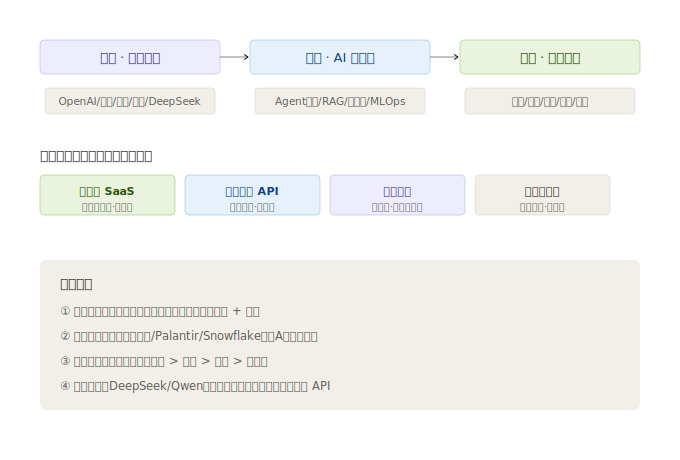

# 02 · 产业链深度拆解

> **给投资者的第一句话**：这一层没有「光刻机」那种硬科技卡脖子，它的价值链在「场景 + 数据 + 用户黏性」。拆解产业链，核心是要回答：**钱在哪一环被赚走、哪一环只是陪跑？**

---

## 2.1 产业链全景

应用层的产业链可以拆成「**上游模型 → 中游工具 → 下游场景**」三段，外加横切的「**变现模式**」：

| 段落 | 角色 | 赚钱逻辑 | 代表公司 |
|------|------|----------|----------|
| 上游 · 基础模型 | 造通用大模型（LLM） | 卖 API（按 Token 收费）、卖云算力 | OpenAI（未上市）、百度、阿里、讯飞、DeepSeek（未上市） |
| 中游 · AI 中间件 | 把模型接进业务 | 平台订阅、部署授权、推理云 | 微软 Azure AI、Palantir、Snowflake、各类向量数据库 |
| 下游 · 应用场景 | 直接服务终端用户/企业 | 软件订阅（SaaS+AI）、按量计费、广告、项目制 | 金山办公、同花顺、腾讯、Salesforce、ServiceNow |

> **重要事实**：国内能上市的「纯大模型公司」极少（DeepSeek、智谱、月之暗面都未上市）。所以**二级市场里，应用层 = 中游中间件 + 下游应用场景**，这是 A 股/港股/美股分布的真实结构。

---

## 2.2 上游：基础大模型（「发动机」供应商）

**它是什么**：用海量数据训练出的通用大模型。可以理解成「卖发动机的」——自己不直接造车，但每辆 AI 车都要装它的发动机，按「马力·小时」收费（Token 计费）。

**投资要点**：
- 全球霸主是 OpenAI（GPT）、Anthropic（Claude）——**都没上市**，散户买不到。
- 国内上市平台里，**百度（文心）、阿里（通义）、讯飞（星火）** 有自研大模型，但它们更大的价值在「下游应用 + 云」，不是卖模型本身。
- 开源模型（Meta Llama、DeepSeek、阿里的 Qwen）让「发动机」逐渐**平权**——这会压低模型 API 价格，利好**下游应用方**（用模型的人更便宜了），利空纯卖模型的中游。

---

## 2.3 中游：AI 中间件（「把发动机装上车」）

**它是什么**：连接模型和业务系统的中间层。类比成「汽车的变速箱 + 底盘」——发动机（模型）再好，没有它，车也开不起来。

细分四类：

| 环节 | 作用 | 类比 | 代表 |
|------|------|------|------|
| **Agent 框架** | 让模型能自主规划、调工具 | 汽车的「自动驾驶决策系统」 | 微软 Copilot、Salesforce Agentforce |
| **RAG / 知识库** | 给模型接企业自有资料 | 「开卷考试的翻书动作」 | Palantir AIP、各企业知识库 |
| **向量数据库** | 存和搜「语义」的数据库 | 给模型准备的「图书馆检索台」 | Snowflake Cortex、Pinecone（未上市） |
| **MLOps / 推理云** | 把模型部署上线、稳定调用 | 「发动机的运维车间」 | 微软 Azure AI、阿里云、腾讯云 |

**投资要点**：中游是**美股最集中的利润区**（微软、Palantir、Snowflake），A 股基本缺位。它赚的是「企业愿意为『把 AI 用起来』付的平台费」，毛利高、黏性强。

---

## 2.4 下游：应用场景（「开车的终端用户」）

**它是什么**：直接给 C 端用户或 B 端企业用的 AI 产品。这是**本模块的核心**，按场景拆成十条赛道：

| 赛道 | AI 带来什么 | A股代表 | 港股/美股代表 |
|------|--------------|---------|----------------|
| 办公 | WPS/Office 加 AI 写作、总结 | 金山办公 | 微软（Copilot） |
| 金融 | AI 投顾、智能投研、风控 | 同花顺、指南针 | — |
| 教育 | 个性化辅导、口语陪练 | 科大讯飞 | 网易有道（未覆盖） |
| 医疗 | 辅助诊断、药物研发 | 讯飞医疗（讯飞子） | — |
| 营销/广告 | AIGC 内容、智能投放 | 蓝色光标、易点天下 | AppLovin（美股） |
| 电商 | AI 客服、智能选品 | 焦点科技 | 阿里、Shopify（美股） |
| 游戏/创意 | AI 素材生成、NPC | 恺英/巨人（未覆盖） | Unity（未覆盖） |
| 政务/媒体 | 智能问答、内容生产 | 拓尔思 | — |
| 工业/机器人 | 质检、仿生机器人 | 汉王科技 | 特斯拉（未覆盖） |
| 终端（AI PC/手机） | 端侧推理 | 传音/联想（未覆盖） | 苹果/华为（未覆盖） |

---

## 2.5 变现模式的四种「收款方式」

理解了场景，还要懂它们**怎么收钱**——不同收款方式，财务质量天差地别：

| 模式 | 怎么收钱 | 财务质量 | 典型公司 |
|------|----------|----------|----------|
| **订阅制（SaaS + AI）** | 年费/月费，提前收 | ⭐⭐⭐⭐⭐ 收入可预测、毛利高、续费率关键 | 微软、Salesforce、ServiceNow、金山办公 |
| **按量计费（API/Token）** | 用多少付多少 | ⭐⭐⭐⭐ 随用量增长，但单价下行压力大 | OpenAI、阿里云、百度智能云 |
| **广告（AI 优化投放）** | 效果广告分成 | ⭐⭐⭐ 规模大但受宏观周期影响 | 腾讯、Meta、AppLovin、快手 |
| **项目制（一次性交付）** | 接项目、验收结款 | ⭐⭐ 收入波动大、难复利 | 多数 A 股集成商、拓尔思 |

> **投资铁律**：同等营收下，**订阅制 > 按量计费 > 广告 > 项目制**。看一家应用层公司，先问它「钱怎么收的」——这是判断它财务质量的第一把尺子。A 股很多公司还停留在「项目制」，这正是它们「增收不增利」的根因之一。

---

> **上一章**：[01-技术体系与发展脉络](./01-技术体系与发展脉络.md)　|　**下一章**：[03-市场格局与竞争态势](./03-市场格局与竞争态势.md)

> **版本**：v1.0｜**更新日期**：2026-07-11
> **数据来源**：产业链结构为行业共识性框架；公司归属基于各公司 2025 年报业务描述。
