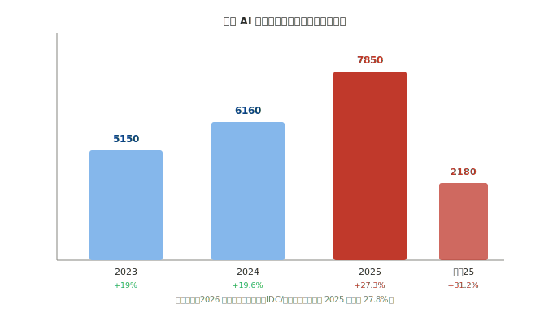
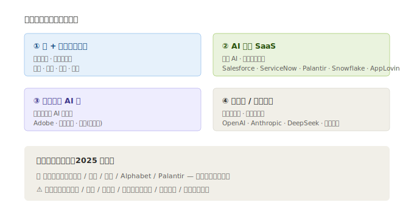

# 03 · 市场格局与竞争态势

> **给投资者的第一句话**：应用层不缺玩家，缺的是「真赚到钱」的玩家。本节先给市场体量（确认需求侧够大），再看谁在赚钱、谁在陪跑。

---

## 3.1 市场规模：需求侧确实在爆发

| 市场 | 2025 实际规模 | 同比增速 | 占全球 |
|------|--------------|----------|--------|
| **全球 AI 软件与平台** | **7850 亿美元** | **+27.3%** | 100% |
| **中国 AI 软件市场** | **2180 亿美元** | **+31.2%** | **27.8%** |
| 其中：中国 GenAI 软件 | ~35 亿美元 | 未来五年或增超 4 倍 | — |

> 数据来源：2026 年产业链研究报告（IDC/行业口径）。中国增速（31.2%）显著高于北美（19.6%）和欧洲，且占全球份额持续提升（2025 年 27.8%）。

**投资含义**：
- 27%+ 的行业增速，放在任何行业都算高景气——**需求侧足够大**，前面四层硬件的「供给扩张」有底气。
- 但「行业高增长 ≠ 每家公司都赚钱」。AI 软件是典型的「**赢家通吃 + 长尾陪跑**」格局，选错标的，行业涨你也不赚。

---

## 3.2 全球竞争格局：三层玩家

| 阵营 | 特征 | 代表 | 投资属性 |
|------|------|------|----------|
| **云 + 模型一体巨头** | 既有云、又有模型、又有应用，全栈通吃 | 微软、谷歌、阿里、腾讯、亚马逊（未覆盖） | 确定性最高，现金流强 |
| **AI 原生 SaaS** | 生于 AI、靠订阅增长 | Salesforce、ServiceNow、Palantir、Snowflake、AppLovin | 高成长高估值，看 ARR 增速 |
| **传统软件 AI 化** | 老牌软件加 AI 功能提客单价 | Adobe、SAP（未覆盖）、金山办公、用友（未覆盖） | 稳健，看 AI 功能渗透率 |
| **纯模型/应用创业** | 未上市为主 | OpenAI、Anthropic、DeepSeek、月之暗面 | 散户买不到，只能看 |

---

## 3.3 谁在真正赚到钱（关键判断）

应用层最怕「增收不增利」。用 2025 年报把三类公司摆一起看：

| 类型 | 代表 | 2025 表现 | 结论 |
|------|------|----------|------|
| **确定性现金流（赚大钱）** | 腾讯、阿里、微软、Alphabet、Palantir | 营收双位数增、净利高增、毛利 50%+ | ✅ 最稳，机构底仓 |
| **高成长订阅（赚快钱）** | ServiceNow、Salesforce、AppLovin | 营收 10%–56% 增、净利高增 | ✅ 成长溢价，估值偏贵 |
| **A 股应用（增收不增利）** | 科大讯飞、金山办公（利还行）、同花顺（利高）、万兴/昆仑/拓尔思（亏） | 营收普遍双位数增，但净利薄或亏损 | ⚠️ 看弹性与主题，需挑 |

**核心洞察**：
1. **美股/港股的互联网与 SaaS 巨头，已经把 AI 变成真金白银的收入**（腾讯 AI 广告、微软 Copilot 订阅、阿里云 AI 收入）。它们的 AI 不是故事，是财报里的增长项。
2. **A 股应用层两极分化**：同花顺（金融 AI 高景气，净利 +75.8%）、金山办公（WPS AI 提客单）已兑现；但万兴、昆仑万维、拓尔思、汉王还在亏损或利润下滑——**「AI 概念」和「AI 利润」之间，差着一条鸿沟**。
3. **商汤、第四范式、微盟**这类纯 AI 公司，营收高增长但**仍未稳定盈利**（商汤亏 17.7 亿但大幅收窄），属于「赛道对、利润未到」的高弹性品种。

---

## 3.4 中国市场的特殊结构

中国市场和美国不同，有三个特点影响投资：

1. **模型平权更彻底**：DeepSeek 开源 + 阿里 Qwen 开源，让国内企业用模型极便宜。利好**下游应用方**（用模型的人），利空**纯卖模型 API** 的玩家。
2. **互联网巨头是 AI 落地主战场**：腾讯（微信）、阿里（电商+云）、字节（未上市）、快手（可灵视频）握着**流量 + 场景 + 数据**三张王牌，AI 变现最顺畅。
3. **A 股「卖铲子」逻辑重演**：就像半导体里设备最确定，AI 应用里**有高黏性场景 + 订阅收入的软件公司**（金山办公、同花顺、科大讯飞教育）比「接项目的集成商」确定性高得多。

---

> **上一章**：[02-产业链深度拆解](./02-产业链深度拆解.md)　|　**下一章**：[04-核心公司分析](./04-核心公司分析.md)

> **版本**：v1.0｜**更新日期**：2026-07-11
> **数据来源**：市场规模来自 2026 年产业链研究报告（IDC/行业口径）；公司财务来自 neodata-financial-search（2025 年报 / 最新财年）。
