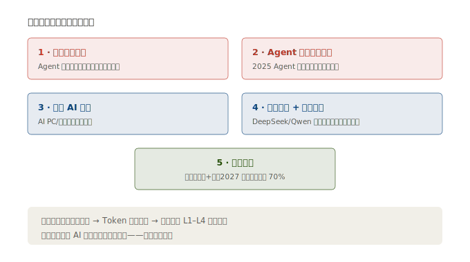
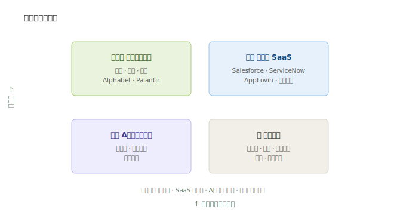

# 05 · 未来趋势与投资逻辑

> **给投资者的第一句话**：应用层是整条 AI 主线的「收口」环节——前面四层堆的算力，最终要在这里变成收入。本节给驱动力、风险和一套能落手的「看公司」框架。

---

## 5.1 五大驱动力

| # | 驱动力 | 是什么 | 利好谁 |
|---|--------|----------|----------|
| 1 | **推理算力爆发** | Agent 让单次任务调用模型几十上百次，推理消耗是聊天的 10–100 倍 | 全链路（反向拉动 L1–L4 硬件） |
| 2 | **Agent 从概念到落地** | 2025「Agent 元年」，企业愿意为「能自己干活的 AI」付平台费 | 微软、Salesforce、Palantir、ServiceNow |
| 3 | **端侧 AI 普及** | AI PC/手机/汽车本地跑小模型，催生端侧芯片 + 端侧应用 | 终端厂、轻量化软件 |
| 4 | **行业模型 + 开源平权** | DeepSeek/Qwen 开源压低模型价，企业自建行业模型成本骤降 | 下游应用方（用模型的人） |
| 5 | **政策加码** | 「人工智能+」行动：2027 年智能体等应用普及率超 70% | 政务、医疗、工业 AI |

> **核心闭环**：应用越普及 → 推理 Token 消耗越大 → 反向拉动算力芯片/封装/光模块/设备需求。这就是为什么应用层是「需求验证」——它点火，全产业链才有持续订单。

---

## 5.2 三大风险（务必盯紧）

| 风险 | 表现 | 信号 |
|------|------|------|
| **商业化不及预期** | 「用户很多、愿意付费的少」，ARR 涨不动 | Token 消耗涨但收入不涨、付费转化率下滑 |
| **巨头碾压** | 腾讯/阿里/微软用流量+免费模型把创业公司挤死 | 创业公司市占率被吞、获客成本飙升 |
| **估值泡沫** | 美股 SaaS/AI 原生普遍 10–30 倍 PS，A 股主题票炒概念 | 股价提前透支 3 年业绩、减持频现 |

> **A 股特别提示**：很多应用层公司「增收不增利」（万兴/昆仑/拓尔思/汉王亏损、蓝色光标利薄）。**「有 AI 概念」≠「有 AI 利润」**，买之前先问：它的 AI 贡献了多少营收？毛利多少？

---

## 5.3 怎么看一家应用层公司（框架）

按重要性排序，给散户一套能落手的 checklist：

1. **收入质量（最重要）**：订阅制 > 按量计费 > 广告 > 项目制。先看它「钱怎么收的」。
2. **AI 贡献占比**：AI 相关业务占营收多少？是真增量还是旧业务贴标签？
3. **ARR / 经常性收入增速**：SaaS 类看年度经常性收入增速，>20% 算健康。
4. **Token 消耗量 / 调用量**：比营收更难造假，是真实使用量的体温计。
5. **毛利率 + 净利率**：AI 应用好生意普遍毛利 60%+（微软、Adobe、金山办公）。长期亏损的要问「拐点何时到」。
6. **留存率（Retention）**：企业客户续费率 >90% 说明产品真有用。

---

## 5.4 投资主线与标的优先级

| 优先级 | 类型 | 代表 | 逻辑 |
|--------|------|------|------|
| ⭐⭐⭐ | 确定性 AI 现金流（巨头） | 腾讯、阿里、微软、Alphabet、Palantir | 已把 AI 变收入，机构底仓，回撤可配 |
| ⭐⭐ | 高成长订阅（SaaS 原生） | Salesforce、ServiceNow、AppLovin、金山办公 | 高成长高估值，看 ARR/Token 增速择时 |
| ⭐⭐ | A 股高景气细分龙头 | 同花顺、科大讯飞、焦点科技 | 赛道对、利润兑现，弹性与质地兼顾 |
| ⭐ | 主题弹性（困境反转/纯 AI） | 三六零、商汤、第四范式、微盟、蓝色光标 | 弹性大、利润未稳，适合小仓位博弈 |

> **一句话策略**：**「巨头打底仓、SaaS 看增速、A 股挑利润兑现的、主题票小仓博弈」**。不要拿 A 股主题票当腾讯/微软估值。

---

## 5.5 催化剂与观察指标

| 类别 | 看什么 | 哪里看 |
|------|--------|--------|
| 需求侧 | Token 单价走势、主流应用 DAU/调用量、云厂 AI 收入增速 | 各公司财报「AI 收入」分项、云厂季报 |
| 产品侧 | Copilot/Agentforce/可灵/文心一言的付费渗透率 | 产品公告、财报用户数 |
| 政策侧 | 「人工智能+」行业落地进度、智算中心订单 | 政策文件、招投标 |
| 风险侧 | SaaS 估值分位、减持公告、付费转化率 | 行情软件、公告 |

---

> **上一章**：[04-核心公司分析](./04-核心公司分析.md)　|　**返回总览**：[AI 应用层行业研究](./AI应用层行业研究.md)

> **版本**：v1.0｜**更新日期**：2026-07-11｜**数据来源**：neodata-financial-search（东方财富 · 2025 年报 / 最新财年口径）；市场规模来自 2026 年产业链研究报告。
