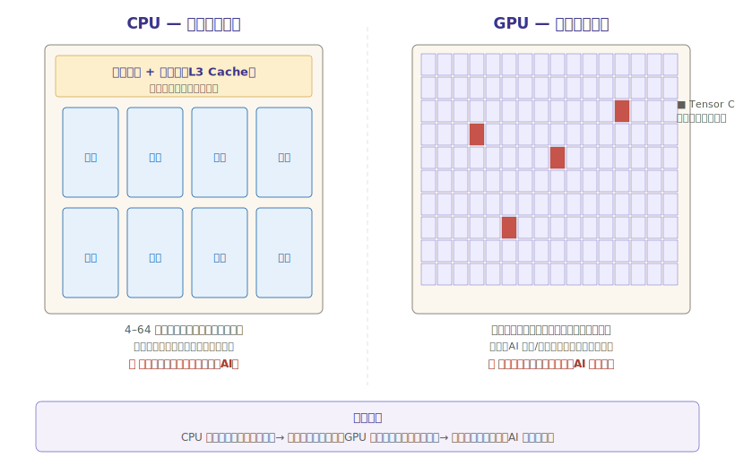
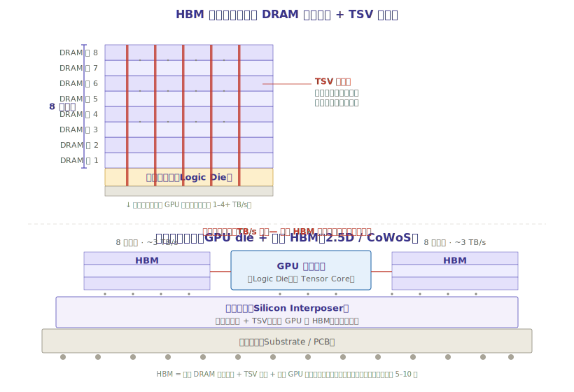

# 第一章：技术体系与发展脉络

要理解 AI 算力芯片的投资机会，第一个要搞清楚的问题不是「买哪家公司」，而是「为什么 AI 一定要用这种芯片」。这一章把 GPU、HBM、ASIC 这三个核心概念讲透——它们是整个板块的技术地基。

---

## 一、为什么 AI 不用 CPU，非要用 GPU？

### 1.1 一个类比：大食堂 vs 一万个外卖小哥

> **一句话**：CPU 是「少数几个顶尖大厨，什么菜都会做，但一次只能做几桌」；GPU 是「一万个只会炒饭的外卖小哥，同时开火，一秒出上万份」。

AI 训练的本质，是做海量的**矩阵乘法**（把两个巨大的数字表格相乘再相加）。一个大模型有几千亿个参数，训练一次要做的乘法次数是天文数字——但这种计算有一个特点：**每次计算都很简单，只是数量极其庞大，而且彼此独立**。

| | CPU（中央处理器） | GPU（图形处理器） |
|---|---|---|
| 类比 | 4-8 个米其林大厨 | 上万个外卖小哥 |
| 核心数 | 少（4-64 个核心） | 多（几千到上万个核心） |
| 每个核心能力 | 强，能处理复杂逻辑 | 弱，只会做简单运算 |
| 擅长 | 串行任务、复杂判断、操作系统调度 | 并行任务、大批量简单运算 |
| AI 适配性 | ❌ 几个核心算不过来 | ✅ 上万核心同时算，天生适合矩阵乘法 |

**为什么 GPU 本来是打游戏用的，却成了 AI 芯片？** 因为 3D 渲染和 AI 训练本质上是同一类问题——都需要对大量像素/参数做并行的简单乘加运算。GPU 当年被设计来「同时算几百万个像素的颜色」，这套并行计算能力恰好也是 AI 最需要的。英伟达最早发现这一点，把 GPU 从「显卡」改造成了「通用计算芯片」，这就是 AI 时代的起点。



### 1.2 从「显卡」到「AI 计算引擎」：三代演化

GPU 并不是一开始就能做 AI。它经历了三代演化：

| 阶段 | 年代 | GPU 的角色 | 关键转折 |
|------|------|-----------|---------|
| **图形渲染时代** | 1990s-2000s | 纯粹的 3D 显卡，只算画面 | GPU = Graphics Processing Unit，名副其实 |
| **通用计算时代** | 2007 起 | 能做科学计算、AI 训练 | 英伟达发布 **CUDA**（2007），让程序员能用普通代码指挥 GPU 算非图形任务 |
| **AI 专用时代** | 2017 起 | 为 AI 量身改造 | 英伟达加入 **Tensor Core**（张量核心），专门加速矩阵乘法，算力暴增几十倍 |

> **投资者关键认知**：CUDA 是英伟达最深的护城河，不是芯片本身。全世界 AI 开发者都用 CUDA 写代码，换芯片就要重写程序——这就是为什么 AMD 的芯片再便宜、性能再接近，也难以抢走英伟达的客户。详见第二章软件生态部分。

### 1.3 Tensor Core：AI 算力暴增的「秘密武器」

普通 GPU 核心一次只能做一个乘法。而 **Tensor Core（张量核心）** 是英伟达从 Volta 架构（2017）开始加入的专用单元，**一次能做一整个小矩阵的乘加运算**——把「4×4 矩阵 × 4×4 矩阵」这种 AI 最常用的运算，从 16 次操作压缩成 1 次。

这带来的算力提升是数量级的：

| 架构 | 年代 | 代表产品 | 关键升级 |
|------|------|---------|---------|
| Pascal | 2016 | GTX 10 系列 | 传统 GPU，无 Tensor Core |
| Volta | 2017 | V100 | **首增 Tensor Core**，AI 算力跃升 5 倍 |
| Ampere | 2020 | A100 | 第 3 代 Tensor Core，支持稀疏化（跳过 0 计算） |
| Hopper | 2022 | H100 | **Transformer Engine**，专为 LLM 设计 |
| Blackwell | 2024 | B200 | 第 5 代 Tensor Core，支持 FP4 精度，算力再翻倍 |
| Rubin | 2026 预期 | R100 | 下一代，HBM4 配套 |

> **为什么精度越来越低（FP16→FP8→FP4）？** AI 计算不需要银行级别的精度。「猫是不是猫」用 4 位精度（FP4）判断就够了，而 FP4 的算力是 FP16 的 4 倍。英伟达每一代都在降低精度换取算力——这正是 AI 芯片和通用芯片的根本区别：**AI 容忍误差，所以能用更少的位数算得更快**。

---

## 二、HBM：AI 芯片的「命门」

### 2.1 一个问题：算得快，但数据喂不进去怎么办？

GPU 的计算核心越来越快，但计算核心本身不存数据——数据要放在**内存**里，算的时候再读进来。问题来了：

> GPU 每秒能算几十万亿次，但传统内存（DDR）每秒只能喂给它几千亿字节的数据。**算力远大于喂料速度，GPU 大量时间在「等数据」，而不是在「算」**。

这就好比：你雇了一万个外卖小哥（GPU 核心），但厨房出餐口（内存带宽）一次只能递出 10 份饭——9990 个小哥干等着。算力再强也白搭。

**HBM（High Bandwidth Memory，高带宽内存）** 就是为解决这个问题而生的。它把内存「堆」起来，紧贴着 GPU，用极宽的通道喂数据。

### 2.2 HBM 怎么「堆」：3D 封装的经典应用

> **一句话**：HBM 把好几层内存芯片像盖楼一样**垂直叠在一起**，然后用叫 TSV 的小铜柱从上到下穿通，最后整体放在 GPU 旁边——这就是先进封装（3D 堆叠）在存储上的最大规模应用。

HBM 的结构和传统内存完全不同：

| | 传统内存（DDR/GDDR） | HBM |
|---|---|---|
| 排列方式 | 平铺在 PCB 板上，离 GPU 远 | 多层芯片**垂直堆叠**，紧贴 GPU |
| 连接方式 | 走 PCB 铜线，引脚少 | **TSV（硅通孔）** 贯穿每层，引脚数千个 |
| 带宽 | 几十~几百 GB/s | **1-3+ TB/s**（高 5-10 倍） |
| 功耗 | 高（信号走长线） | 低（距离短） |
| 容量 | 单颗大 | 单颗小，靠堆叠增加 |
| 制造难度 | 成熟 | 极高——全球仅 3 家能造 |



**HBM 的代际演进**（每一代堆更多层、带宽更大）：

| 代际 | 堆叠层数 | 带宽 | 配套 GPU | 量产时间 |
|------|---------|------|---------|---------|
| HBM2 | 4-8 层 | ~1 TB/s | 英伟达 V100 | 2018 |
| HBM2e | 8 层 | ~1.6 TB/s | A100 | 2020 |
| HBM3 | 12 层 | ~3 TB/s | H100 | 2022 |
| HBM3e | 12 层 | ~3.5-4 TB/s | H200、B200 | 2024 |
| HBM4 | 12-16 层 | ~4-5 TB/s | R100（2026E） | 2026 爬坡 |

> **为什么 HBM 是「命门」**：一颗英伟达 H100 要配 6 颗 HBM3，一颗 B200 要配 8 颗 HBM3e。HBM 产能不足 = GPU 出不了货。全球能造 HBM 的只有 **SK 海力士、三星、美光** 三家，SK 海力士独占约 50% 份额。HBM 产能决定了英伟达的出货上限——这就是「命门」的含义。

### 2.3 HBM 与先进封装的关系

HBM 本身就是 3D 封装（TSV 垂直堆叠）的产物，而 HBM 与 GPU 的组合又是 2.5D 封装（CoWoS）的典型应用。所以：

> **AI 算力芯片 = GPU 计算 die + HBM 内存堆叠 + 2.5D/3D 先进封装**，三者缺一不可。这也是为什么本板块与[先进封装板块](../先进封装/先进封装行业研究.md)深度联动——封装产能直接卡住芯片出货。

---

## 三、ASIC：不走通用路线的「另一条路」

### 3.1 通用 vs 专用：一个永恒的权衡

> **一句话**：GPU 是「万能瑞士军刀」，什么 AI 任务都能干，但为通用性付了代价；ASIC 是「专用开瓶器」，只会开一种瓶，但开得又快又便宜。

| | GPU（通用） | ASIC（专用） |
|---|---|---|
| 设计目标 | 适配所有 AI 模型 | 针对某一类/某个客户的模型优化 |
| 灵活性 | 高，换模型不用换芯片 | 低，模型变了芯片可能要重设计 |
| 性能/功耗 | 好 | **更好**（专用电路效率更高） |
| 谁在用 | 所有人（英伟达客户） | Google（TPU）、华为（昇腾）、博通定制客户 |
| 软件生态 | CUDA 成熟 | 各家自建，碎片化 |
| 适合场景 | 训练 + 通用推理 | 大规模推理、特定模型 |

### 3.2 三大 ASIC 玩家

| 玩家 | 产品 | 模式 | 现状 |
|------|------|------|------|
| **Google** | TPU（Tensor Processing Unit） | 自研自用，支撑 Google 搜索/DeepMind | 已到第六代，不外售，但通过云服务对外提供算力 |
| **博通 Broadcom** | 定制 ASIC（XPU） | **帮别人设计**——Meta、Google、字节都是客户 | 2024 年 AI ASIC 营收 ~120 亿美元，是英伟达之外最大受益者 |
| **华为** | 昇腾 910C | 国产替代主力，信创 + 运营商集采 | 受制程限制，单卡性能落后英伟达，但集群方案在国内规模化落地 |

> **ASIC 为什么崛起**：当 AI 推理规模大到一定程度（比如 Google 每天处理几十亿次搜索推理），通用 GPU 的「灵活性溢价」就不划算了——花 3 万美元买一颗能干所有事的 GPU，不如花 1 万美元买一颗只干推理但效率高 3 倍的 ASIC。**推理规模越大，ASIC 越划算**。这是 ASIC 渗透率提升的根本逻辑。

---

## 四、训练 vs 推理：两种完全不同的需求

### 4.1 什么是训练，什么是推理？

> **类比**：训练 = 学生学习做题（反复练习，吃力，要大量算力）；推理 = 学生考试做题（用学过的知识答题，快，算力需求小但次数极多）。

| | 训练（Training） | 推理（Inference） |
|---|---|---|
| 做什么 | 用海量数据「教会」模型 | 用训练好的模型「回答」问题 |
| 类比 | 备考 | 考试 |
| 计算量 | 极大（几周~几个月） | 单次小，但次数海量（每秒百万次请求） |
| 精度要求 | 高（FP16/FP8） | 可低（FP8/FP4/INT8） |
| 主流芯片 | 英伟达 H100/B200（绝对主导） | GPU + ASIC + CPU 都能做 |
| 市场格局 | 英伟达 ~90% 垄断 | 多元化，ASIC 渗透快 |
| 增速 | 高（新模型训练） | **更高**（每个 AI 应用都要推理） |

### 4.2 为什么推理是下一个爆发点

训练市场已经被英伟达吃透了，但推理市场才刚刚开始：

1. **每个 AI 应用都要推理**：训练只做一次，推理是持续消耗——你每次问 ChatGPT、每次用 AI 搜索，都在消耗推理算力
2. **推理算力需求将超过训练**：业界共识，2025-2026 年起，推理算力消耗将超过训练算力消耗
3. **推理对成本更敏感**：训练不在乎单次成本（反正要做几个月），推理每次都要算钱——这给了 ASIC（更便宜）和国产芯片（更便宜）的机会

> **投资含义**：训练阶段买英伟达（确定性强）；推理阶段，ASIC 阵营（博通、Google）和国产芯片（寒武纪、海光）开始抢份额。详见第五章投资时钟。

---

## 五、AI 算力芯片的三层技术壁垒

理解了 GPU、HBM、ASIC，再来看为什么这个赛道壁垒高得吓人。一颗顶级 AI 芯片要同时跨越三座大山：

```
┌─────────────────────────────────────────────┐
│  壁垒一：设计（架构 + 软件）                    │
│  英伟达 CUDA 生态壁垒 + 架构 know-how          │
│  → 全球能设计顶级 AI 芯片的公司 < 5 家         │
├─────────────────────────────────────────────┤
│  壁垒二：制造（先进制程）                       │
│  3nm/2nm 只有台积电、三星能造                  │
│  → 英伟达/AMD/苹果全部排队求台积电             │
├─────────────────────────────────────────────┤
│  壁垒三：封装 + 内存（CoWoS + HBM）            │
│  CoWoS 台积电独占 90%；HBM 三家寡头垄断       │
│  → 封装产能 = 芯片出货上限                     │
└─────────────────────────────────────────────┘
```

这三层壁垒层层叠加，导致一个残酷现实：**即便你有图纸，也造不出来**。设计需要生态（CUDA），制造需要台积电产线，封装需要 CoWoS 产能，内存需要 HBM 配额——任何一环卡住，芯片就出不了货。

> 这也解释了为什么国产 AI 芯片（寒武纪、华为昇腾）只能在制程落后、HBM 受限的情况下，靠架构创新和集群方案「弯道追赶」——详见第三章国产替代部分。

---

## 六、技术演进路线图

```
           2022        2023        2024        2025        2026        2027+
            │           │           │           │           │           │
 GPU    ────●──H100─────●───────────●──B200─────●───────────●──R100─────●────→
 (英伟达)   Hopper      (过渡)      Blackwell   (放量)      Rubin       下一代
            HBM3        H200        HBM3e       B300        HBM4
            │           │           │           │           │
 HBM    ────●──HBM3─────●──HBM3e────●───────────●──HBM4─────●──────────→
            12层        12层        (主流)       12-16层     (爬坡)
            │           │           │           │           │
 ASIC   ────┼───────────●──TPU v5───●──博通XPU──●───────────●──────────→
            │           (Google)    (Meta/字节)  ASIC放量    推理渗透
            │           │           │           │           │
 推理    ────┼───────────┼───────────●──起步─────●──爆发─────●──超训练─→
            │           │           │           │           │
 国产    ────┼──昇腾910──●───────────●──寒武纪───●──海光DCU──●──────────→
            (华为)                   扭亏        放量        国产化率↑
```

**关键节点**：
- **2024-2025**：Blackwell B200 量产，1.6T 光模块配套，AI 训练算力再翻倍
- **2025-2026**：推理算力需求超过训练，ASIC 渗透加速；国产 AI 芯片（寒武纪）扭亏为盈
- **2026+**：Rubin + HBM4 世代开启，CPO 共封装光学落地，国产芯片制程追赶

---

## 七、本章小结：三个必须记住的认知

1. **GPU 赢在并行，CUDA 赢在生态**——英伟达的壁垒不在芯片本身，在于全世界都用 CUDA 写代码
2. **HBM 是命门**——三寡头垄断，产能决定 GPU 出货上限，是供需最紧的环节
3. **训练看英伟达，推理看多元化**——推理爆发将打破英伟达一家独大，ASIC 和国产芯片的机会在推理

> **数据来源**：本章为技术内容，综合行业公开资料整理；涉及的具体公司财务数据见第四章及子文件，均来自 neodata-financial-search（东方财富）。

> **下一章**：[02-产业链深度拆解](./02-产业链深度拆解.md) — 从设计到制造到封测到内存，每个环节谁在赚钱。
