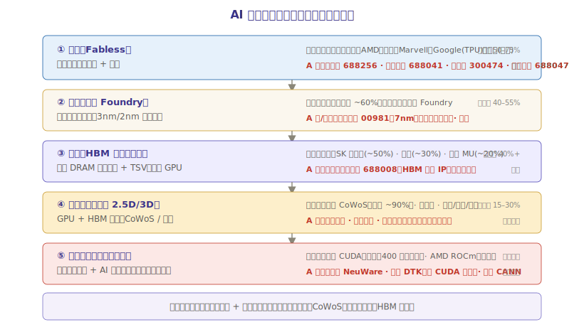

# 第二章：产业链深度拆解

一颗 AI 算力芯片从「想法」到「出货」，要穿越五个环节：**设计 → 制造 → 封测 → 内存 → 软件生态**。每个环节的技术壁垒、竞争格局、利润率截然不同。本章把这五个环节拆开看，告诉你钱最终流向了谁。

---

## 一、产业链全景图



| 环节 | 做什么 | 谁在赚钱 | 利润率 | A 股标的 |
|------|--------|---------|--------|---------|
| **① 设计** | 画芯片图纸（架构 + 电路） | 英伟达（暴利）、AMD、寒武纪、海光 | 最高（毛利 50-75%） | 寒武纪、海光信息 |
| **② 制造（代工）** | 把图纸变成晶圆 | 台积电（垄断）、三星、中芯国际 | 高（毛利 40-55%） | 中芯国际（港股/A股） |
| **③ 封测** | 切片 + 封装 + 测试 | 台积电 CoWoS（独占）、长电/通富/华天 | 中（毛利 15-30%） | 长电科技、通富微电 |
| **④ 内存（HBM）** | 造高带宽内存堆叠 | SK 海力士、三星、美光 | 高（HBM 毛利 40%+） | —（A股无HBM厂商）|
| **⑤ 软件生态** | 让芯片能用起来 | 英伟达 CUDA（垄断）、AMD ROCm | 生态锁定的隐性利润 | — |

> **关键认知**：产业链利润呈「微笑曲线」——两端（设计、软件）最赚钱，中间（封测）利润薄。但**封测是产能瓶颈**，没有 CoWoS 再好的设计也出不了货。这就是先进封装板块与本章的深度联动点。

---

## 二、设计环节：图纸上的暴利

### 2.1 设计一颗 AI 芯片要多少钱？

| 芯片类型 | 设计成本 | 流片（试产）成本 | 代表产品 |
|---------|---------|----------------|---------|
| 7nm AI 芯片 | ~$2-3 亿 | ~$3000 万 | 寒武纪思元、海光 DCU |
| 5nm AI 芯片 | ~$5-8 亿 | ~$5000 万 | 华为昇腾 910C |
| 3nm 顶级 GPU | ~$10-15 亿 | ~$1 亿 | 英伟达 H100/B200 |

> 设计成本为什么这么高？一颗顶级 GPU 有 **800 亿个晶体管**，人工画不完，要靠 EDA 软件（电子设计自动化）自动布局布线。EDA 软件被三家美国公司垄断（Synopsys、Cadence、Siemens EDA）， license 一年几千万美元。再加上架构设计团队（几百个顶尖工程师），成本自然高。

### 2.2 设计环节的三类玩家

| 类型 | 模式 | 代表公司 | 特点 |
|------|------|---------|------|
| **IDM** | 自己设计 + 自己制造 | 英特尔、三星 | 垂直整合，但两头来回拖累 |
| **Fabless** | 只设计，制造外包 | **英伟达、AMD、寒武纪、海光** | 轻资产，利润率最高，AI 时代主流 |
| **定制 ASIC** | 帮客户定制设计 | **博通**、Marvell | 不卖标准品，帮 Meta/Google/字节造专用芯片 |

> **为什么 Fabless 是主流**：造一座 3nm 晶圆厂要 200 亿美元，没人愿意既设计又建厂。Fabless 模式让英伟达能把所有钱砸在设计上，制造交给台积电——这是 AI 时代最高效的分工。

### 2.3 设计 IP：芯片界的「乐高积木」

不是所有公司都从头设计一颗芯片。很多公司买**设计 IP**（已验证的电路模块）来拼装，就像用乐高积木搭房子：

| IP 类型 | 做什么 | 垄断者 | A 股标的 |
|--------|--------|--------|---------|
| CPU IP | 处理器核心设计 | ARM（全球垄断手机 CPU IP） | — |
| 互联 IP | 芯片间高速通信 | Synopsys（PCIe/CXL）、ARM | — |
| 内存接口 IP | DDR/HBM 接口 | **澜起科技**（全球前三）、瑞萨 | 澜起科技 |
| AI 加速 IP | 矩阵运算单元 | 英伟达自研、Cadence | — |

> **澜起科技的特殊地位**：它是 A 股极少数能切入全球 AI 芯片核心供应链的公司——HBM 内存接口芯片（DDR5 RCD/MRCD、HBM MXC 接口）全球只有三家能做，澜起是其中之一。每颗 HBM 配套的接口芯片都有澜起的份额。

---

## 三、制造环节：台积电的绝对王国

### 3.1 为什么台积电一家独大？

> **一句话**：造先进制程芯片 = 烧钱比赛。一座 3nm 厂要 200 亿美元，而且每两年就要建新一代。全球烧得起、且烧得对的公司，只剩台积电和三星。

| 制程 | 厂商 | 状态 | AI 芯片应用 |
|------|------|------|-----------|
| 3nm（N3） | 台积电、三星 | 量产 | 英伟达 B200、苹果 A17/A18 |
| 2nm（N2） | 台积电、三星 | 2025 量产 | 英伟达 Rubin（2026E） |
| 1.4nm（A14） | 台积电 | 2027 计划 | 下一代 AI 芯片 |

台积电的统治力来自三方面：
1. **良率领先**：同样 3nm，台积电良率 80%+，三星只有 60% 左右。良率差 20 个百分点 = 成本差 30%+
2. **客户锁定**：英伟达、AMD、苹果、高通全部是台积电客户，没人敢换（换厂 = 重新流片 = 多花一年 + 几亿美元）
3. **CoWoS 封装绑死**：台积电不只是造晶圆，还独家做 CoWoS 先进封装。客户要用 CoWoS，就得用台积电的晶圆——打包锁死

### 3.2 中国制造的处境

| 公司 | 最先进制程 | 现状 |
|------|-----------|------|
| 中芯国际 | 7nm（受 EUV 光刻机限制） | 无法获取 EUV，靠 DUV 多重曝光做到 7nm，良率低、成本高 |
| 华虹 | 14nm | 成熟制程为主，不碰先进制程 |

> **出口管制的本质**：美国不让荷兰 ASML 卖 EUV 光刻机给中国，导致中国卡在 7nm。这意味着**国产 AI 芯片（寒武纪、华为昇腾）只能在 7nm 制程上，靠架构创新和集群方案追赶英伟达的 4nm/3nm**。这就是国产芯片「制程落后一代、靠系统补」的根本原因。详见第三章国产替代部分。

---

## 四、封测环节：产能瓶颈与价值重估

### 4.1 为什么封测从「苦力活」变成「香饽饽」？

传统封装（打线、注塑）利润薄、技术含量低，被认为是半导体的「后道苦力」。但 AI 时代彻底改变了这一点：

> **先进封装（2.5D/3D）= AI 芯片的产能阀门**。英伟达 GPU 出货量不取决于晶圆产能，而取决于台积电 CoWoS 封装产能——这是当前全产业链最紧的环节。

这部分内容与[先进封装板块](../先进封装/先进封装行业研究.md)深度重合，这里只点出与 AI 芯片直接相关的关键点：

| 封装类型 | 用在哪 | 谁能做 | AI 芯片相关性 |
|---------|--------|--------|-------------|
| **CoWoS（2.5D）** | 英伟达/AMD 所有 AI GPU | 台积电独占 ~90% | 🔴 决定 GPU 出货上限 |
| **HBM 堆叠（3D）** | 每颗 AI 芯片的内存 | SK 海力士/三星/美光 | 🔴 决定 GPU 配套 |
| **SoIC（3D 逻辑堆叠）** | AMD 3D V-Cache、未来 AI 芯片 | 台积电 | 🟡 下一代方向 |

### 4.2 CoWoS 产能缺口

台积电 CoWoS 月产能演进：

| 时间 | 月产能（片） | 缺口 |
|------|------------|------|
| 2023 | ~1.5 万 | 缺口 ~30% |
| 2024 | ~3.5 万 | 缺口 ~20% |
| 2025 | ~6-7 万+ | 缺口收窄至 ~10% |
| 2026E | ~9-10 万 | 趋于平衡 |

> **投资含义**：CoWoS 缺口 → 台积电自己吃满（暴利）→ 订单外溢给 OSAT（日月光、长电、通富）→ 上游封装材料/设备拉动。这条传导链已在先进封装板块详述，此处不重复。

---

## 五、内存环节：HBM 三寡头的「命门生意」

### 5.1 HBM 为什么只有三家能造？

HBM 的制造难度远超普通内存：

1. **TSV 工艺**：要在每层 DRAM 上打几千个比头发丝还细的孔，再用铜填满——精度要求极高
2. **堆叠良率**：8 层堆叠，任何一层坏了整颗报废。8 层良率 = 单层良率的 8 次方
3. **测试极难**：堆叠后无法单独测每层，要靠特殊测试方案
4. **与 GPU 协同设计**：HBM 要和英伟达/AMD 的芯片一起设计验证，新进入者没有客户带

这三道门槛把绝大多数存储厂挡在门外，全球只剩三家：

| 厂商 | 份额 | 技术 | 客户 |
|------|------|------|------|
| **SK 海力士** | ~50% | 最先量产 HBM3E，独家供应英伟达 H200 主力 | 英伟达（主力） |
| **三星** | ~30% | HBM3E 良率追赶中，供应 AMD、部分英伟达 | AMD、英伟达（二供） |
| **美光** | ~20% | HBM3E 量产最晚但产能扩张最快，毛利率弹性最大 | 英伟达（份额提升中） |

### 5.2 HBM 的经济学：为什么它是「命门生意」

> **关键数据**：一颗英伟达 B200 要配 8 颗 HBM3E，HBM 成本占整颗 GPU 的 ~30-40%。HBM 产能不足 = GPU 出不了货。

HBM 供需极度紧张带来两个结果：
1. **涨价**：HBM 单价是同容量普通 DRAM 的 3-5 倍，且持续涨价
2. **产能抢占**：三家把大量 DRAM 产能转去做 HBM，挤压了普通内存供给，带动整个存储周期反转

> 这就是为什么美光（MU）从 FY2023 巨亏 58 亿美元到 FY2025 盈利 85 亿美元——HBM 拉动存储周期 V 型反转。

---

## 六、软件生态：CUDA 的「隐形垄断」

### 6.1 为什么软件比芯片更难追？

> **一句话**：换一颗芯片容易，换一套软件生态难于登天。英伟达的真正护城河不是 GPU，是 CUDA。

CUDA 是英伟达 2007 年推出的并行计算平台——一套让程序员能用 C/C++/Python 指挥 GPU 干活的工具链。经过 18 年积累：

| 维度 | CUDA 生态 | 竞争对手现状 |
|------|----------|------------|
| 开发者数量 | ~400 万 | AMD ROCm：~50 万 |
| 库与框架 | cuDNN、TensorRT、DeepSpeed 等数千个 | 各家自建，碎片化 |
| 主流框架支持 | PyTorch/TensorFlow 原生最优支持 | 需要适配，性能打折 |
| 迁移成本 | — | 换芯片要重写/重调代码，几个月到一年 |

**生态锁定的恶性循环（对挑战者）/ 良性循环（对英伟达）**：
```
开发者多 → 框架优先支持 CUDA → 新用户只会 CUDA → 开发者更多
                                              ↑
                            英伟达芯片卖得更好 → 投更多钱建生态
```

### 6.2 各家的软件突围

| 厂商 | 软件栈 | 策略 | 进展 |
|------|--------|------|------|
| 英伟达 | CUDA | 维持垄断 | 绝对主导，无法撼动 |
| AMD | ROCm（开源） | 兼容 CUDA 代码 | 性能接近，但生态仍小 |
| **寒武纪** | NeuWare | 兼容 PyTorch/Triton，Day0 适配主流模型 | 已适配 DeepSeek-V4、GLM-5，国产最成熟 |
| **海光** | DTK（类 CUDA） | 兼容 CUDA 环境，降低迁移成本 | 适配 365 款主流大模型，覆盖 99% 非闭源模型 |
| 华为昇腾 | CANN | 自建生态，绑定昇腾硬件 | 信创场景成熟，通用性弱 |

> **国产芯片的软件突围逻辑**：寒武纪和海光都不试图自建全新生态（打不过 CUDA），而是**做「CUDA 兼容层」**——让原本为英伟达写的代码能低成本迁移过来。海光的 DTK「兼容类 CUDA 环境」、寒武纪的「Day0 适配」（新模型发布当天就能跑），都是这个思路。这是国产芯片能在出口管制窗口期抢份额的关键。

---

## 七、产业链价值分布：钱最终流向了谁？

把一颗英伟达 B200 的物料成本拆开（估算）：

| 环节 | 占成本比 | 谁拿走 | 说明 |
|------|---------|--------|------|
| **GPU 计算 die 制造** | ~25% | 台积电 | 4nm/3nm 代工 |
| **HBM 内存** | ~35% | SK 海力士/三星/美光 | 8 颗 HBM3E，成本最高单项 |
| **CoWoS 封装** | ~10% | 台积电 | 2.5D 封装 |
| **基板/其他** | ~10% | 欣兴/深南等 | ABF 载板 |
| **设计 + 软件 + 利润** | ~20% | **英伟达** | 设计毛利 + CUDA 生态溢价 |

> **残酷现实**：英伟达只负责设计和软件（~20% 成本占比对应的环节），却拿走了整条产业链**最大的利润**（FY2026 净利 1200 亿美元，毛利率 71%）。台积电、HBM 三家赚的是「辛苦制造钱」，英伟达赚的是「设计 + 生态垄断钱」。

### 对 A 股投资者的启示

| 环节 | A 股能否切入 | 逻辑 |
|------|------------|------|
| 设计 | ✅ 能 | 寒武纪、海光（国产替代窗口） |
| 制造 | ❌ 难 | 制程落后，中芯国际受光刻机限制 |
| 封测 | ✅ 能（间接） | 长电/通富承接外溢订单（见先进封装板块） |
| HBM | ❌ 不能 | A 股无 HBM 厂商，但**澜起科技**做 HBM 接口 IP |
| 软件生态 | 🟡 部分 | 寒武纪 NeuWare、海光 DTK 是国产软件突围 |

> **结论**：A 股投资 AI 算力芯片，核心就是 **寒武纪 + 海光信息**（设计端国产替代）+ **澜起科技**（HBM 接口 IP）+ 封测链（先进封装板块已覆盖）。

---

> **数据来源**：NeoData 金融数据搜索（东方财富）、各公司年报、公开行业报告。公司财务数据基准见第四章。

> **下一章**：[03-市场格局与竞争态势](./03-市场格局与竞争态势.md) — 全球市场多大？英伟达霸权怎么形成？ASIC 和国产芯片能抢多少份额？
