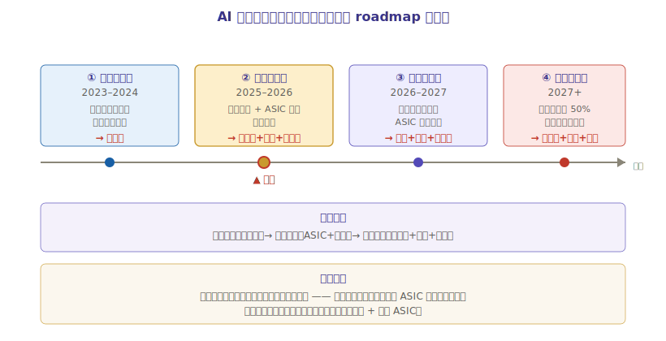

# 第五章：未来趋势与投资逻辑

AI 算力芯片是 AI 产业链价值量最大、确定性最强的环节，但也是估值最高、波动最大的赛道。本章回答四个问题：未来怎么走？什么时候买什么？核心逻辑是什么？风险在哪？

---

## 一、未来 3-5 年五大核心趋势

### 趋势 1：推理算力需求将超过训练（最大拐点）

> **类比**：训练是「建发电厂」，推理是「千家万户用电」。发电厂建一座就够，但用电是持续的、海量的。

| 时间 | 训练 vs 推理 | 市场含义 |
|------|------------|---------|
| 2023-2024 | 训练为主（大模型军备竞赛） | 英伟达通吃 |
| **2025-2026** | **推理需求追平训练** | 拐点出现 |
| 2027+ | 推理远超训练 | ASIC、国产芯片机会 window |

**投资含义**：训练阶段买英伟达（确定性强）；推理阶段，ASIC（博通、Google）和国产芯片（寒武纪、海光）开始抢份额。**推理爆发是打破英伟达一家独大的根本力量**。

### 趋势 2：ASIC 渗透率持续提升

| 指标 | 2024 | 2025 | 2026E | 2027E |
|------|------|------|-------|-------|
| ASIC 占 AI 芯片比 | ~13% | ~17% | ~21% | ~25%+ |

驱动因素：
1. 云厂商自研化（Google TPU、亚马逊 Trainium、Meta 定制）
2. 推理规模大到通用 GPU 不划算
3. 博通/Marvell 定制模式成熟

**最大受益者**：博通（AVGO）——不管谁的 ASIC 卖得好，博通都赚设计费。

### 趋势 3：国产替代加速（管制窗口期）

| 指标 | 2024 | 2025 | 趋势 |
|------|------|------|------|
| 中国 AI 芯片国产化率 | 30% | 41% | 持续提升 |

驱动因素：
1. 美国出口管制持续收紧（H20 也被限制）
2. 国产芯片软件生态成熟（寒武纪 Day0 适配、海光 DTK 兼容 CUDA）
3. 政策强制（信创、运营商集采）

**最大受益者**：寒武纪（弹性最大）、海光信息（双芯确定性）。

### 趋势 4：HBM4 世代开启

| HBM 代际 | 配套 GPU | 时间 | 关键变化 |
|---------|---------|------|---------|
| HBM3E | H200/B200 | 2024-2025 | 当前主流 |
| **HBM4** | **Rubin R100** | **2026 爬坡** | 12-16 层，带宽 4-5 TB/s |
| HBM4E | 下一代 | 2027+ | 进一步扩展 |

HBM4 的两个变化：
1. **层数从 12 → 16**：堆叠难度再升级，三寡头壁垒更深
2. **逻辑层定制化**：HBM4 底层逻辑芯片可由客户定制（台积电代工），打破 SK 海力士独家局面

### 趋势 5：CPO（共封装光学）落地

> CPO 是 AI 算力芯片与[光模块板块](../光模块/光模块行业研究.md)的交汇点——把光引擎封装进交换芯片内部。

- NVIDIA Spectrum-X CPO 交换机：2026H2 小批量交付
- 影响：光模块从「可插拔」走向「共封装」，天孚通信、中际旭创是核心供应商

---

## 二、投资时钟：不同阶段买什么

AI 算力芯片的投资节奏跟着英伟达 roadmap 走。不同阶段，最优标的不同：



| 阶段 | 市场特征 | 最优标的 | 逻辑 |
|------|---------|---------|------|
| **训练爆发期**（2023-2024） | 大模型军备竞赛，训练算力短缺 | **英伟达** | 训练通吃，最确定 |
| **放量验证期**（2025-2026） | 推理崛起，ASIC 渗透，国产扭亏 | **英伟达 + 博通 + 寒武纪** | 训练延续 + 推理 + 国产弹性 |
| **推理主导期**（2026-2027） | 推理算力超训练，ASIC 占比提升 | **博通 + 美光 + 寒武纪** | 推理 ASIC + HBM + 国产 |
| **国产替代深化期**（2027+） | 国产化率超 50%，国产芯片规模化 | **寒武纪 + 海光 + 中芯国际** | 国产闭环成熟 |

> **当前（2026 中）处于「放量验证期」向「推理主导期」过渡**：训练仍强（英伟达 FY2026 营收 +65%），但推理和 ASIC 开始放量（博通 AI 营收翻倍），国产芯片扭亏（寒武纪 2025 盈利）。这个阶段适合**均衡配置**：英伟达（训练延续）+ 博通（推理 ASIC）+ 寒武纪（国产弹性）。

---

## 三、八条核心投资逻辑

| # | 逻辑 | 核心标的 |
|---|------|---------|
| 1 | **英伟达是 AI 时代最确定的赢家**——训练通吃，CUDA 锁定 | 英伟达 |
| 2 | **HBM 是命门**——三寡头垄断，产能决定 GPU 出货 | 美光（弹性最大）|
| 3 | **推理爆发打破一家独大**——ASIC 渗透率提升 | 博通 |
| 4 | **国产替代是管制倒逼的确定性机会**——英伟达退出中国，国产唯一选择 | 寒武纪、海光 |
| 5 | **双芯平台稀缺性**——CPU+DCU 唯一，信创+AI 双驱动 | 海光信息 |
| 6 | **制造是国产闭环命脉**——中芯国际制程进步 = 国产 AI 芯片天花板 | 中芯国际 |
| 7 | **软件生态是真正护城河**——CUDA 无法追，但兼容层（DTK/NeuWare）能抢份额 | 寒武纪、海光 |
| 8 | **产业链联动**——芯片 roadmap 决定封装（CoWoS）和光模块（速率翻代）节奏 | 见先进封装/光模块板块 |

---

## 四、核心风险与应对

| 风险 | 影响程度 | 影响标的 | 应对 |
|------|---------|---------|------|
| **AI 投资周期下行** | ★★★★★ | 全板块 | 关注云厂商资本开支增速，若连续两个季度下滑则警惕 |
| **估值过高** | ★★★★ | 寒武纪（PE>100x）、英伟达 | 分批建仓，设置止盈；关注业绩兑现度 |
| **出口管制反复** | ★★★★ | 寒武纪、海光（利好）/ 英伟达（利空） | 国产替代标的反而受益于管制收紧 |
| **HBM 供需反转** | ★★★ | 美光、SK 海力士 | 跟踪 HBM 产能扩张节奏，2027 后警惕过剩 |
| **国产芯片制程受阻** | ★★★★ | 寒武纪、海光、中芯 | 关注中芯国际制程突破进展 |
| **技术路线突变** | ★★ | 全板块 | 关注光子计算、存算一体等颠覆性技术 |

### 最大风险：AI 投资周期下行

AI 算力芯片的高估值建立在「AI 投资持续高增长」的假设上。一旦云厂商资本开支增速放缓（比如 AI 应用变现不及预期，云厂商削减 capex），整个链条会戴维斯双杀（业绩 + 估值双杀）。

**跟踪信号**：
- 云厂商（微软/Google/Meta/亚马逊）季度 capex 增速
- 英伟达季度营收环比增速（连续两季环比负增长 = 警报）
- AI 应用商业化进展（Agent、自动驾驶落地情况）

---

## 五、关键跟踪指标

### 行业层面

| 指标 | 来源 | 频率 | 含义 |
|------|------|------|------|
| 英伟达季度营收/指引 | 财报 | 季度 | AI 投资温度计 |
| 云厂商 capex | 财报 | 季度 | AI 基建投入意愿 |
| HBM 产能/价格 | 行业研报 | 季度 | 命门供需 |
| CoWoS 产能 | 台积电法说 | 季度 | GPU 出货上限 |
| 中国 AI 芯片国产化率 | IDC | 半年 | 国产替代进度 |

### 公司层面

| 公司 | 关键指标 |
|------|---------|
| 英伟达 | 数据中心营收占比、毛利率、下季指引 |
| 寒武纪 | 合同负债（订单）、存货、Day0 适配进度 |
| 海光信息 | DCU 出货量、毛利率、HSL 生态进展 |
| 美光 | HBM 营收占比、产能扩张、毛利率 |
| 博通 | AI ASIC 营收、客户拓展 |
| 中芯国际 | 先进制程产能、毛利率、资本开支 |

---

## 六、与已学板块的串联

本板块是 AI 主线的第三步，与已学的两个板块形成完整闭环：

```
先进封装（L3）           ← AI 芯片的「瓶颈」
    │                       CoWoS 产能 = GPU 出货上限
    ↓
光模块（L4）             ← AI 集群的「神经」
    │                       GPU 速率翻代 → 光模块速率翻代
    ↓
AI 算力芯片（L2，本板块） ← AI 的「心脏」
    │                       价值量最大、技术壁垒最高
    ↓
半导体制造 + 设备 + 材料（L1）← 下一个板块
                            一切芯片的物理基础
```

> **学习视角**：学完本板块，再看先进封装和光模块，会有「顿悟」感——为什么 CoWoS 这么紧？因为每颗 AI 芯片都要用。为什么光模块速率每代翻倍？因为 GPU 算力每代翻倍。**AI 算力芯片是整条产业链的节奏制定者**。

---

## 七、本章总结：三个必须带走的核心认知

1. **训练买英伟达，推理看多元化**——推理爆发是 2026-2027 的最大变量，ASIC 和国产芯片的机会在推理
2. **HBM 是命门，美光是弹性**——三家寡头垄断，美光产能扩张最激进，弹性最大
3. **国产替代是管制倒逼的确定性机会**——寒武纪+海光是 A 股唯二的基本面标的，中芯国际是制造命脉

> **下一步学习**：按 [AI 主线投资地图](../AI主线投资地图.md)，下一个板块是 **半导体制造 + 设备 + 材料（L1 基底层）**——一切芯片的物理基础。

---

> **版本**：v1.1｜**更新日期**：2026-07-06（2026-07-09 时效复核：补录美/港 2026Q1 单季） 
> 风险提示：本文仅供学习研究参考，不构成投资建议。市场有风险，投资需谨慎。
