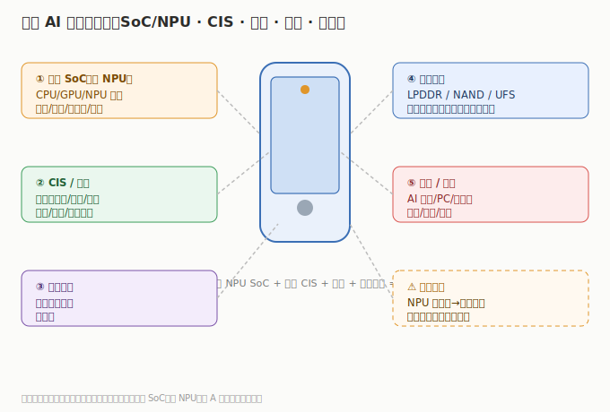

# 01 技术体系与发展脉络

> AI 终端不是一台新设备，而是「给旧设备装上本地 AI 大脑」。先搞清楚端侧 AI 由什么组成、哪个最值钱，才能看懂为什么 A股炒 SoC 和光学、美股炒苹果/高通。

## 1.1 一台 AI 终端由什么组成

以 AI 手机/AI PC 为例，核心子系统：

| 子系统 | 作用 | 关键部件 | 代表公司 | 市场 |
|--------|------|---------|---------|------|
| **端侧算力（SoC）** | 本地跑模型 | NPU/CPU/GPU 集成 SoC | 高通/苹果（美）、瑞芯微/全志/晶晨/恒玄（A） | 美/A |
| **视觉（CIS/光学）** | 看得清 | 图像传感器、镜头、模组 | 韦尔/舜宇/丘钛/水晶光电 | A/港 |
| **通信（射频）** | 连得稳 | 射频前端、天线 | 卓胜微（A） | A |
| **整机/代工** | 总装 | 手机/PC/可穿戴 | 小米/苹果（整机）、歌尔/比亚迪电子（代工） | 港/美 |
| **存储（端侧）** | 存模型/数据 | LPDDR/NAND/UFS | 兆易/长鑫（见存储芯片模块） | A |

## 1.2 最值钱的环节：端侧 SoC（含 NPU）

- **端侧 SoC** 把 CPU/GPU/NPU 集成，NPU 专门跑神经网络推理，是端侧 AI 的算力底座。
- 高通骁龙、苹果 A/M 系列是标杆；瑞芯微 RK3588/3576、恒玄 BES 是国产突破。
- SoC 单机价值量与算力（TOPS）同步提升，是板块价值量最高、壁垒最强的环节。

## 1.3 视觉：AI 手机的「眼睛」升级

- AI 手机多摄+高像素+潜望，拉动 **CIS（韦尔/豪威）与光学（舜宇/水晶光电/丘钛）** 规格升级，ASP 上行。
- 可穿戴/AR 眼镜的微型光学（光波导）是新增长极，水晶光电等受益。

## 1.4 整机与代工：换机的「载体」

- 小米（人车家生态）、苹果（Apple Intelligence）是端侧 AI 整机标杆；AI 手机/PC 换机直接放大销量。
- 歌尔（可穿戴/AR-VR 代工）、比亚迪电子（终端代工）承接硬件制造。

## 1.5 演进主线

1. **从云到端**：推理从云端下沉到设备，隐私/延迟/离线优势驱动端侧 NPU 标配化。
2. **换机周期**：AI PC（2024 起）/ AI 手机（2025 起）重启换机，单机价值量提升。
3. **国产突破**：端侧 SoC（瑞芯微等）、CIS（韦尔）对标高通/索尼，份额提升。

> 投资含义：**端侧 SoC 价值量最高、壁垒最强（确定性看高通/苹果、弹性看瑞芯微/恒玄）；光学/CIS 受益规格升级；整机在港/美，A股赚 SoC/光学/传感/代工放量+国产替代。**

---

---

> **版本**：v1.0（已核对）｜**更新日期**：2026-07-11｜**数据来源**：行业共识性技术框架；财务数据见各子文件（neodata-financial-search，东方财富）
