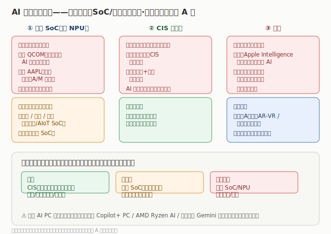

# 03 市场格局与竞争态势

> AI 终端格局的特殊性：端侧 SoC 与整机的标杆在美股（高通/苹果）与港股（小米），A股以 SoC 国产替代、CIS、光学、代工为主。理解这个「分层」，才能理解为什么 A股炒瑞芯微/韦尔、美股炒苹果/高通。

## 3.1 端侧 SoC：高通/苹果双霸，国产突破

- **海外**：高通（骁龙，安卓端侧 AI 霸主）、苹果（A/M 系列，自研闭环）。
- **国产**：瑞芯微（RK3588 系列领先）、全志/晶晨（多媒体 SoC）、恒玄（可穿戴 SoC）。
- 国产在中高端仍需追赶，但 AIoT/车机/可穿戴等细分已规模突破。

## 3.2 CIS 与光学：韦尔（豪威）对标索尼

- **CIS**：韦尔股份（豪威）全球前三，手机/汽车双线；舜宇（镜头+模组）全球第一。
- **模组**：丘钛（高弹性）、比亚迪电子（代工平台）。
- 光学是 AI 手机规格升级最直接受益环节，国产已具全球竞争力。

## 3.3 整机：小米（港）与苹果（美）

- 小米「人车家全生态」+ 自研端侧大模型，是港股最纯端侧 AI 整机；苹果 Apple Intelligence 是全球装机量最大的端侧 AI。
- 联想 AI PC 已在「算力基础设施」模块覆盖；微软 Copilot+ PC、AMD Ryzen AI、谷歌端侧 Gemini 已在「AI 应用层 / AI 算力芯片」覆盖，本板块引用不重复。

## 3.4 国产替代空间

| 环节 | 国产化进度 | 代表 |
|------|-----------|------|
| 端侧 SoC | 突破中，细分领先 | 瑞芯微/全志/晶晨/恒玄 |
| CIS | 成熟（全球前三） | 韦尔股份（豪威） |
| 光学镜头/模组 | 领先全球 | 舜宇/丘钛/水晶光电 |
| 射频前端 | 突破中 | 卓胜微 |
| 整机/代工 | 成熟 | 小米/歌尔/比亚迪电子 |

> 核心认知：**SoC/整机标杆在美/港，A股赚「端侧 SoC/CIS/光学/传感/代工放量 + 国产替代」；绑定大客户+换机周期兑现是分水岭。**

---

---

> **版本**：v1.0（已核对）｜**更新日期**：2026-07-11｜**数据来源**：市场份额为行业研究共识性估算；财务数据见各子文件（neodata-financial-search，东方财富）
