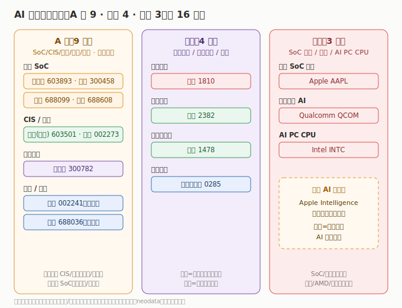

# 04 核心公司分析

> **给投资者的第一句话**：AI 终端公司多、环节杂、市场分层是最大特征（SoC/整机标杆在美/港、A股以 SoC 国产替代/CIS/光学/代工为主）。本节只做「索引 + 一句话逻辑 + 真实财务」，逐家深挖在子文件里。财务为 **2025 年报 / 最新财年** 口径，数据来自 neodata（东方财富）核对。

## 4.1 A 股（9 家，2025 年报）

| 公司 | 代码 | 环节 | 2025 营收 | 2025 营收同比 | 2025 归母净利 | 一句话逻辑 |
|------|------|------|----------|--------------|--------------|------------|
| 韦尔股份 | 603501 | CIS 视觉 | ¥288.55 亿 | +12.14% | ¥40.45 亿 | 豪威集团，手机/汽车端侧视觉核心 |
| 瑞芯微 | 603893 | 端侧 SoC | ¥44.02 亿 | +40.36% | ¥10.40 亿 | RK3588/3576，AIoT/车机/AR |
| 晶晨股份 | 688099 | 音视频 SoC | ¥67.93 亿 | +14.63% | ¥8.73 亿 | 智能电视/机顶盒/AI 音视频 |
| 恒玄科技 | 688608 | 可穿戴 SoC | ¥35.25 亿 | +8.02% | ¥5.94 亿 | 智能音频/可穿戴 BES 系列 |
| 全志科技 | 300458 | 终端 SoC | ¥28.38 亿 | +24.04% | ¥2.62 亿 | 智能终端应用处理器 |
| 水晶光电 | 002273 | 光学薄膜 | ¥69.28 亿 | +10.37% | ¥11.72 亿 | 滤光片/光波导，端侧光学 |
| 歌尔股份 | 002241 | 可穿戴代工 | ¥965.50 亿 | -4.36% | ¥39.40 亿 | AR-VR/可穿戴整机组装 |
| 传音控股 | 688036 | AI 手机整机 | ¥655.91 亿 | -4.55% | ¥25.81 亿 | 非洲/新兴市场 AI 手机龙头 |
| 卓胜微 | 300782 | 射频前端 | ¥37.26 亿 | -16.96% | -¥2.93 亿（转亏） | 手机射频前端芯片 |

> A 股 26Q1：neodata 当前（2026-07-11）对 9 家 26Q1 单季数据**均未收录**，故以 2025 年报为最新确认值。逐家深挖见 [A股子文件](./A股/AI终端A股.md)。

## 4.2 港股（4 家）

| 公司 | 代码 | 环节 | 最新财年营收 | 营收同比 | 净利 | 端侧 AI 落点 |
|------|------|------|------------|----------|------|---------|
| 小米集团 | 1810 | AI 手机生态 | $636.14 亿（≈¥4580） | +25.12% | $57.93 亿（≈¥417） | 人车家全生态，端侧 AI 整机 |
| 舜宇光学 | 2382 | 光学镜头 | 432.29 亿¥ | +12.89% | 46.39 亿¥ | 手机/车载光学全球第一 |
| 比亚迪电子 | 0285 | 终端代工 | 1794.77 亿¥ | +1.22% | 35.15 亿¥（-17.61%） | 智能终端代工/结构件/XR |
| 丘钛科技 | 1478 | 摄像头模组 | 208.77 亿¥ | +29.26% | 14.94 亿¥ | 手机摄像头模组，净利高弹性 |

> 小米 neodata 返回美元（ADR 口径），附 ¥ 折算；舜宇/比亚迪电子/丘钛以 ¥ 列示。联想 AI PC 见「算力基础设施」模块。详见 [港股子文件](./港股/AI终端港股.md)。

## 4.3 美股（3 家）

| 公司 | 代码 | 环节 | 最新财年 | 财年营收 | 营收同比 | 财年净利 | 最新单季 | 单季营收 | 单季营收同比 | 端侧 AI 落点 |
|------|------|------|----------|----------|----------|----------|----------|----------|--------------|---------|
| Apple | AAPL | AI 整机 | FY2025 | $4161.61 亿 | +6.43% | $1120.10 亿 | FY2026Q2 | $1111.84 亿 | +16.60% | Apple Intelligence |
| Qualcomm | QCOM | 骁龙 SoC | FY2025 | $442.84 亿 | +13.66% | $55.41 亿（-45.19%） | FY2026Q2 | $105.99 亿 | 约-3.5% | 骁龙端侧 AI 平台 |
| Intel | INTC | AI PC CPU | FY2025 | $528.53 亿 | -0.47% | -$2.67 亿（亏收窄） | FY2026Q1 | $135.77 亿 | +7.18% | Core Ultra NPU |

> ⚠️ Qualcomm 2026Q2 单季净利含 51.38 亿 $ 一次性所得税收益（经调整约 28 亿 $），详见 [美股子文件](./美股/AI终端美股.md)；微软 Copilot+ PC、AMD Ryzen AI、谷歌端侧 Gemini 见其他板块。

---

---

> **版本**：v1.0（已核对）｜**更新日期**：2026-07-11｜**数据来源**：neodata-financial-search（东方财富），A股 2025 年报（26Q1 未收录）、港股/美股 2025 财年+单季（高通单季异常已标注）；涨跌配色：正增长红、负增长/亏损绿
