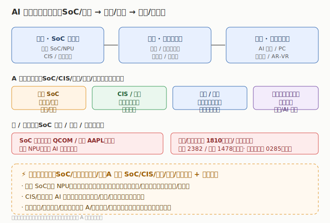

# AI 终端行业研究

> **一句话定位**：AI 终端是 AI 算力从「云端」下沉到「设备」——把大模型塞进手机/PC/可穿戴，靠端侧芯片本地推理。它是 AI 主线在「消费电子」的落点，与「AI 算力芯片 / 存储」互补（端侧也需算力与存储），又拉动 SoC/光学/传感/整机代工全线升级。

AI 的下一个十年，推理不只发生在数据中心。当手机、PC、眼镜有了本地 NPU，就能在设备端跑大模型——隐私更好、延迟更低、离线可用。2024 年起 **Apple Intelligence、骁龙端侧 AI、Copilot+ PC、AI 手机** 密集落地，**「端侧 NPU 成标配」驱动换机周期**，AI 终端成为 AI 主线最贴近消费者的落地场景。本板块覆盖端侧 AI 的「芯片（SoC）— 光学/传感 — 整机/代工」全链条，与「AI 算力芯片 / 存储 / 智能驾驶」互补——端侧既是算力的消费方，又是硬件升级的拉动方。

---

---

## 关键数据速览（2025 年报 / 最新财年，neodata 核对）

| 公司 | 市场 | 2025 营收 | 同比 | 归母/净利 | 一句话定位 |
|------|------|----------|------|-----------|------------|
| 韦尔股份 603501 | A股 | ¥288.55 亿 | +12.14% | ¥40.45 亿 | 豪威集团，CIS 端侧视觉核心 |
| 瑞芯微 603893 | A股 | ¥44.02 亿 | +40.36% | ¥10.40 亿 | 端侧 AI SoC（RK3588/3576） |
| 小米 1810 | 港股 | $636.14 亿（≈¥4580） | +25.12% | $57.93 亿 | 人车家全生态，端侧 AI 整机 |
| 舜宇光学 2382 | 港股 | ¥432.29 亿 | +12.89% | ¥46.39 亿 | 光学镜头+模组全球第一 |
| Apple AAPL | 美股 | $4161.61 亿 | +6.43% | $1120.10 亿 | Apple Intelligence 标杆整机 |
| 高通 QCOM | 美股 | $442.84 亿 | +13.66% | $55.41 亿 | 骁龙端侧 AI 平台（SoC） |

> ⚠️ 高通 2026Q2 单季净利含 51.38 亿 $ 一次性所得税收益（经调整约 28 亿 $，详见 [美股子文件](./美股/AI终端美股.md)）；韦尔股份 2025 更名豪威集团（代码不变）；A股 26Q1：neodata「公司概况」路径已返回 26Q1 累计（豪威/瑞芯微/全志/水晶光电/歌尔/卓胜微 6 家经核验），结构化财务 API 仍以 2025 年报为最新，本表以 2025 年报为确认值。完整 9+4+3 家见 [04 章](./04-核心公司分析.md)。

---

## 市场有多大（行业研究口径）

- **换机周期重启**：AI PC/AI 手机将「端侧 NPU」变为标配，推动 2024–2026 换机潮，单机价值量（SoC/内存/光学）提升。
- **价值量分布**：端侧 SoC（含 NPU）是价值量与壁垒最高的环节；CIS/光学随 AI 手机多摄+高像素升级；可穿戴/AR 是新增长极。
- **国产替代空间**：端侧 SoC（瑞芯微/全志/晶晨/恒玄）对标高通/苹果，CIS（韦尔）对标索尼，全面加速。
- **A 股逻辑**：整机在港/美（小米/苹果），A股赚「端侧 SoC/光学/传感/代工放量 + 国产替代」——与「人形机器人」「智能驾驶」的「整机在外、零部件在 A」逻辑同构。

> 数据来源：2026 年产业链研究报告（行业口径）量级估算；财务数据见各子文件（neodata-financial-search，东方财富）。

---

## 本章导航

- [01 技术体系与发展脉络](./01-技术体系与发展脉络.md) — 端侧 AI 的芯片/模型/硬件
- [02 产业链深度拆解](./02-产业链深度拆解.md) — 从 SoC 到整机的价值分布
- [03 市场格局与竞争态势](./03-市场格局与竞争态势.md) — 国产 SoC vs 高通/苹果
- [04 核心公司分析](./04-核心公司分析.md) — 9+4+3 索引表
- [05 未来趋势与投资逻辑](./05-未来趋势与投资逻辑.md) — 换机拐点、投资框架、风险

> **版本**：v1.0（已核对）｜**复核日期**：2026-07-15｜**数据来源**：neodata-financial-search（东方财富），A股 2025 年报（26Q1 累计经「公司概况」路径核验 6 家）、港股/美股 2025 财年+单季（高通单季异常已标注）；市场规模来自 2026 年产业链研究报告（行业口径）
