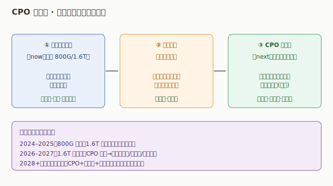

# 01 技术体系与发展脉络

> **给投资者的第一句话**：CPO/硅光不是凭空出现的新技术，而是光互联「电退光进」的必然演进——从可插拔光模块，到硅光集成，再到共封装（CPO），每一步都在解决同一个问题：GPU 之间传数据，要更快、更省电、更密。

## 一、先搞懂：光互联在 AI 集群里干什么

AI 集群里几万颗 GPU 要协同训练一个大模型，它们彼此之间要频繁传递海量中间结果（激活值、梯度）。传递的通道就是「光互联」——用光（光纤）代替电（铜线）做长距离、高带宽传输。

- **为什么用光不用电**：电在铜线上跑得越快、距离越长，损耗和发热越恐怖；光的损耗小、带宽高、不受电磁干扰。所以「节点之间」一定是光，「芯片内部」还是电。
- **瓶颈在哪**：芯片算得越来越快（见 AI 算力芯片板块），但「芯片到光」的接口——也就是光模块——成了新瓶颈。可插拔光模块要占用面板空间、耗电、有损耗。

## 二、演进三步曲（关键类比）

把光互联想象成「员工之间传文件」的方式进化：

| 阶段 | 形态 | 类比 | 问题 |
|------|------|------|------|
| **可插拔光模块** | 独立盒子插在面板（当前主流 800G/1.6T） | 每个员工桌上放一台独立传真机 | 占空间、耗电、绕路，密度到顶 |
| **硅光（Silicon Photonics）** | 用硅晶圆做光器件，把光收发集成进小芯片 | 把传真机做成一个小芯片，焊在办公桌里 | 仍是「桌边」，没解决到封装 |
| **CPO（共封装光学）** | 光引擎直接封装在交换机/ASIC 芯片旁边 | 把光收发器直接焊进员工的办公桌（芯片封装） | 工艺难、生态未成熟，但方向确定 |

> **一句话**：可插拔是 now，硅光是工艺路线，CPO 是 next——三者不是替代关系，而是「现在用着、工艺在变、未来必到」的连续演进。

## 三、CPO 到底解决了什么

- **功耗**：光信号从芯片封装直接出光，省掉可插拔模块的电—光—电多次转换，单比特功耗可降 30%~50%。
- **密度**：面板空间有限，CPO 把光引擎塞进封装，端口密度成倍提升，支撑 3.2T 及以上。
- **延迟**：信号不出封装就上光路，延迟显著降低——对分布式训练至关重要。

## 四、硅光：CPO 的「底层工艺」

硅光不是产品，是「用 CMOS 工艺在硅上做光器件（激光器/调制器/探测器）」的制造路线。它的意义：

- 让光器件像芯片一样批量制造、低成本集成；
- 是 CPO 光引擎的实现基础——没有硅光，CPO 光引擎做不便宜、做不大；
- A股（源杰科技激光器芯片、光迅科技光芯片）与美股（Coherent 的 InP 衬底、Lumentum）卡位不同环节。

## 五、时间线（投资视角的节奏）

- **2024–2025**：800G 可插拔大规模量产，1.6T 导入；硅光在 800G 中渗透率提升。
- **2026–2027**：1.6T 成为主力，CPO 从样机走向量产（Nvidia/博通/台积电布局）；3.2T 研发。
- **2028+**：机柜级光互联（CPO + 光引擎 + 交换芯片）成为十万卡/百万卡集群标配。

> 投资启示：现在买的是「800G/1.6T 放量的业绩」，赌的是「CPO 量产的技术期权」——两者在同一批公司（中际旭创/新易盛/天孚/博通）身上叠加。

---

> **版本**：v1.0（已核对）｜**更新日期**：2026-07-12｜**数据来源**：neodata-financial-search（东方财富）+ 2026 年产业链研究报告（行业口径）
