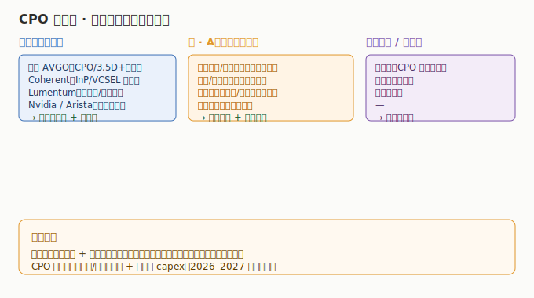

# 03 市场格局与竞争态势

> **给投资者的第一句话**：CPO/硅光是「全球三极」格局——美国在底层布局（博通/Coherent）、中国在制造放量（中际旭创/新易盛）、台湾在代工与系统（台积电/Arista 生态）。A股在光模块制造环节已具全球定价权，是弹性最强的一段。

## 一、全球三极格局

| 极 | 代表方 | 卡位 | 投资含义 |
|----|--------|------|---------|
| **美** | 博通、Coherent、Lumentum、AAOI、Nvidia、Arista | CPO/3.5D 布局、光材料与器件上游、交换系统 | 底层规则+确定性 |
| **中（A股）** | 中际旭创、新易盛、天孚、光迅、源杰、盛科 | 光模块制造、光器件、激光器芯片、交换芯片 | 制造放量+弹性 |
| **台** | 台积电（CPO 封装）、鸿海系（代工） | 先进封装、代工 | 产业链配套 |

## 二、细分环节竞争态势

### 1. 光模块：中际旭创 + 新易盛「双雄」格局

- **全球前二**：中际旭创（382 亿营收、107.97 亿净利）、新易盛（248 亿、95.32 亿）已跻身全球光模块第一梯队，800G 份额领先、1.6T 导入。
- **第二梯队**：华工科技、剑桥科技、长芯博创、联特科技、德科立，增速分化（长芯博创高增、德科立承压）。
- **竞争焦点**：1.6T 出货节奏、硅光/LPO 方案占比、海外云厂商份额。

### 2. 光器件：天孚「一家独大」的确定性

- 天孚通信在陶瓷插芯、无源/有源光器件环节国内领先，是 CPO 配套「卖铲人」，客户覆盖主流光模块厂，确定性高于纯模块厂。

### 3. 激光器芯片：小而美、国产替代

- 源杰科技（VCSEL/DFB）是 A股硅光光源稀缺标的，受益于硅光渗透率提升；美股 Coherent/Lumentum 在上游材料与器件全球领先。

### 4. 交换芯片：博通主导，盛科国产突围

- 博通 Tomahawk 系列主导全球高速交换芯片；盛科通信是 A股稀缺的以太网交换芯片标的，短期亏损换 AI 交换机卡位。

## 三、CPO 量产的「开关」在哪

- **技术开关**：博通/台积电/英伟达的 CPO 量产节奏（3.5D 封装良率、光引擎可靠性）。
- **需求开关**：云厂商（谷歌/微软/Meta/亚马逊）十万卡集群 capex 与机柜级光互联采用意愿。
- **时间窗口**：2026–2027 是 CPO 从样机走向量产的关键期，届时格局可能重塑（先发者受益）。

## 四、投资启示

- **确定性**：上游光器件（天孚）、光芯片一体化（光迅）、交换芯片底层（博通）受技术路线切换影响小。
- **弹性**：光模块双雄（中际旭创/新易盛）直接兑现 800G/1.6T 业绩，但估值含高预期。
- **期权**：激光器芯片（源杰）、交换芯片（盛科）、CPO 纯正布局方，弹性大、需跟踪量产节点。

---

> **版本**：v1.0（已核对）｜**更新日期**：2026-07-12｜**数据来源**：neodata-financial-search（东方财富）+ 2026 年产业链研究报告（行业口径）
