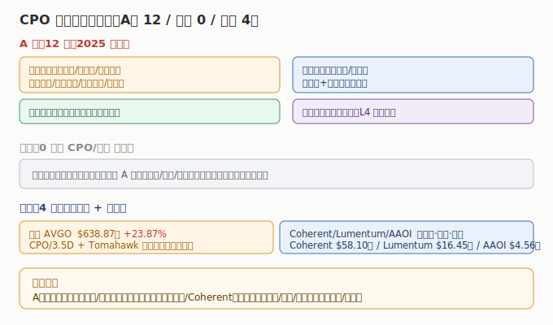

# 04 核心公司分析

> **给投资者的第一句话**：CPO/硅光标的横跨「光模块制造（A股最强）—光器件/芯片（A股+美股）—交换芯片与底层布局（美股主导）」三类。本节做索引 + 一句话逻辑 + 真实财务，逐家深挖在子文件。

## 4.1 A 股（12 家，2025 年报 + 逐股 26Q1）

| 公司 | 代码 | 环节 | 2025 营收 | 2025 营收同比 | 2025 归母净利 | 一句话逻辑 |
|------|------|------|----------|--------------|--------------|------------|
| 中际旭创 | 300308 | 光模块 | ¥382.40 亿 | +60.25% | ¥107.97 亿 | 全球光模块绝对龙头，1.6T/CPO 领先 |
| 新易盛 | 300502 | 光模块 | ¥248.42 亿 | +187.29% | ¥95.32 亿 | 800G/1.6T 主力，AI 数通高弹性 |
| 华工科技 | 000988 | 光模块 | ¥143.55 亿 | +22.59% | ¥14.71 亿 | 三业务：光电器件(含光模块)60.97亿/敏感元器件40.27亿/激光装备36.36亿 |
| 光迅科技 | 002281 | 光芯片+模块 | ¥119.29 亿 | +44.20% | ¥9.46 亿 | 光芯片+模块一体化，国产光芯片核心 |
| 天孚通信 | 300394 | 光器件 | ¥51.63 亿 | +58.79% | ¥20.17 亿 | 光器件/陶瓷插芯，CPO 配套核心 |
| 剑桥科技 | 603083 | 光模块 | ¥48.22 亿 | +32.07% | ¥2.63 亿 | 高速光模块（占 34.7%）+ 电信宽带 + 无线网络与边缘计算代工 |
| 长芯博创 | 300548 | 光模块 | ¥25.33 亿 | +44.93% | ¥3.35 亿 | PLC/硅光模块，长飞系硅光平台 |
| 太辰光 | 300570 | 光器件 | ¥15.47 亿 | +12.26% | ¥2.99 亿 | 光纤连接器/MT 插芯，CPO 高密度互连 |
| 联特科技 | 301205 | 光模块 | ¥12.58 亿 | +41.13% | ¥1.03 亿 | 400G+ 光模块，境外占比约 89% |
| 盛科通信 | 688702 | 交换芯片 | ¥11.51 亿 | +6.35% | 亏损 -1.50 亿 | 以太网交换芯片，AI 交换机国产芯片 |
| 源杰科技 | 688498 | 激光器芯片 | ¥6.01 亿 | +138.50% | ¥1.91 亿 | 激光器芯片（VCSEL/DFB），硅光光源 |
| 德科立 | 688205 | 光模块 | ¥9.34 亿 | +10.99% | 0.72 亿（下滑 -28.77%） | 光模块/子系统，短期承压 |

> A 股 26Q1：neodata 逐股开放，仅 太辰光（营收 -8.04%、归母 -17.12%）、长芯博创（+24.53%、+45.00%）、联特科技（-9.56%、-83.71%）3 家返回同比（绝对值未收录），其余标「数据未收录」。逐家深挖见 [A股子文件](./A股/CPO与硅光A股.md)。

## 4.2 美股（4 家，最新财年 + 单季）

| 公司 | 代码 | 落点 | 财年营收 | 营收同比 | 财年净利 | 单季营收同比 | AI/CPO 落点 |
|------|------|------|----------|----------|----------|------------|------------|
| 博通 | AVGO | CPO/3.5D+交换 | $638.87 亿 | +23.87% | $231.26 亿 | +47.87%（26Q2） | CPO/机柜光互联规则制定者 |
| Coherent | COHR | InP/VCSEL/硅光衬底 | $58.10 亿 | +23.43% | $0.49 亿（扭亏） | +20.55%（26Q3） | 光材料与器件上游 |
| Lumentum | LITE | 光器件/激光器/硅光 | $16.45 亿 | +21.03% | $0.26 亿（扭亏） | +90.03%（26Q3） | 数据中心光器件爆发 |
| AAOI | AAOI | 光模块/CPO 中概 | $4.56 亿 | +82.77% | -$0.38 亿（亏收窄） | +51.36%（26Q1） | 光模块 CPO，仍亏高增 |

> 美股财年区间各异（AVGO 年结 11 月初、COHR/LITE 年结 6 月底、AAOI 自然年），单季已注明。逐家深挖见 [美股子文件](./美股/CPO与硅光美股.md)。

## 4.3 港股（无纯正标的）

港股无纯 CPO/硅光上市标的（昂纳科技已私有化转 A 股）；中兴通讯/长飞光纤/鸿腾精密为相关非纯正标的。详见 [港股子文件](./港股/CPO与硅光港股.md)。

---

> **版本**：v1.0（已核对）｜**更新日期**：2026-07-12｜**数据来源**：neodata-financial-search（东方财富），A股 2025 年报（26Q1 逐股开放、多数未收录）+ 美股最新财年/单季；涨跌配色：正增长红、负增长/亏损绿
