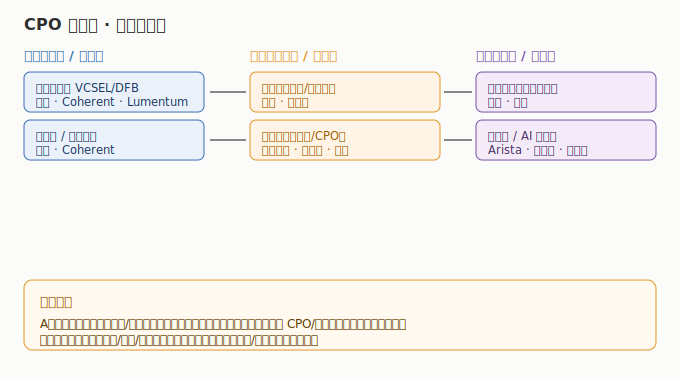

# CPO 与硅光行业研究

> **一句话定位**：CPO（共封装光学）与硅光，是 AI 集群「光互联」的下一代形态——把光收发器从面板搬进芯片封装，解决 GPU 之间的带宽与功耗瓶颈。它是光模块（L4 互联层）的演进方向，也是整条 AI 主线目前唯一被点名、却还没单独成篇的硬缺口。

AI 集群可以想象成一栋几万人的写字楼：每颗 GPU 是一个埋头干活的员工，员工之间要传递海量文件（数据）。传统做法，每个员工桌上放一台独立传真机（可插拔光模块），文件先出办公室、再走走廊光纤——设备多、耗电大、绕路慢。**CPO/硅光**做的事，是把「光收发器」直接焊进员工的办公桌（芯片封装内部），文件一出门就上了光路，不再绕路——功耗更低、延迟更小、端口密度更高。当单卡算力越来越高、集群规模越来越大，这种「把光和电焊在一起」的工艺，就从「可选升级」变成「必经之路」。本板块与「光模块」板块同源互补（光模块是 now、CPO/硅光是 next），与「AI 算力芯片」「存储芯片」共同决定 AI 集群能跑多快、多省电。

---

---

## 关键数据速览（2025 年报 / 最新财年，neodata 核对）

| 公司 | 市场 | 2025 营收 | 同比 | 归母净利润 | 一句话定位 |
|------|------|----------|------|-----------|------------|
| 中际旭创 300308 | A股 | ¥382.40 亿 | +60.25% | ¥107.97 亿 | 全球光模块绝对龙头，1.6T/CPO 领先 |
| 新易盛 300502 | A股 | ¥248.42 亿 | +187.29% | ¥95.32 亿 | 800G/1.6T 高速光模块主力 |
| 天孚通信 300394 | A股 | ¥51.63 亿 | +58.79% | ¥20.17 亿 | 光器件/陶瓷插芯，CPO 配套核心 |
| 光迅科技 002281 | A股 | ¥119.29 亿 | +44.20% | ¥9.46 亿 | 光芯片+模块一体化，国产光芯片 |
| 源杰科技 688498 | A股 | ¥6.01 亿 | +138.50% | ¥1.91 亿 | 激光器芯片（VCSEL/DFB），硅光光源 |
| 盛科通信 688702 | A股 | ¥11.51 亿 | +6.35% | 亏损 -1.50 亿 | 以太网交换芯片（L4 网络层），由盈转亏 |
| 博通 AVGO | 美股 | $638.87 亿 | +23.87% | $231.26 亿 | CPO/3.5D + Tomahawk 交换，布局方 |
| Coherent COHR | 美股 | $58.10 亿 | +23.43% | $0.49 亿 | 磷化铟/VCSEL/硅光衬底，扭亏 |
| Lumentum LITE | 美股 | $16.45 亿 | +21.03% | $0.26 亿 | 光器件/激光器/硅光，扭亏 |
| AAOI | 美股 | $4.56 亿 | +82.77% | 亏损 -0.38 亿 | 光模块/CPO 中概，仍亏但收窄 |

> **数据时效**：A股以 2025 年报为最新确认值，neodata 的 26Q1 为逐股开放——截至 2026-07-12 仅 太辰光/长芯博创/联特科技 3 家返回 26Q1 同比（绝对值未收录），其余仍只有 2025 年报，统一标「数据未收录」不臆造；美股为最新完整财年 + 单季（财年区间各异，已注明）。**港股无纯 CPO/硅光上市标的**（昂纳科技已私有化转 A 股，中兴/长飞为相关非纯正），详见 [港股子文件](./港股/CPO与硅光港股.md)。完整 12+4 家见 [04 章](./04-核心公司分析.md)。

---

## 市场有多大（行业研究口径）

- **光模块/光互联市场**：2025 年全球高速光模块市场约 **100–120 亿美元**，受 800G/1.6T 与 AI 集群扩张驱动，2026–2028 年复合增速预计 30%+；CPO 作为子集当前占比小（个位数），但 2027 年后随 3.2T 与机柜级光互联放量，渗透率快速提升。
- **硅光是底层工艺**：硅光（Silicon Photonics）不是单一产品，而是「用硅晶圆做光器件」的制造路线，可覆盖光模块、CPO、光引擎、光互联。Yole 等机构预计硅光市场规模 2025 约 20+ 亿美元、2030 向 60–80 亿美元演进。
- **驱动逻辑**：AI 集群从万卡向十万卡、百万卡扩展，节点间带宽需求每代翻倍（800G→1.6T→3.2T），功耗与密度倒逼「电退光进」——CPO 正是这一拐点的工程解。

> 数据来源：2026 年产业链研究报告（Yole / LightCounting / TrendForce 行业口径）量级估算；财务数据来自 neodata-financial-search（东方财富）。

---

## 本章导航

- [01 技术体系与发展脉络](./01-技术体系与发展脉络.md) — 可插拔→硅光→CPO 的演进，为什么必须「电退光进」
- [02 产业链深度拆解](./02-产业链深度拆解.md) — 激光器/调制器/光引擎/光纤/交换芯片，谁卡位
- [03 市场格局与竞争态势](./03-市场格局与竞争态势.md) — 全球三极（美/中/台），A股弹性最强
- [04 核心公司分析](./04-核心公司分析.md) — A股 12 家 + 美股 4 家索引表
- [05 未来趋势与投资逻辑](./05-未来趋势与投资逻辑.md) — 3.2T、机柜级光互联、风险
- 子文件：[A股](./A股/CPO与硅光A股.md) ｜ [港股](./港股/CPO与硅光港股.md) ｜ [美股](./美股/CPO与硅光美股.md)

> **版本**：v1.0（已核对）｜**更新日期**：2026-07-12｜**数据来源**：neodata-financial-search（东方财富），A股 2025 年报（26Q1 逐股开放、多数未收录）+ 美股最新财年/单季（财年各异）；市场规模来自 2026 年产业链研究报告（行业口径）
