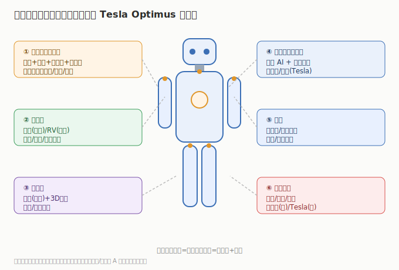

# 01 技术体系与发展脉络

> 人形机器人不是一台机器，而是一套「精密制造 + AI 控制」的系统。先搞清楚由哪些部件组成、哪个最值钱，才能看懂 A 股为什么炒丝杠和减速器。

## 1.1 一台人形机器人由什么组成

以特斯拉 Optimus 为例，核心子系统：

| 子系统 | 作用 | 关键部件 | A 股机会 |
|--------|------|---------|---------|
| **执行器（关节）** | 让身体动起来 | 丝杠（行星滚柱）、电机、减速器、编码器 | 三花/拓普/北特/贝斯特/绿的/双环 |
| **电机** | 提供扭矩 | 空心杯电机、无框力矩电机 | 鸣志电器/江苏雷利 |
| **减速器** | 降速增矩 | 谐波减速器（轻载）、RV 减速器（重载） | 绿的谐波/双环传动/中大力德 |
| **传感器** | 感知力/位置/环境 | 力矩传感器、视觉（3D）、触觉 | 柯力传感/奥比中光 |
| **大脑（控制器）** | AI 推理与运动规划 | 端侧算力 + 控制算法 | 偏软件/美股（Tesla） |
| **整机集成** | 总装 | 骨架/电池/系统 | 优必选（港股）/Tesla（美股） |

## 1.2 最值钱的环节：执行器与丝杠

- **线性执行器**是人形机器人用量最大的部件（四肢+躯干几十个），核心是高精度**行星滚柱丝杠**——把电机的旋转变成直线推力，要求高承载、高精度、长寿命。
- 丝杠单机价值量高、技术壁垒强，是 A 股最被看好的环节（北特科技、贝斯特、五洲新春、拓普、三花均在布局）。
- **减速器**：谐波减速器用于轻载关节（绿的谐波），RV 减速器用于髋/腰等重载关节（双环传动、中大力德）。

## 1.3 电机与传感器

- **空心杯电机 / 无框力矩电机**：用于手指、腕部等小空间高扭矩场景（鸣志电器、江苏雷利）。
- **力矩传感器**：让机器人「感知用力大小」，是安全交互与精细操作的关键（柯力传感）。
- **3D 视觉**：让机器人「看清」环境与物体（奥比中光）。

## 1.4 大脑：AI 控制的归宿

- 运动控制依赖端侧 AI（大模型 + 强化学习），消耗算力但不单独体现在机器人公司财报（Tesla 用自研 Dojo/英伟达芯片）。
- 对 A 股投资者，这部分主要通过「AI 算力芯片 / 存储」板块间接受益，本板块聚焦硬件零部件与整机。

## 1.5 演进主线

1. **从演示到量产**：2023–2024 以视频演示为主；2025 起小批量工厂部署；2026–2027 看量产拐点。
2. **降本曲线**：单机 BOM 从数十万美元向 2–3 万美元下探，靠丝杠/减速器/电机国产化与规模效应。
3. **AI 能力提升**：端侧大模型让机器人从「预设动作」走向「自主任务」，打开应用天花板。

> 投资含义：**丝杠/减速器/电机/传感器是价值量最高、国产替代弹性最大的环节；整机在港股/美股，A 股赚零部件放量与替代。**

---

---

> **版本**：v1.0（已核对）｜**更新日期**：2026-07-11｜**数据来源**：行业共识性技术框架；财务数据见各子文件（neodata-financial-search，东方财富）
