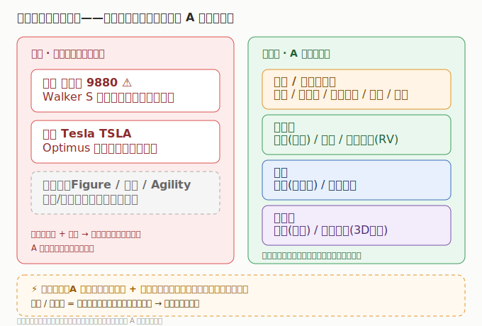

# 03 市场格局与竞争态势

> 人形机器人格局的特殊性：整机稀缺（港股/美股），零部件内卷但弹性大（A股）。理解这个「错位」，才能理解为什么 A 股炒零部件、整机却在海外。

## 3.1 整机：高度集中，且在海外

- **全球玩家**：Tesla（Optimus）、优必选（Walker S）、Figure、宇树、Agility 等。
- **上市整机标的稀缺**：优必选（港股 9880）是港股唯一纯人形机器人整机公司；Tesla（美股）Optimus 为期权性业务（财报未单列）。
- A 股几乎无纯整机上市公司（多为零部件供应商），这是人形机器人板块「A 股赚零部件、整机在海外」的根本原因。

## 3.2 零部件：A 股百花齐放

- **丝杠**：北特科技、贝斯特、五洲新春，以及拓普/三花通过执行器总成切入。
- **减速器**：绿的谐波（谐波）、双环传动 / 中大力德（RV）。
- **电机**：鸣志电器（空心杯）、江苏雷利。
- **传感器**：柯力传感（力矩）、奥比中光（3D 视觉）。
- 特点：单家营收规模差异大（三花/拓普 300 亿级 vs 绿的/奥比 数亿级），但机器人业务占比与弹性不同——小公司弹性更大，大公司确定性更高。

## 3.3 国产替代空间

| 环节 | 国产化进度 | 代表 |
|------|-----------|------|
| 丝杠（行星滚柱） | 突破中，良率/一致性是关键 | 北特/贝斯特 |
| 谐波减速器 | 较成熟，份额提升 | 绿的谐波 |
| RV 减速器 | 突破中 | 双环/中大力德 |
| 空心杯电机 | 突破中 | 鸣志/江苏雷利 |
| 力矩/3D 视觉 | 较成熟 | 柯力/奥比中光 |

> 核心认知：**整机在港股/美股，A 股赚「零部件放量 + 国产替代」双击**；丝杠/减速器是价值量最高、壁垒最强的环节，弹性最大。

## 3.4 竞争要点

- **绑定大客户**：谁能进 Tesla / 优必选 / 头部整机厂供应链，谁有确定性（三花/拓普的特斯拉链预期）。
- **量产能力**：从样品到百万台级，良率/成本/交付是分水岭。
- **技术壁垒**：丝杠/减速器的一致性与寿命，是中长期护城河。

---

---

> **版本**：v1.0（已核对）｜**更新日期**：2026-07-11｜**数据来源**：市场份额为行业研究共识性估算；财务数据见各子文件（neodata-financial-search，东方财富）
