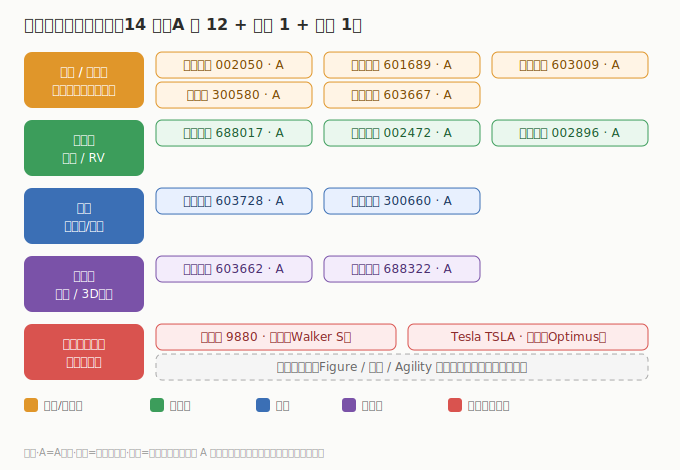

# 04 核心公司分析

> **给投资者的第一句话**：人形机器人公司多、环节杂、整机与零部件错位是最大特征。本节只做「索引 + 一句话逻辑 + 真实财务」，逐家深挖在子文件里。财务为 **2025 年报 / 最新财年** 口径，数据来自 neodata（东方财富）核对。

## 4.1 A 股（12 家，2025 年报）

| 公司 | 代码 | 环节 | 2025 营收 | 2025 营收同比 | 2025 归母净利 | 一句话逻辑 |
|------|------|------|----------|--------------|--------------|------------|
| 三花智控 | 002050 | 执行器/热管理 | ¥310.12 亿 | +10.97% | ¥40.63 亿 | 特斯拉机器人链，执行器+热管理总成 |
| 拓普集团 | 601689 | 执行器/结构件 | ¥295.81 亿 | +11.21% | ¥27.79 亿 | 特斯拉机器人链，直线执行器总成 |
| 双环传动 | 002472 | RV 减速器 | ¥91.12 亿 | +3.77% | ¥12.62 亿 | RV 减速器/齿轮，机器人重载关节 |
| 江苏雷利 | 300660 | 电机 | ¥41.80 亿 | +18.77% | ¥2.99 亿 | 电机，机器人关节驱动 |
| 柯力传感 | 603662 | 力传感器 | ¥15.58 亿 | +20.33% | ¥3.41 亿 | 力矩传感器，机器人「触觉」 |
| 五洲新春 | 603667 | 轴承/丝杠 | ¥33.43 亿 | +2.41% | ¥0.91 亿 | 轴承/丝杠，执行器零部件 |
| 鸣志电器 | 603728 | 电机 | ¥27.62 亿 | +14.32% | ¥0.61 亿 | 空心杯电机，手指/小关节 |
| 北特科技 | 603009 | 丝杠 | ¥23.23 亿 | +14.79% | ¥1.20 亿 | 行星滚柱丝杠，线性执行器核心 |
| 贝斯特 | 300580 | 丝杠 | ¥15.04 亿 | +10.82% | ¥2.78 亿 | 丝杠+精密制造，执行器延伸 |
| 绿的谐波 | 688017 | 谐波减速器 | ¥5.71 亿 | +47.31% | ¥1.24 亿 | 谐波减速器，轻载关节核心 |
| 中大力德 | 002896 | 减速器 | ¥10.41 亿 | +6.61% | ¥0.63 亿 | 减速器，机器人关节 |
| 奥比中光 | 688322 | 3D 视觉 | ¥9.41 亿 | +66.66% | ¥1.28 亿 | 3D 视觉，环境感知 |

> A 股 26Q1：neodata 利润表接口未返回单季绝对营收/净利，故绝对值标「数据未收录」；26Q1 营收同比已查到 5 家（三花/绿的/双环/鸣志/柯力），中大力德仅披露归母同比（-36.42%），均在 [A股子文件](./A股/人形机器人A股.md) 列示。逐家深挖见 A股子文件。

## 4.2 港股（1 家）

| 公司 | 代码 | 环节 | 最新财年营收 | 营收同比 | 净利 | AI 落点 |
|------|------|------|------------|----------|------|---------|
| 优必选 UBTECH | 9880 | 人形机器人整机 | ~¥24.88 亿 ⚠️ | +53.29% | 亏损 -6.20 亿 | Walker S 工业版整机龙头，港股唯一纯标的 |

> ⚠️ 优必选 neodata 营收/净利与卖方共识（约 ¥20.01 亿 / 亏损 ¥7.03 亿）存在偏差，研判以公司正式财报为准，详见 [港股子文件](./港股/人形机器人港股.md)。

## 4.3 美股（1 家）

| 公司 | 代码 | 环节 | 最新财年 | 财年区间 | 财年营收 | 营收同比 | 财年净利 | 最新单季 | 单季营收 | 单季营收同比 | 单季净利 | AI 落点 |
|------|------|------|----------|----------|----------|----------|----------|----------|----------|--------------|----------|---------|
| Tesla TSLA | TSLA | 整车/储能/Optimus | FY2025 | 2025 全年 | $948.27 亿 | -2.93% | $37.94 亿 | 2026 Q1 | $223.87 亿 | +15.8% | $4.77 亿 | Optimus 研发方，机器人收入未单列 |

> Tesla 财报含汽车/储能，Optimus 机器人收入未单独披露，属期权性业务；单季数据见 [美股子文件](./美股/人形机器人美股.md)。

---

---

> **版本**：v1.0（已核对）｜**更新日期**：2026-07-11｜**数据来源**：neodata-financial-search（东方财富），A股 2025 年报 + 2026Q1（Q1 绝对数 neodata 未收录）、港股/美股最新财年+单季；涨跌配色：正增长红、负增长/亏损绿
