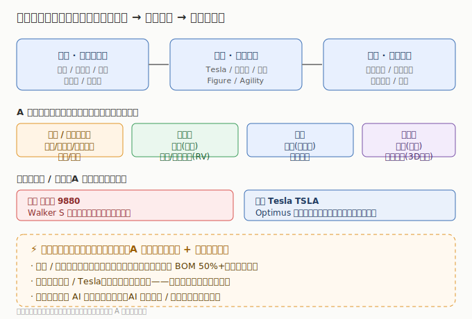

# 人形机器人行业研究

> **一句话定位**：人形机器人是 AI 从「软件」走向「物理世界」的落地——大模型有了身体，才能真的干活。它是 AI 主线最具想象空间的延伸，A 股以零部件（丝杠/减速器/电机/传感器）为主，整机在港股（优必选）与美股（Tesla）。

AI 的下一个十年不止在屏幕里。当大模型具备推理与规划能力，把它装进一双腿、一双手，就能替代工厂装配、仓储搬运、商业服务等真实劳动。2025 年起，Tesla Optimus、优必选 Walker、Figure、宇树等产品加速从演示走向小批量部署，**「AI + 硬件」的具身智能（Embodied AI）成为最热赛道**。本板块覆盖人形机器人的核心部件链条与整机厂，与「AI 算力芯片 / 存储 / 算力基础设施」互补——机器人既消耗 AI 算力（端侧推理），又拉动精密制造需求。

---

---

## 关键数据速览（2025 年报 / 最新财年，neodata 核对）

| 公司 | 市场 | 2025 营收 | 同比 | 归母净利润 | 一句话定位 |
|------|------|----------|------|-----------|------------|
| 三花智控 002050 | A股 | ¥310.12 亿 | +10.97% | ¥40.63 亿 | 热管理+执行器，特斯拉机器人链 |
| 拓普集团 601689 | A股 | ¥295.81 亿 | +11.21% | ¥27.79 亿 | 执行器+结构件，特斯拉机器人链 |
| 双环传动 002472 | A股 | ¥91.12 亿 | +3.77% | ¥12.62 亿 | RV 减速器/齿轮，机器人关节 |
| 绿的谐波 688017 | A股 | ¥5.71 亿 | +47.31% | ¥1.24 亿 | 谐波减速器，机器人关节核心 |
| 柯力传感 603662 | A股 | ¥15.58 亿 | +20.33% | ¥3.41 亿 | 力传感器，机器人「触觉」 |
| 优必选 9880 | 港股 | ~¥24.88 亿 ⚠️ | +53.29% | 亏损 -6.20 亿 | 人形机器人整机龙头（Walker S） |
| Tesla TSLA | 美股 | $948.27 亿 | -2.93% | $37.94 亿 | Optimus 研发方，机器人收入未单列 |

> ⚠️ 优必选 neodata 营收/净利与卖方共识（约 ¥20.01 亿 / 亏损 ¥7.03 亿）存在偏差，详见 [港股子文件](./港股/人形机器人港股.md)；Tesla 财报未单独披露机器人分部收入，Optimus 为期权性业务。完整 14 家（A股 12 + 港股 1 + 美股 1）见 [04 章](./04-核心公司分析.md)。

---

## 市场有多大（行业研究口径）

- **人形机器人出货量**：2025 年约数万台级（以演示/试点为主），预计 2026–2027 年随 Tesla/优必选等量产爬坡进入十万–百万台临界点；单台 BOM 成本正从数十万美元向 2–3 万美元下探。
- **核心零部件市场**：丝杠（行星滚柱丝杠）、谐波/RV 减速器、空心杯电机、力矩传感器是价值量最高、国产化弹性最大的环节，单机价值量合计占比可达 50%+。
- **A 股逻辑**：整机组装多在港股/美股，A 股赚「零部件放量 + 国产替代」——丝杠/减速器/电机/传感器公司直接受益于单机用量与出货量双击。

> 数据来源：2026 年产业链研究报告（行业口径）量级估算；财务数据见各子文件（neodata-financial-search，东方财富）。

---

## 本章导航

- [01 技术体系与发展脉络](./01-技术体系与发展脉络.md) — 执行器/减速器/电机/传感器/视觉/整机
- [02 产业链深度拆解](./02-产业链深度拆解.md) — 从丝杠到整机的价值分布
- [03 市场格局与竞争态势](./03-市场格局与竞争态势.md) — A股零部件 vs 港股/美股整机
- [04 核心公司分析](./04-核心公司分析.md) — 12+1+1 索引表
- [05 未来趋势与投资逻辑](./05-未来趋势与投资逻辑.md) — 量产拐点、投资框架、风险

> **版本**：v1.0（已核对）｜**更新日期**：2026-07-11｜**数据来源**：neodata-financial-search（东方财富），A股 2025 年报 + 2026Q1（Q1 绝对数 neodata 未收录）、港股/美股最新财年+单季（优必选口径异常已标注）；市场规模来自 2026 年产业链研究报告（行业口径）
