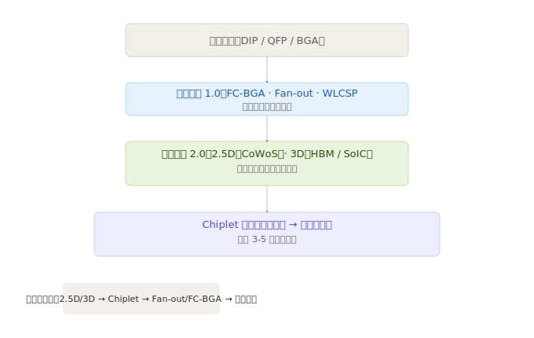

# 第一章：技术体系与发展脉络

要理解先进封装的投资机会，首先要搞清楚「先进封装」到底是一堆什么技术、各自解决什么问题、谁在用、谁受益。

---

## 1.1 为什么需要先进封装？

传统封装的本质是「保护芯片 + 引出导线」。把做好的芯片用塑料或陶瓷包起来，用金属线把芯片上的焊盘连到外面，搞定。这种模式在摩尔定律快速推进的年代够用——每 18 个月芯片本身性能翻倍，谁在乎封装？

但摩尔定律在 7nm 之后明显放缓。芯片制造成本指数级上升，一颗 3nm 芯片的设计费用超过 5 亿美元。于是行业转向了另一个方向：**既然造更大更密的单芯片越来越贵，不如把多个芯片「拼」在一起，通过先进封装实现类似甚至更高的性能。**

这就是先进封装的底层逻辑：**从「把一颗芯片封起来」变成「把多颗芯片集成为一个系统」**。

---

## 1.2 技术演化全景

封装技术从简单到复杂，大致经历了三代演化：

| 阶段 | 年代 | 代表技术 | 核心特征 | 投资意义 |
|------|------|---------|---------|---------|
| **传统封装** | 1980s-2010s | DIP、QFP、BGA | 引线键合，芯片平放，I/O 密度低 | 已进入存量淘汰阶段，关注度低 |
| **先进封装 1.0** | 2010s-2020s | FC-BGA、Fan-out WLP | 倒装焊、晶圆级封装，大幅提升 I/O 密度 | 当前主流方案，手机/PC 芯片标配 |
| **先进封装 2.0** | 2020s-至今 | 2.5D（CoWoS）、3D（SoIC/HBM）| 多芯片异构集成，垂直堆叠 | AI/超算核心瓶颈，增速最快 |

> **投资者关键认知**：不是所有「先进封装」都值得关注。真正的增量在 2.5D/3D——这是 AI 算力爆发的直接受益环节，也是技术壁垒最高、利润最厚的部分。FC-BGA 和 Fan-out 虽然也叫「先进」，但已是成熟工艺，增速较慢。

---

## 1.3 核心技术拆解

### 1.3.1 FC-BGA（倒装球栅阵列）

**是什么**：把芯片「倒扣」在封装基板上，用焊球代替传统的金线连接。对比老式打线封装，FC-BGA 的 I/O 密度提高了 10 倍以上。

**谁在用**：几乎所有 CPU/GPU/FPGA 都在用。英特尔、AMD 的桌面和服务器芯片，英伟达的游戏 GPU，高通、联发科的手机 SoC——量最大的先进封装方案。

**市场地位**：FC-BGA 是先进封装中出货量最大的品类，2024 年约占先进封装市场的 40%+。但增速趋缓（个位数），因为它已经是成熟技术，增量来自芯片出货量增长而非技术迭代。

**投资关联**：
- 封装厂：日月光、长电科技、通富微电均大量承接 FC-BGA 订单
- 基板厂：FC-BGA 需要高端 ABF 载板，拉动深南电路、兴森科技、欣兴电子的载板需求
- 设备厂：FC-BGA 产线扩产需要大量贴片机、回流焊炉等

---

### 1.3.2 Fan-out（扇出型封装）与 WLCSP（晶圆级芯片尺寸封装）

**是什么**：在晶圆阶段就把连接点「扇出」到芯片外围，省掉了传统的封装基板，封装后的芯片体积几乎和裸芯片一样大。

**两种路线**：
| | Fan-out WLP（晶圆级扇出） | Fan-out PLP（面板级扇出） |
|---|---|---|
| 载体 | 12 英寸晶圆 | 面板（类似 LCD 产线） |
| 效率 | 一片晶圆封装几百颗 | 一块面板封装几千颗 |
| 成本 | 较高 | 理论成本更低 |
| 成熟度 | 已量产（台积电 InFO） | 产业初期，日月光/力成在推进 |
| 应用 | 手机处理器、射频 | 未来可能用于中端芯片 |

**谁在用**：
- **台积电 InFO**（Integrated Fan-Out）：苹果 A 系列处理器自 iPhone 7 开始使用，独家绑定台积电
- **日月光 FOCoS**：高通、联发科的手机芯片和射频模组
- **长电科技**：Fan-out 产能已规模化，国内设计公司的重要选项

**投资关联**：
- Fan-out 是手机/可穿戴设备小型化的核心方案，属于增量稳定但爆发性不强的赛道
- 面板级扇出（FOPLP）如果量产成功，可能大幅降低中端芯片的封装成本，值得跟踪但短期贡献有限

---

### 1.3.3 2.5D 封装（硅中介层互联）—— 当前最核心赛道

**是什么**：多颗芯片并排放在一片「硅中介层」（Silicon Interposer）上，通过中间层的微米级布线实现高速互联。芯片之间不用走外面的 PCB 板，带宽暴增、功耗暴降。

**为什么是「2.5D」而非「3D」**：芯片是水平排列的（不是垂直堆叠），但互联密度远超传统 2D 封装，处于 2D 和 3D 之间，所以叫 2.5D。

**核心应用场景**：

| 场景 | 典型产品 | 封装内容 | 为什么必须用 2.5D |
|------|---------|---------|-----------------|
| AI 训练芯片 | 英伟达 H100/B200 | GPU + 6颗 HBM 内存 | GPU 和 HBM 之间需要 TB/s 级带宽，传统封装（~100GB/s）根本不够 |
| AI 推理芯片 | 英伟达 B300、AMD MI300 | GPU/APU + HBM | 同上 |
| 高端 FPGA | 赛灵思 Versal | 逻辑芯片 + HBM + 高速 SerDes | 异构集成需求 |
| 网络芯片 | 博通 Tomahawk 5 | 交换芯片 + HBM | 大带宽需求 |

**主要玩家**：

| 公司 | 平台名称 | 技术路线 | 当前产能状态 |
|------|---------|---------|------------|
| **台积电** | CoWoS（Chip on Wafer on Substrate） | 硅中介层 + TSV | 绝对主导，市占率 ~90%，月产能 2023 年 1.5 万片 → 2025 年目标 6-7 万片+ |
| **三星** | I-Cube | 硅中介层，类似 CoWoS | 产能远落后于台积电，主要自用和绑定少数客户 |
| **英特尔** | EMIB | 嵌入式硅桥（不用整片中阶层） | 技术路线不同，成本较低，但生态不成熟 |

**投资关键判断**：
- 2.5D 封装是当前先进封装行业最大的增量市场，也是利润最厚的环节
- 台积电 CoWoS 一家独大（~90% 市占率），但产能缺口（~20%）正在把订单外溢给日月光、长电科技等 OSAT 厂商
- CoWoS 的供应瓶颈直接决定了英伟达 GPU 的出货量——封装产能 = AI 芯片出货量上限

---

### 1.3.4 3D 封装（垂直堆叠）—— 下一个爆发点

**是什么**：芯片直接垂直堆叠，上下层之间通过 TSV（硅通孔，Through-Silicon Via）或 Hybrid Bonding（混合键合）直接互联。这是目前封装密度最高的方案。

**两种主流路线**：

| | HBM 堆叠（存储） | 逻辑 3D 堆叠 |
|---|---|---|
| 堆叠内容 | 多层 DRAM 芯片 + 底层逻辑芯片 | 逻辑芯片 + 逻辑芯片 |
| 代表技术 | HBM3/HBM3E/HBM4 | 台积电 SoIC、英特尔 Foveros |
| 互联方式 | TSV + Micro-bump | Hybrid Bonding（铜对铜直接键合） |
| 成熟度 | 已量产（HBM3 12层） | 小规模量产（AMD 3D V-Cache） |
| 当前应用 | 英伟达/AMD AI 芯片配套内存 | AMD Ryzen 3D V-Cache、英特尔 Meteor Lake |
| 未来方向 | HBM4 16层，带宽翻倍 | Chiplet 逻辑堆叠，异构计算 |

**HBM（高带宽内存）与先进封装的关系**：
HBM 是当前 3D 封装最大规模的应用。以英伟达 H100 为例：1 颗 GPU + 6 颗 HBM3 堆叠内存，每颗 HBM3 内部堆叠 8-12 层 DRAM。一颗芯片背后是几十片晶圆的封装复杂度。

**谁受益**：
- **台积电 SoIC**：AMD 的 3D V-Cache 芯片使用 SoIC 技术，这是目前最先进的逻辑 3D 堆叠量产案例
- **三星 X-Cube**：绑定自家 HBM + 代工，试图形成存储器+逻辑的一体化方案
- **英特尔 Foveros**：在 Meteor Lake 处理器中首次大规模商用，但市场反响一般

**投资意义**：
- 3D 封装是增速最快的细分赛道之一，但绝对体量还小于 2.5D
- HBM 是当前 3D 封装的最大单一市场，HBM 出货量直接拉动 3D 封装需求
- Hybrid Bonding 是 3D 封装的终极技术方向（对标 TSMC SoIC），掌握者拥有下一代封装的话语权

---

### 1.3.5 Chiplet（小芯片）—— 先进封装的下半场

**是什么**：把一颗大芯片「拆」成多个小芯粒（Chiplet），然后用先进封装技术把芯粒拼回去。每个芯粒可以用不同工艺制造（7nm 做计算芯粒，14nm 做 I/O 芯粒），大幅降低成本和提升良率。

**Chiplet 与先进封装的关系**：Chiplet 是「设计理念」，先进封装是「实现手段」。Chiplet 依赖 2.5D/3D 封装来完成芯粒间的互联，没有先进封装就没有 Chiplet。

**Chiplet 的核心价值**：

| 维度 | 单片大芯片（SoC） | Chiplet 方案 |
|------|-----------------|-------------|
| 制造成本 | 全部用最先进工艺，成本指数级增长 | 不同芯粒用不同工艺，总体成本更低 |
| 良率 | 面积越大良率越差 | 小芯粒良率高，组合后整体良率提升 |
| 灵活性 | 重新设计整颗芯片 | 可以像搭积木一样组合不同芯粒 |
| 迭代速度 | 牵一发动全身 | 单个芯粒可独立迭代 |

**谁在推进**：

| 公司 | Chiplet 实践 | 封装方式 |
|------|------------|---------|
| **AMD** | 从 Zen 2（2019 年）开始全面 Chiplet 化，是业界先驱 | 台积电 CoWoS（GPU）、台积电 SoIC（3D V-Cache） |
| **英特尔** | Meteor Lake 用 Foveros 拼装多芯粒 | 自家 EMIB + Foveros |
| **苹果** | M1 Ultra 用 UltraFusion 桥接两颗 M1 Max | 台积电 InFO-LSI |
| **华为** | 昇腾 AI 芯片采用 Chiplet 设计 | 国内封装厂 |
| **英伟达** | Blackwell B200 已包含 Chiplet 元素 | 台积电 CoWoS-L |

**UCIe 标准**：Universal Chiplet Interconnect Express，一个开放的 Chiplet 互联标准（2022 年发布）。类比 USB 对电脑外设的意义——如果所有芯粒遵循同一标准，任何厂商的芯粒都可以拼在一起。

**对封装行业的深远影响**：
- **中立 OSAT 价值上升**：Chiplet 生态越开放，越需要中立的封装平台（而非绑定某一家 Foundry 的封装方案）。日月光、长电科技是 UCIe 标准的核心参与者
- **封装从「附加值低的后道工序」变成「系统集成的核心」**：封装厂不再只是「把芯片包起来」，而是在芯片设计阶段就要深度参与
- **标准化降低门槛**：UCIe 如果普及，封装的竞争会从「谁绑定了台积电」延伸到「谁能在标准生态中提供最好的集成服务」

---

## 1.4 技术路线总结

**投资优先级**：2.5D/3D（当前核心） > Chiplet（中期主线） > Fan-out/FC-BGA（存量升级） > 传统封装（被替代方向）

---

> **下一章**：[02-产业链深度拆解](./02-产业链深度拆解.md)
