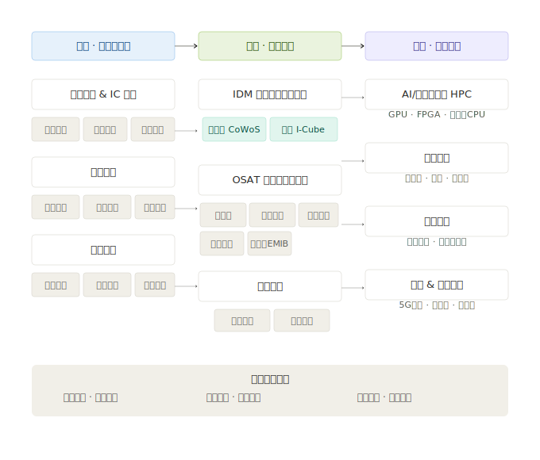

# 第二章：产业链深度拆解

先进封装的产业链不是简单的「上中下游」三句话能说完的。上游分材料、设备、基板三大块，每一块又分多个细分赛道；中游封装有三种截然不同的商业模式；下游的需求来自几个完全不同逻辑的终端市场。

---

## 2.1 产业链全景速览

---

## 2.2 上游 · 封装基板与 IC 载板

封装基板（IC Substrate）是先进封装中最核心的「基础设施」。它的作用是：在芯片和 PCB 之间架一座桥，把芯片上密密麻麻的焊点（微米级间距）转换成 PCB 能处理的信号（毫米级间距）。

### 2.2.1 封装基板的分类

| 基板类型 | 核心材料 | 主要客户 | 中国代表公司 | 全球格局 |
|---------|---------|---------|------------|---------|
| **BT 载板** | BT 树脂（Bismaleimide Triazine） | 存储芯片（DRAM/NAND）、射频芯片 | 深南电路（成熟量产） | 日本/中国台湾主导，国产化率较高 |
| **ABF 载板** | ABF 薄膜（Ajinomoto Build-up Film） | CPU/GPU/FPGA 等高端逻辑芯片 | 深南电路（送样中）、兴森科技（建产线） | **日本味之素垄断 ABF 薄膜材料**，基板制造由欣兴/景硕/揖斐电主导 |
| **MIS 载板** | 模塑互联基板 | 模拟芯片、功率半导体 | 国内小规模 | 台系为主 |
| **硅中介层** | 硅晶圆（用于 2.5D CoWoS） | 高端 AI 芯片 | 台积电自产 | 台积电垄断 |

### 2.2.2 ABF 载板：先进封装最大的上游瓶颈

**为什么 ABF 载板这么重要？**
FC-BGA 封装必须用 ABF 载板。每颗服务器 CPU、每颗 AI GPU，都需要一块高端 ABF 载板。载板上的线路层数越多（14-20 层）、线宽越细，能支持的芯片越高端。

**供需格局**：

| 指标 | 数据 |
|------|------|
| 全球 ABF 载板市场规模（2024 年） | 约 55 亿美元 |
| 2025-2028 年需求 CAGR | 整体 ~10%，AI 驱动的高端载板细分 ~22% |
| 2025-2028 年供给 CAGR | ~12% |
| 供需状态 | 2024 年起已经供不应求，缺口预计持续扩大至 2027 年后 |
| 关键原材料（ABF 薄膜） | 日本味之素全球垄断，2026 年 Q2/Q3 全面涨价 30%（高端 AI/HBM 型号可能涨 50%） |

**国产化进展**：
- **深南电路**：BT 载板已大规模量产，ABF 载板正在送样验证（FC-BGA 方向），是国产化进度最快的玩家
- **兴森科技**：新建 ABF 载板产线，面向 FC-BGA 封装，处于产能爬坡期
- **差距**：高端 ABF 载板（14 层以上）仍由台系（欣兴、景硕）日系（揖斐电）主导，国产化率极低

**投资关联**：
- ABF 薄膜涨价 → 载板成本上升 → 封装厂毛利率承压（短期负面影响）
- ABF 载板国产化 → 深南电路、兴森科技是最大受益标的
- 载板供不应求 → 台系载板厂（欣兴、景硕）业绩确定性高

### 2.2.3 硅中介层（Silicon Interposer）—— CoWoS 的核心组件

硅中介层是 2.5D 封装的核心。它本质上是一块「开了很多微小通孔（TSV）的硅片」，用来连接上面的 GPU 芯片和下面的 ABF 载板。

**关键事实**：
- 硅中介层由台积电自己制造（用成熟制程的晶圆厂产能），不外包
- 这也是台积电在 2.5D 封装上形成垄断的重要原因——它有晶圆厂，能自产硅中介层，OSAT 厂商做不到
- 三星也有自产硅中介层的能力（自家晶圆厂），但产能和良率远落后于台积电

---

## 2.3 上游 · 封装材料

先进封装用到的材料远比传统封装复杂。从大类上可以分：

### 2.3.1 关键封装材料体系

| 材料类别 | 具体产品 | 用途 | 国产代表 | 进口依赖度 |
|---------|---------|------|---------|-----------|
| **底部填充胶** | Underfill | 填充芯片与基板之间的空隙，保护焊点 | 德邦科技 | 高（日系为主） |
| **封装基板材料** | ABF 薄膜、BT 树脂 | 基板的核心原材料 | 无（ABF 味之素垄断） | **极高** |
| **键合丝/焊料** | 金线、铜线、锡球 | 连接芯片与基板 | 康强电子 | 中 |
| **电镀液** | 铜/锡电镀液 | 在晶圆上沉积金属线路（RDL/TSV 工艺） | 上海新阳 | 高 |
| **前驱体/电子特气** | TEOS、TDMAT 等 | 薄膜沉积工艺用 | 雅克科技、南大光电 | 高 |
| **光刻胶** | 封装用光刻胶 | 封装图形化工艺 | 晶瑞电材、上海新阳 | 极高 |
| **EMC 塑封料** | Epoxy Molding Compound | 把芯片用塑封料包起来 | 华海诚科 | 高（日系主导） |
| **热界面材料** | TIM（导热硅脂/凝胶） | 芯片散热 | 德邦科技 | 高 |

### 2.3.2 材料环节的核心投资逻辑

1. **「卖铲子」逻辑**：封装产能扩得越猛，材料需求越大。这不是选股问题，是整个材料板块的 β 机会。
2. **国产替代是主旋律**：上述材料几乎每一项的国产化率都不到 30%，日系企业（住友、日立化成、味之素等）主导。任何一个细分材料突破都有独立行情。
3. **关注 ABF 薄膜替代**：味之素涨价 30% 是重大催化，谁能在高端 ABF 薄膜上突破（哪怕只是部分替代），谁就能获得巨大α。
4. **上海新阳和雅克科技**是 A 股封装材料中最核心的两个标的。前者在电镀液和光刻胶上布局深，后者在前驱体和电子特气上领先。

---

## 2.4 上游 · 封装设备

### 2.4.1 关键设备类型

| 设备类型 | 用途 | 全球格局 | 国产代表 |
|---------|------|---------|---------|
| **刻蚀设备** | 在硅中介层或晶圆上刻出 TSV 通孔 | 泛林（Lam）、应用材料 | **北方华创**（ICP 刻蚀）、**中微公司**（CCP 刻蚀） |
| **薄膜沉积设备**（PVD/CVD/ALD） | 在 TSV 孔壁上沉积绝缘层和金属层 | 应用材料、泛林 | **北方华创**（PVD 国内独家）、**中微公司**（ALD） |
| **光刻设备** | 封装图形化 | 佳能、尼康（封装用光刻机精度要求低于芯片制造） | 上海微电子（封装用光刻机） |
| **CMP 设备** | 研磨平坦化 | 应用材料 | 华海清科 |
| **贴片机/键合机** | 把芯片精确贴到基板上 | ASM Pacific、Besi | 快克智能 |
| **检测设备** | 封装后检测缺陷 | 科磊（KLA）、泰瑞达 | **华峰测控**、长川科技 |

### 2.4.2 封装设备的特殊之处

**芯片制造的前道设备（刻蚀/薄膜沉积/光刻）和先进封装设备有很大重叠**。台积电的硅中介层本质上是用成熟制程的晶圆厂设备造的。这意味着：
- 北方华创、中微公司既受益于芯片制造的扩产，也受益于先进封装的扩产——双重驱动
- 封装设备的国产化率相对更高（因为封装对精度的要求低于芯片制造），但高端环节（精密贴片、高端检测）仍被海外垄断

---

## 2.5 中游 · 封装制造（三种商业模式）

先进封装的中游不是一类玩家，而是**三种截然不同的商业模式**：

### 2.5.1 Foundry 封装（台积电）

| 维度 | 特征 |
|------|------|
| **核心逻辑** | 芯片在我这制造，封装我也一并做了——「一站式」服务，客户不用找第二家 |
| **代表** | 台积电（CoWoS/InFO/SoIC） |
| **优势** | 与芯片制造无缝衔接；硅中介层自产；工艺控制权在自己手里 |
| **劣势** | 产能有限；客户担心被「绑定」——一旦用了 CoWoS，几乎不可能转单 |
| **定价权** | 极强。CoWoS 不是按「封装成本+利润」定价，而是按「客户愿意付多少钱」定价 |
| **对行业的影响** | 台积电把封装变成了绑定客户的壁垒。英伟达/AMD 离不开 CoWoS，意味着它们也离不开台积电的代工 |

### 2.5.2 OSAT 封装（日月光、长电科技、通富微电、华天科技）

| 维度 | 特征 |
|------|------|
| **核心逻辑** | 独立第三方封装厂，来料加工。客户把芯片拿来，我帮你封好再还给你 |
| **代表** | 日月光（全球第一）、长电科技（全球第三）、通富微电、华天科技 |
| **优势** | 中立（客户不用绑定单一代工厂）；产能弹性大；规模效应带来成本优势 |
| **劣势** | 与制造环节割裂；先进封装技术（尤其是含硅中介层的方案）追赶台积电困难 |
| **定价权** | 较弱。OSAT 本质上是服务商，定价能力远不如台积电这样的「基础设施提供者」 |
| **对行业的影响** | Chiplet 和 UCIe 标准利好 OSAT——越开放，中立封装的平台价值越大 |

### 2.5.3 IDM 封装（三星、英特尔）

| 维度 | 特征 |
|------|------|
| **核心逻辑** | 我有自己的芯片 + 自己的厂 + 自己的封装——全包，但主要服务自己 |
| **代表** | 三星（I-Cube/X-Cube）、英特尔（EMIB/Foveros） |
| **优势** | 全产业链协同（设计+制造+封装一家搞定） |
| **劣势** | 产能和封装能力主要为自己服务，外部客户拓展难（谁会把芯片给竞争对手封装？） |
| **定价权** | N/A（不对外，无所谓定价） |
| **对行业的影响** | 英特尔 IDM 2.0 战略试图把先进封装作为吸引代工客户的筹码——「用我的代工，就能用我的先进封装」 |

### 三种模式的投资含义

| 模式 | 代表 | 投资逻辑 | 风险 |
|------|------|---------|------|
| **Foundry** | 台积电 | AI 算力最大受益者，封装+代工双壁垒 | 地缘政治；产能瓶颈 |
| **OSAT** | 日月光/长电 | Chiplet 标准化的最大受益者；封装外溢承接方 | 技术差距；利润率偏低 |
| **IDM** | 三星/英特尔 | 自用为主，封装能力是 IDM 2.0 战略的筹码而非独立利润中心 | 战略成功与否取决于代工生态 |

---

## 2.6 下游 · 终端应用与需求结构

先进封装的需求不是均匀分布的，而是高度集中在几个头部应用。

### 2.6.1 需求结构（2024 年估算）

| 应用领域 | 占先进封装需求比例 | 核心封装技术 | 增长驱动力 |
|---------|------------------|------------|-----------|
| **AI/HPC（高性能计算）** | ~35%（增速最快） | 2.5D CoWoS、3D SoIC/HBM | 英伟达/AMD AI 芯片出货量翻倍 |
| **智能手机** | ~25% | Fan-out、FC-BGA、SiP | 稳中有降（手机换机周期拉长） |
| **通信基站/网络** | ~15% | FC-BGA、SiP | 5G/6G 建设周期 |
| **汽车电子** | ~12% | FC-BGA、功率封装 | 自动驾驶芯片、车用 MCU 增长 |
| **PC/服务器** | ~8% | FC-BGA、Chiplet | 存量市场，Chiplet 升级需求 |
| **其他（消费电子/IoT）** | ~5% | WLCSP、SiP | 碎片化 |

### 2.6.2 下游的核心驱动逻辑

**AI/HPC 是当前唯一的核心增量来源**。其他需求要么增速平稳（手机、PC），要么体量尚小（汽车电子）。这意味着先进封装行业的景气度高度绑定 AI 产业链——AI 火，封装就火；AI 退潮，封装的所有逻辑都要重新定价。

---

## 2.7 先进封装与其他半导体板块的联动关系

| 关联板块 | 联动方式 | 联动强度 |
|---------|---------|---------|
| **晶圆制造（台积电）** | 台积电用 CoWoS 绑定代工客户；制造和封装是同一扇门的两把锁 | ★★★★★ |
| **芯片设计（英伟达/AMD）** | Chiplet 设计依赖封装实现；芯片架构师必须懂封装 | ★★★★★ |
| **存储芯片（HBM）** | HBM 本质是 3D 封装产品；HBM 出货量直接拉动封装需求 | ★★★★★ |
| **封装基板** | 每颗 FC-BGA 芯片配一块 ABF 载板；载板产能是封装扩产的上限 | ★★★★★ |
| **半导体设备** | 封装扩产拉动刻蚀/沉积/检测设备采购 | ★★★★ |
| **EDA 软件** | Chiplet 需要全新的 EDA 工具支持多芯粒协同设计 | ★★★ |
| **散热方案** | 3D 堆叠导致散热挑战剧增，拉动液冷/新材料需求 | ★★ |

---

> **上一章**：[01-技术体系与发展脉络](./01-技术体系与发展脉络.md)
> **下一章**：[03-市场格局与竞争态势](./03-市场格局与竞争态势.md)
