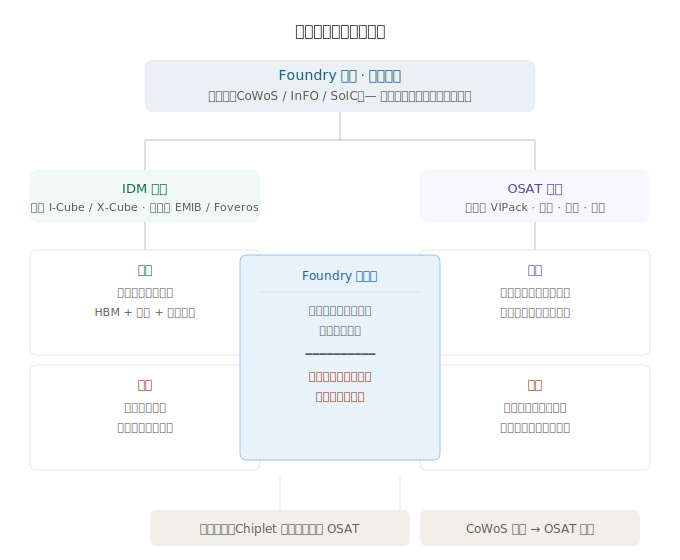
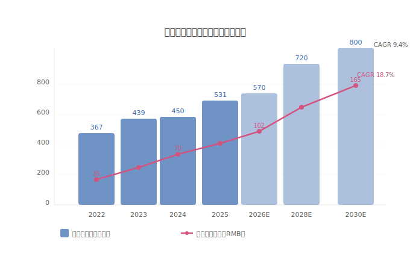

# 先进封装行业研究

> **视角定位**：投资者视角，关注产业链位置、核心公司、竞争格局与投资逻辑。技术概念点到为止，不深挖工艺细节。

---

## 一、什么是先进封装

传统封装就是把做好的芯片用塑料/陶瓷包起来、接上线。**先进封装**是在芯片封装环节引入更高密度的互联技术，让多个芯片（甚至不同工艺、不同功能的芯片）像搭积木一样「拼」在一起，实现更高的性能、更低的功耗、更小的体积。

### 主要技术类型

| 技术 | 一句话定位 | 典型应用 | 代表的公司阵营 |
|------|-----------|---------|--------------|
| **FC-BGA**（倒装球栅阵列） | 芯片倒扣在基板上，用焊球连接，主流方案 | CPU/GPU | 日月光、长电科技、通富微电 |
| **Fan-out**（扇出型封装） | 把连接点"扇"到芯片外面，体积更小 | 手机处理器 | 台积电 InFO、日月光 |
| **2.5D 封装** | 多颗芯片并排放在硅中介层上，通过中间层互联 | AI 加速器、HPC | 台积电 CoWoS、三星 I-Cube |
| **3D 封装** | 芯片垂直堆叠，直接上下互联 | HBM 内存、Chiplet | 台积电 SoIC、三星 X-Cube、英特尔 Foveros |
| **Chiplet**（小芯片） | 把大芯片拆成多个小芯粒再拼装 | 服务器 CPU | AMD、英特尔、华为 |

> **投资视角总结**：2.5D/3D 封装和 Chiplet 是当前最核心的技术竞争赛道，也是 AI 算力需求爆发的直接受益环节。

---

## 二、产业链全景

先进封装的产业链分三层，从上游的材料设备到中游的封装制造，再到下游的终端应用。

### 各环节的核心逻辑

| 环节 | 关键特征 | 投资意义 |
|------|---------|---------|
| **上游材料** | 封装基板、IC 载板需求旺盛，国产化替代空间大 | 受益于封装产能扩张，确定性高 |
| **上游设备** | 刻蚀、薄膜沉积、检测设备，高技术壁垒 | 国产化率低，弹性大 |
| **中游封装** | 产能为王，先进封装产能紧缺 | AI 产业链核心瓶颈，龙头受益最大 |
| **下游应用** | AI/HPC 需求爆发，车用芯片增长稳健 | 需求端持续拉动封装量价齐升 |

---

## 三、行业现状

### 全球市场

| 年份 | 市场规模（亿美元） | 同比增速 | 占整体封装市场比例 |
|------|-------------------|---------|-------------------|
| 2022 | ~367 | — | ~45% |
| 2023 | ~439 | +19.6% | ~48.8% |
| 2024 | ~450-519 | +10.9% | ~50%+ |
| 2025E | ~571 | +10%+ | ~55% |
| 2028E | ~786 | CAGR ~9.4% | ~60%+ |
| 2030E | ~800 | — | — |

*数据来源：Yole、中商产业研究院（不同机构口径有差异，取交叉验证后的区间值）*

### 中国市场

| 年份 | 市场规模（亿元人民币） | 增速 | 渗透率 |
|------|----------------------|------|--------|
| 2020 | ~351 | — | — |
| 2024 | ~698 | CAGR 18.7% | ~40% |
| 2025E | ~852 | +22% | ~45% |

中国市场增速（18.7%）显著高于全球（9.4%），但渗透率（40%）仍低于全球（55%），**追赶空间明确**。

### 关键判断

- **供不应求**：台积电 CoWoS 产能缺口约 20%，预计 2026 年底收窄至 10%
- **价格上行**：先进封装 ASP 是传统封装的 5-10 倍，且随技术升级继续上升
- **结构升级**：2.5D/3D 封装占比快速提升，成为增速最快子赛道

---

## 四、代表公司（A 股篇）

### 4.1 长电科技（600584）

| 项目 | 内容 |
|------|------|
| **定位** | 中国封装龙头，全球第 3（市场份额 12%） |
| **2024 年营收** | 约 359.6 亿元（+21.24%） |
| **核心客户** | 高通、博通、AMD、华为海思等 |
| **先进封装能力** | 2.5D/3D、Fan-out、SiP 系统级封装，技术覆盖最全面 |
| **产能布局** | 中国 + 韩国 + 新加坡，全球化程度最高 |
| **看点** | 规模最大、技术最全；若 Chiplet 生态兴起，长电作为中立 OSAT 受益最大 |

### 4.2 通富微电（002156）

| 项目 | 内容 |
|------|------|
| **定位** | 国内第 2，全球前 5，AMD 核心封测伙伴 |
| **2024 年营收** | 同比增长 7.24% |
| **核心客户** | AMD（最大客户，深度绑定）、英伟达（部分） |
| **先进封装能力** | 2.5D、FC-BGA，重点布局 Chiplet 封装 |
| **产能布局** | 国内为主，海外基地配合 AMD 节奏 |
| **看点** | AMD 系最大受益者；AI 芯片需求拉动确定性强，但对大客户依赖度高 |

### 4.3 华天科技（002185）

| 项目 | 内容 |
|------|------|
| **定位** | 国内第 3，增速最快 |
| **2024 年营收** | 约 144.6 亿元（+28%） |
| **核心客户** | 本土芯片设计公司为主，客户结构分散 |
| **先进封装能力** | Fan-out、WLCSP，在存储芯片封装上有特色 |
| **产能布局** | 国内为主，西安/天水/南京三地布局 |
| **看点** | 弹性大（营收基数小 + 增速快）；受益于国产化替代；成本控制能力强 |

### 三巨头对比一览

| 指标 | 长电科技 | 通富微电 | 华天科技 |
|------|---------|---------|---------|
| 2024 营收 | ~359.6 亿 | ~238.8 亿 | ~144.6 亿 |
| 全球排名 | 第 3 | 前 5 | 前 10 |
| 客户结构 | 全球化、分散 | AMD 深度绑定 | 国内为主、分散 |
| 技术全面性 | ★★★★★ | ★★★★ | ★★★ |
| 增长弹性 | ★★★ | ★★★★ | ★★★★★ |

> A 股上游材料与设备核心标的（雅克科技、上海新阳、北方华创等）详见 [A 股公司分析子文档](./A股/先进封装A股公司分析.md)。

---

## 五、代表公司（海外篇）

### 5.1 台积电（TSMC）— Foundry 模式主导者

| 项目 | 内容 |
|------|------|
| **封装平台** | CoWoS（2.5D）、InFO（Fan-out）、SoIC（3D） |
| **行业地位** | 先进封装绝对龙头，CoWoS 一家独大 |
| **核心客户** | 英伟达、AMD、博通、苹果 |
| **产能状态** | 持续紧缺，月产能从 2023 年 1.5 万片→2025 年目标 6-7 万片+ |
| **战略意义** | 封装成为绑定高端客户的核心壁垒：你不只是买代工，你还必须用我的封装 |

### 5.2 日月光投控（ASE）— OSAT 模式领军者

| 项目 | 内容 |
|------|------|
| **封装平台** | VIPack（集成 2.5D/3D/Fan-out 等全系技术） |
| **行业地位** | 全球最大封测厂，也是台积电 CoWoS 的外包产能承接方 |
| **核心客户** | 高通、联发科、苹果、英特尔 |
| **战略看点** | 台积电 CoWoS 产能外溢的最大受益者；OSAT 赛道绝对龙头 |

### 5.3 三星电子 / 英特尔 — IDM 模式的挑战者

| 公司 | 封装平台 | 定位 | 竞争力判断 |
|------|---------|------|-----------|
| **三星** | I-Cube（2.5D）、X-Cube（3D） | 追赶台积电，绑定自家存储（HBM）优势 | 全产业链（设计+代工+内存+封装），但封装市占率远落后 |
| **英特尔** | EMIB（2.5D）、Foveros（3D） | 自用为主，先进封装是 IDM 2.0 战略杠杆 | 技术有特色，但客户局限于自身产品，代工生态未成熟 |

---

## 六、竞争格局

先进封装已经形成**三方势力**：

### 三方优劣势

| 阵营 | 优势 | 劣势 | 代表 |
|------|------|------|------|
| **Foundry** | 与芯片制造无缝衔接，技术闭环，客户黏性极强 | 产能有限，排他性强（客户担心被绑定） | 台积电 |
| **OSAT** | 中立第三方，客户面广，产能弹性大 | 与制造环节割裂，先进技术追赶慢 | 日月光、长电科技 |
| **IDM** | 全产业链控制力，HBM/封装/制造协同 | 封装主要自用，外部客户拓展难 | 三星、英特尔 |

### 核心趋势

1. **台积电一家独大，但外溢效应正在扩散**：CoWoS 产能缺口推动日月光、长电等 OSAT 获得更多先进封装订单
2. **Chiplet 生态利好中立 OSAT**：Chiplet 需要不同厂商的芯粒拼装，中立封装的平台价值上升
3. **中国封装三巨头加速追赶**：渗透率从 40% 到 55% 的提升空间，叠加国产化政策驱动

---

## 七、未来驱动力与增长空间

### 核心驱动力

| 驱动力 | 逻辑 | 影响程度 |
|--------|------|---------|
| **AI 算力爆发** | 英伟达 H100/B200 系列每颗都需要 CoWoS，AI 服务器出货量持续翻倍 | ★★★★★ |
| **Chiplet 趋势** | 大芯片成本高、良率低，拆成小芯粒是行业共识，AMD/英特尔/华为全面转向 | ★★★★★ |
| **HBM 带动 3D 封装** | HBM3/HBM4 内存必须用 3D 堆叠封装，随 AI 芯片放量同步增长 | ★★★★ |
| **国产替代** | 美国出口管制加速中国半导体自主化，先进封装是重点突破方向 | ★★★★ |
| **汽车电子** | 自动驾驶芯片、功率半导体对先进封装需求增长，但增速慢于 AI | ★★★ |
| **终端轻薄化** | 手机/可穿戴需要 Fan-out 等小型化封装，属于存量升级逻辑 | ★★ |

### 市场规模展望

### 中国市场增速更快

- 2024 年：约 698 亿元人民币
- 预计 2025 年：约 852 亿元（+22%）
- 渗透率：从 40% → 目标 55%+（逼近全球水平）
- **若渗透率达到全球水平（55%），意味着中国先进封装市场还有约 37.5% 的纯渗透率提升空间**

---

## 八、投资关注要点

### 核心催化剂

| 催化剂 | 时间窗口 | 关注标的 |
|--------|---------|---------|
| 英伟达新品发布（B200/Rubin 系列） | 2025-2026 | 台积电、长电科技、通富微电 |
| CoWoS 产能持续紧缺，外包扩散 | 2025-2026 | 日月光、长电科技 |
| 中国半导体大基金三期密集落地 | 2025 年起 | 长电、通富、华天、北方华创 |
| Chiplet 标准 UCIe 生态扩大 | 持续 | 长电科技（中立 OSAT 逻辑） |

### 风险提示

| 风险 | 说明 |
|------|------|
| **AI 需求不及预期** | 若 AI 算力投资放缓，先进封装需求增速可能下修 |
| **技术替代风险** | 玻璃基板、光子互联等新技术可能改变封装路线 |
| **地缘政治** | 美国对华设备出口管制可能影响中国封装厂设备采购 |
| **产能过剩** | 2026 年后全球先进封装产能集中释放，可能出现阶段性供过于求 |
| **大客户依赖** | 通富微电高度依赖 AMD，若 AMD 市场份额变化影响直接 |

### 关键观察指标

- 台积电 CoWoS 月度产能及扩产进度
- 英伟达 GPU 季度出货量（作为先进封装需求的先行指标）
- 长电科技/通富微电/华天科技季度营收增速与毛利率趋势
- 中国先进封装渗透率（目标从 40% → 55%）
- 日月光 VIPack 平台客户导入进展

---

> **文档版本**：v1.0｜**撰写日期**：2026-06-21｜**数据来源**：Yole、中商产业研究院、各公司年报、公开行业报告
> 
> 风险提示：本文仅供学习研究参考，不构成投资建议。市场有风险，投资需谨慎。
