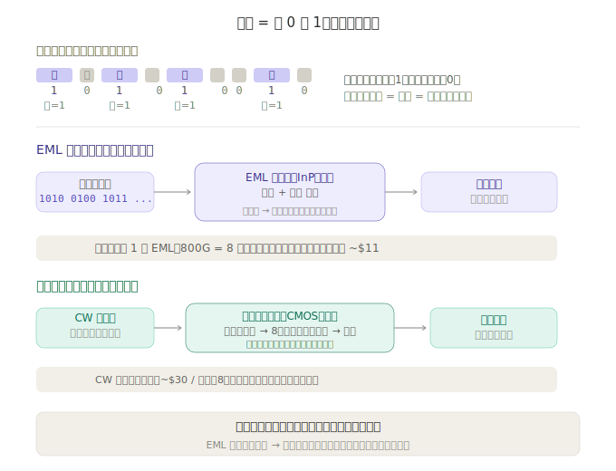
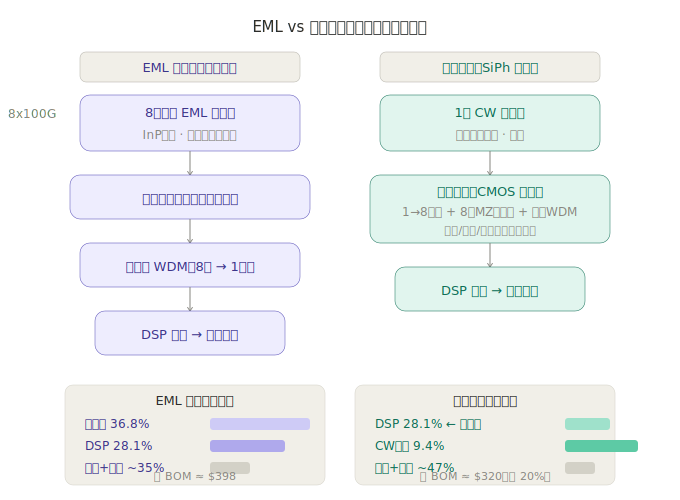

# 第一章：技术体系与发展脉络

光模块是 AI 数据中心最核心的互联器件——每块 GPU 都需要配套光模块来传输数据。当 AI 算力集群从千卡扩展到万卡甚至十万卡，光模块的需求不仅是「数量增多」，更是「速率翻倍」。

---

## 一、光模块是什么

光模块本质是一个「光电翻译器」：把芯片输出的电信号转换成光信号，通过光纤发送出去；接收端再把光信号转回电信号。

AI 集群中的光模块用量极其惊人。一个英伟达 GB300 NVL72 机柜需要配套 200-400 只 800G 光模块。当集群扩大到千柜级，光模块用量轻松突破 10 万只。

---

## 二、速率演进：每一代翻倍的「铁律」

AI 算力每 18 个月增长约 10 倍，光模块速率每 2-3 年翻一倍，这条铁律已经持续了十几年：

| 代际 | 主流速率 | 典型场景 | 量产状态 |
|------|---------|---------|---------|
| 4G/云计算时代 | 25G → 100G | 传统数据中心 | 存量市场 |
| AI 爆发初期（2023-2024） | 400G | A100/H100 集群 | 成熟量产 |
| AI 主力（2025-2026） | 800G | H200/B200/GB200 集群 | **主流放量** |
| AI 下一代（2026-2027） | 1.6T（2×800G） | B300/GB300 集群 | 导入期，小批量 |
| AI 远期（2028+） | 3.2T（2×1.6T） | Rubin 后集群 | 研发/送样阶段 |

> **关键认知**：光模块的价值不是只取决于出货「只数」——速率每翻一代，单只光模块的 ASP（平均售价）也大幅提升。一只 800G 光模块的价格是 400G 的 2-3 倍。量 + 价双重增长。

**2026 年行业数据**：据中国光通信协会，2026 年国内数通光模块需求约 2000-3000 万只，800G 逐步成为主流出货产品，1.6T 进入客户测试与小批量试用阶段。LightCounting 2025 年全球 Top 10 光模块供应商中，中国企业占 7 席。

---

## 三、光模块内部结构

一只光模块由两大部分构成：

```
光模块
  ├── 光器件（收发端）          ← 核心，占总成本 60-70%
  │     ├── TOSA（光发射组件）：激光器芯片 + 驱动
  │     └── ROSA（光接收组件）：探测器芯片 + 放大器
  └── 电芯片                    ← 占总成本 30-40%
        ├── DSP（数字信号处理器）：信号处理核心
        ├── CDR（时钟数据恢复）
        └── 驱动/放大器
```

**成本结构解析**：
- **光芯片**（激光器 + 探测器）是光模块中技术壁垒最高、国产化率最低的环节。高端 EML/CW 激光器芯片国产化率不足 10%
- **DSP 芯片**是电芯片中价值量最大的部分，全球被 Marvell（迈威尔）和 Broadcom（博通）两家垄断，国产化率为零
- **光器件封装**是将光芯片、电芯片、光纤、透镜等精密组装在一起的工艺，天孚通信是全球光器件龙头

### 关键概念：什么是「调制」

> **一句话**：调制就是把电脑里的 0 和 1（电信号）「写」到光上面——亮代表 1，灭代表 0。

类比：用手电筒发摩尔斯电码。手电筒快速亮灭就能传递信息，「亮」和「灭」的节奏编码了完整的数据。光模块里的调制就是这个道理，只是速度快了无数倍——800G 光模块每秒传输 **8000 亿比特**（使用 PAM4 调制，每通道每秒 500 亿个光脉冲，8 通道并行共 4000 亿光脉冲/秒）。



理解调制之后，再看 EML 和硅光的区别就非常直观了：

| | EML 方案 | 硅光方案 |
|--|---------|---------|
| 类比 | 每盏灯自带开关，8 盏灯 = 8 个开关 | 1 个常亮灯泡，后面放 8 个「超高速快门」 |
| 调制在哪做 | 激光器**内部**（电吸收调制） | 硅光芯片**表面**（MZ 调制器 / 微环调制器） |
| 激光器角色 | 发光 + 调制，全能选手 | 只发光，纯光源 |
| 成本逻辑 | 能做调制的激光器很贵（InP材料）× 8 颗 | 激光器便宜 × 1 颗，调制交给 CMOS 硅芯片 |

**为什么调制位置决定成本**：能在每秒几百亿次频率下精准控制亮灭的器件，工艺难度极高。EML 方案要求每颗激光器都具备这个能力，硅光方案把它集中到一颗硅芯片上——硅芯片用成熟的 CMOS 工艺制造，成本远低于 III-V 族化合物半导体。

> 这个区别不仅是技术细节，它是理解「硅光为什么便宜」「硅光渗透率提升利好谁」的最底层逻辑。详见本章 [5.1-A 节](#51-a-eml-vs-硅光为什么硅光改变了成本结构)。

---

## 四、六大技术路线：不是「谁替代谁」，而是「按场景分工并存」

光模块行业正经历技术路线的「多路线竞赛」阶段。浙商证券将当前市场归纳为六大技术路线：

| 技术路线 | 核心特点 | 功耗 | 成本 | 成熟度 | 主要使用场景 |
|---------|---------|------|------|--------|------------|
| **传统可插拔** | 模块可插拔，标准化程度高 | 高 | 中 | ✅ 成熟 | 400G/800G 主流方案 |
| **硅光（SiPh）** | 用硅基工艺做光芯片，适合大规模集成 | 中 | 低 | ✅ 800G 已量产 | 800G/1.6T，中国领先 |
| **LPO（线性驱动）** | 去掉 DSP，用模拟驱动替代 | 中低 | 更低 | ✅ 800G 商用 | 短距（<100m）低功耗场景 |
| **LRO（线性接收）** | LPO 变体，只优化接收端 | 中 | 低 | 🔶 验证中 | 特定场景 |
| **NPO（近封装光学）** | 光引擎靠近交换芯片但不共封装 | 低 | 中高 | 🔶 国内主流方案 | 交换机侧 |
| **CPO（共封装光学）** | 光引擎与交换芯片直接在封装内互联 | 最低 | 高 | 🔶 1.6T 送样 | 终极方案，NVIDIA 2026H2 交付 |

> **投资者关键认知**：CPO 是公认的技术终局（功耗最低、性能最优），但商业化挑战极大——需要交换机厂商和光模块厂商深度合作，供应链整合难度远高于传统可插拔。当前阶段，**硅光 + LPO 是最现实的降功耗方案**。

---

## 五、三大核心技术方向深度解析

### 5.1 硅光技术（Silicon Photonics）

硅光是用 CMOS 工艺在硅基晶圆上制造光器件，将传统的分立光学器件（激光器、调制器、探测器）集成到一颗芯片上。

- **优势**：适合大规模生产，成本远低于传统分立方案；功耗大幅降低；特别适合多通道并行（800G 有 8 个通道，1.6T 有 16 个通道）
- **现状**：800G 硅光模块已批量出货，中际旭创、英特尔、博通等是主要玩家。1.6T 硅光方案正在导入
- **中国优势**：中国在硅光模块制造环节（封装、测试、量产）具有全球竞争力，但在硅光芯片设计环节（尤其是高速调制器 IP）仍以海外为主

### 5.1-A EML vs 硅光：为什么硅光改变了成本结构

> **一句话**：EML 方案「激光器自己调制自己」→ 8 颗贵芯片；硅光方案「激光器只发光，调制搬到硅芯片上」→ 1 颗便宜光源 + 1 颗硅芯片。

传统分立方案（EML）和硅光方案的核心区别在于**调制发生在哪里**，这直接决定了光模块的成本结构。



| 对比维度 | EML 方案（传统分立） | 硅光方案（SiPh） |
|---------|-------------------|----------------|
| 激光器类型 | EML（电吸收调制激光器） | CW（连续波激光器） |
| 激光器数量（800G） | **8 颗**（每通道 1 颗） | **1 颗**（分 8 路） |
| 调制位置 | 激光器**内部** | 硅光芯片**表面** |
| 芯片材料 | InP（磷化铟），昂贵 | 硅基 CMOS，便宜 |
| 最大成本项 | **光芯片**（~36.8%） | **DSP**（~28.1%） |
| 光源成本 | ~$88（8 × ~$11） | ~$30（1 × CW） |
| 总 BOM（800G） | ~$398 | ~$320（省 ~20%） |
| 国产化难度 | 光芯片卡脖子（<10%） | CW光源相对成熟（~15%） |
| 功耗 | 较高 | 较低 |

**根源**：EML 激光器集「发光」和「调制」于一体，每颗都是昂贵的 III-V 族化合物半导体（InP，磷化铟）；硅光方案把调制搬到硅芯片上，激光器退化为只发光的「灯泡」。激光器数量从 8 颗降至 1 颗，材料从昂贵的 InP 换成便宜的硅基 CMOS，这是硅光成本优势的根本来源。

**投资含义**：硅光方案占比每提升 10%，光模块中「光芯片卡脖子」问题就弱一分，中国厂商的量产优势就强一分。CW 光源供应商（源杰科技、仕佳光子）和光引擎龙头（天孚通信）是这条路线最直接的结构性受益者。

### 5.2 CPO（Co-Packaged Optics，共封装光学）

CPO 将光引擎与交换芯片在同一个封装内直接互联，省去了从芯片到面板光模块的整个电连接链路。

- **为什么 CPO 重要**：当前 51.2T 交换机中，从交换芯片到面板光模块的电信号传输已经是功耗大头——功耗和信号完整性都接近极限。102.4T 以上必须走 CPO 或 NPO
- **落地时间线**：
  - NVIDIA Spectrum-X CPO 交换机 → 2026 年 H2 小批量交付
  - 博通 CPO 方案 → 2026-2027
  - 行业共识：大规模商用要到 **2028+**（SemiAnalysis 原预期推迟至 2028+，后被英伟达澄清未延期）
- **对 A 股的影响**：CPO 需要光引擎制造能力，天孚通信、中际旭创是核心供应商

### 5.3 LPO（Linear-drive Pluggable Optics，线性驱动）

LPO 的核心思路是把光模块中的 DSP 芯片去掉，用线性驱动芯片替代。

- **优势**：功耗降低 ~50%，成本降低 ~30%
- **局限**：只能用于短距离（<100m），对信号质量要求高
- **现状**：800G LPO 已小规模商用，1.6T LPO 尚在验证

---

## 六、光模块技术与先进封装的关系

光模块和先进封装并非两个独立赛道，它们在 CPO 上**交汇**：

1. **CPO 是「光 + 电」的先进封装**：CPO 需要将光子芯片（PIC）和电子芯片（EIC）通过 2.5D/3D 先进封装技术集成在一起，本质上是一种特殊形态的先进封装
2. **硅光芯片本身需要先进封装**：硅光芯片的光学耦合（光纤到芯片的光连接）是极精密的封装工艺，封装良率是硅光模块成本的主要瓶颈
3. **光模块的 EML/CW 激光器需要高精度贴装**：激光器芯片的贴装精度要求亚微米级，这本身就是先进封装设备（固晶机/贴片机）的应用场景

> **学习视角**：学完先进封装再看光模块，CPO 不再是一个「黑盒子」——你可以理解它是如何把光引擎和电芯片「拼在一起」的。

---

## 七、技术演进路线图

```
              2024          2025          2026          2027         2028+
              │             │             │             │             │
  可插拔  ────●──400G主供────●──800G放量───●──800G为主────●──1.6T放量───●──1.6T为主─→
              │             │             │             │             │
  硅光    ────┼──小批量──────●──800G量产───●──1.6T导入───●──1.6T量产────●─────────→
              │             │             │             │             │
  CPO     ────┼─────────────┼─────────────●──送样/验证───●──小批量──────●──规模商用─→
              │             │             │             │             │
  LPO     ────┼──800G验证───●──800G商用───●──1.6T验证───●──1.6T商用───●──────────→
```

---

> **下一章**：[02-产业链深度拆解](./02-产业链深度拆解.md)
