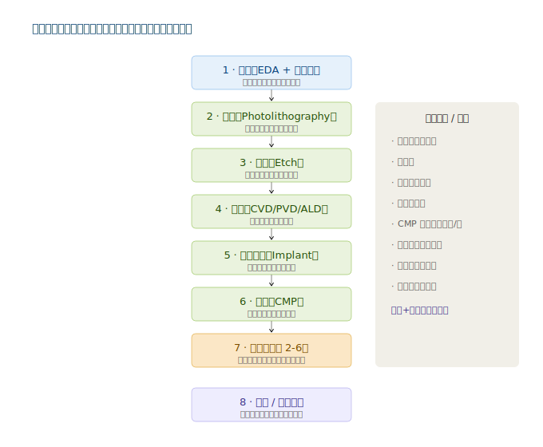
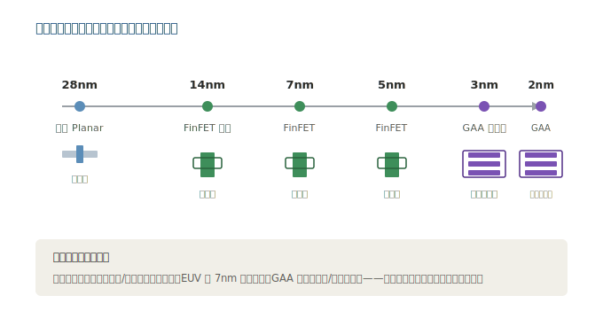

# 第一章：技术体系与发展脉络

要理解半导体（制造+设备+材料）的投资机会，先要搞清楚两件事：**一颗芯片到底是怎么造出来的**，以及**为什么越造越难、越难越值钱**。

---

## 1.1 半导体是什么？—— 从沙子到芯片

**类比（给非技术读者的直观解释）**：半导体芯片的本质，是在一块极纯净的硅片上「雕刻」出几十亿个比头发丝细万倍的微型开关（晶体管），再用金属线把它们连成电路。

- **沙子（硅）**：芯片的「地基材料」。硅来自沙子里的二氧化硅，提纯后做成圆柱形的**硅锭**，再切成薄片，就是**晶圆（Wafer）**。
- **雕刻（制造）**：用光照（光刻）、腐蚀（刻蚀）、镀膜（沉积）等上百道工序，在晶圆表面「画」出电路图案。
- **施工机械（设备）**：完成上述每道工序都需要专用机器——光刻机、刻蚀机、沉积设备、清洗机、检测机。
- **建材（材料）**：硅片本身是材料，此外还需要光刻胶（「感光底片」）、电子特气（「工艺气体」）、靶材（「金属镀膜原料」）、抛光材料（「打磨耗材」）等几十种关键材料。

> **投资者关键认知**：制造是「盖楼」，设备是「施工机械」，材料是「建材」。盖楼需要先买机械、进建材。所以**设备与材料的景气，往往领先于制造本身**——这也是为什么在半导体周期里，设备股和材料股常被视为「先行指标」。

---

## 1.2 一颗芯片的诞生：制造工艺流程

现代芯片制造要在同一片晶圆上反复「涂胶—曝光—刻蚀—沉积—抛光」，循环成百上千次，一层层堆叠出立体电路。简化流程如下：

| 步骤 | 名称 | 在做什么 | 关键设备/材料 | 类比 |
|------|------|---------|--------------|------|
| 1 | 设计 | 用 EDA 软件画出电路图，生成掩膜版 | EDA 工具、掩膜版 | 画建筑图纸 |
| 2 | 光刻（Photolithography） | 用光刻机把电路图案「印」到涂了光刻胶的晶圆上 | 光刻机、光刻胶、掩膜版 | 用底片在相纸上曝光 |
| 3 | 刻蚀（Etch） | 把没被光刻胶保护的地方「腐蚀」掉，留下图案 | 刻蚀机 | 按图纸切除多余部分 |
| 4 | 沉积（Deposition） | 在表面镀上一层绝缘膜或金属膜 | 薄膜沉积设备（CVD/PVD/ALD） | 刷一层涂料 |
| 5 | 离子注入（Implant） | 往硅里打进杂质，改变导电性质 | 离子注入机 | 往混凝土里加钢筋 |
| 6 | 抛光（CMP） | 把表面磨平，准备下一层 | CMP 设备、抛光液/垫 | 打磨找平 |
| 7 | 循环 | 重复步骤 2-6 成百上千次，叠出多层电路 | 全系列设备 | 一层层盖楼 |
| 8 | 测试/封装 | 切粒、测试、封装成成品芯片 | 测试机、封装设备 | 竣工验收、装修交付 |

> **关键认知**：这套流程里，**第 2-7 步就是「前道工艺」**，是半导体设备和材料消耗最密集的环节。先进封装（已学过）属于「后道」，而本章聚焦的制造、设备、材料主要对应**前道**。前道一道工序出问题，整片晶圆报废——这就是为什么设备和材料的可靠性要求极高、认证极严。

---

## 1.3 制程节点演进：为什么 3nm 比 28nm 难那么多？

「制程节点」（如 28nm、7nm、3nm）指的是芯片上晶体管的最小线宽，数字越小，单位面积能塞下的晶体管越多、性能越强、功耗越低。

| 节点 | 年代 | 晶体管结构 | 代表产品 | 投资含义 |
|------|------|-----------|---------|---------|
| 28nm / 14nm | 2010s | 平面晶体管（Planar） | 多数成熟制程芯片 | 中国已自主掌握，是基本盘 |
| 16/14nm → 7nm | 2010s末-2020s | FinFET（鳍式） | 手机 SoC、CPU | 中芯国际已突破 7nm（受限） |
| 5nm / 3nm | 2020s | FinFET（5nm）→ GAA（3nm） | 苹果 A17、英伟达 H100 | 全球仅台积电/三星量产 |
| 2nm（研发中） | 2025+ | GAA（全环绕栅极） | 下一代 AI 芯片 | 台积电/三星/英特尔竞速 |

### 晶体管结构的三次跃迁（类比）

把晶体管想象成一扇「水龙头」控制电流：

- **平面晶体管（Planar）**：像地面上平铺的水龙头，水流（电流）从旁边流过。线宽越小，水流越难控制——漏电严重。
- **FinFET（鳍式）**：把「水面」竖起来，做成一道「鱼鳍」，从三面围住水流，控制力大增。相当于从「平房」升级到「立体围墙」。
- **GAA（全环绕栅极）**：把「鱼鳍」进一步变成被栅极**四面环绕**的纳米片（Nanosheet），控制力再次跃升。相当于水流被「立体管道」完全包裹，开关更精准。

> **投资者关键认知**：制程越先进，对设备和材料的要求越苛刻——EUV 光刻机只在 7nm 以下才需要，GAA 结构需要全新沉积/刻蚀工艺。每一次结构跃迁，都是设备和材料公司的「技术换代」机会，也是国产替代最难、但价值最高的战场。

---

## 1.4 三大子板块如何划分

半导体（L1 基底层）按价值链可分为制造、设备、材料三大环节，彼此层层嵌套：

| 子板块 | 干什么 | 核心壁垒 | A 股代表 | 投资属性 |
|--------|--------|---------|---------|---------|
| **晶圆制造** | 用设备+材料把设计图变成晶圆 | 工艺积累、产能、客户认证 | 中芯国际、华虹公司、晶合集成 | 重资产、强周期、国产替代核心载体 |
| **半导体设备** | 造「施工机械」 | 精密机械、光学、软件算法 | 北方华创、中微公司、盛美上海、拓荆科技、华海清科、芯源微、长川科技、华峰测控、中科飞测 | 「卖铲子」、确定性高、成长性强 |
| **半导体材料** | 造「建材」 | 化学合成、纯度控制、认证周期 | 沪硅产业、鼎龙股份、安集科技、雅克科技、南大光电、上海新阳、华特气体、江丰电子、彤程新材、金宏气体、立昂微 | 耗材逻辑、国产替代空间最大 |

> **三者关系**：制造是「甲方」，扩产必须先采购设备、消耗材料。所以**设备与材料的需求，是制造扩产的「领先指标」**。当晶圆厂资本开支（CapEx）上升，设备和材料公司的订单会率先兑现。

---

## 1.5 技术路线总结

**投资优先级（本章视角）**：
1. **设备**（确定性最高）：无论哪类芯片放量，都要先买设备；国产化率仅约 20%，空间大。
2. **制造**（战略核心）：国产芯片自主化的承载主体，但重资产、周期波动大。
3. **材料**（弹性最大）：耗材逻辑、国产替代空间普遍在 30%-80%，每突破一个细分都有独立行情。

---

> **下一章**：[02-产业链深度拆解](./02-产业链深度拆解.md)
