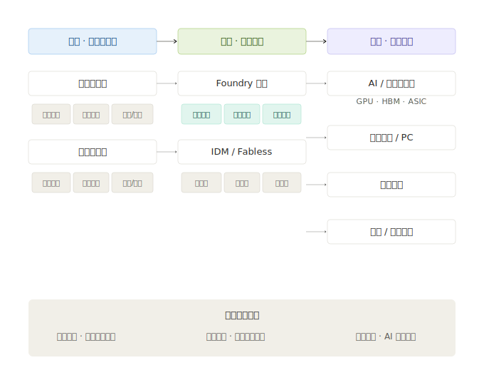
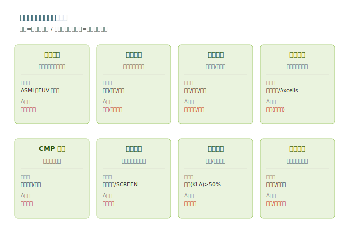
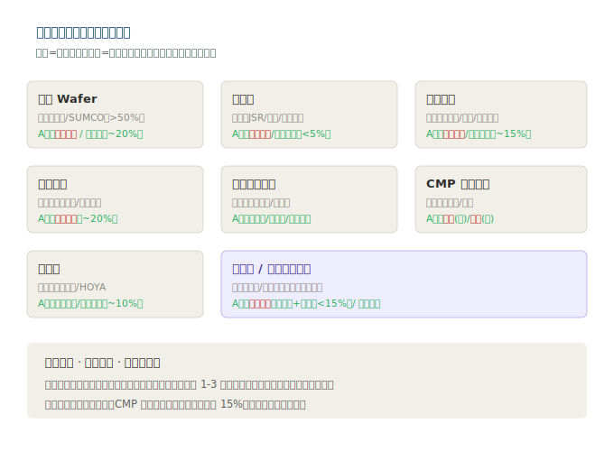

# 第二章：产业链深度拆解

> **版本**：v1.1｜**更新日期**：2026-07-09｜**数据来源**：neodata-financial-search（东方财富 · A股 2025 年报 + 2026Q1 季报口径）

半导体（制造+设备+材料）的产业链比先进封装复杂得多——上游是几十种设备和几十种材料，中游是三种截然不同的制造模式，下游则覆盖所有芯片。本章按「上游设备 → 上游材料 → 中游制造 → 下游应用」逐层拆解。

---

## 2.1 产业链全景速览

---

## 2.2 上游 · 半导体设备（按工艺分类）

半导体前道设备按功能可分为八大类，每一类对应制造流程里的一道核心工序。全球设备市场约 70% 被美（应用材料/拉姆研究/科磊）、日（东京电子）、荷（ASML）垄断。

### 2.2.1 八大类设备一览

| 设备类别 | 在制造中的作用 | 全球格局 | A 股代表 |
|---------|--------------|---------|---------|
| **光刻设备** | 用光把电路图案「印」到晶圆（最核心、最贵） | **ASML 独家垄断 EUV**；佳能/尼康做成熟制程 | 上海微电子（国产光刻机） |
| **刻蚀设备** | 按图案「切除」多余材料 | 拉姆研究、应用材料、东京电子三强 | **中微公司**（CCP 刻蚀）、**北方华创**（ICP 刻蚀） |
| **薄膜沉积设备** | 镀绝缘膜/金属膜（CVD/PVD/ALD） | 应用材料、拉姆研究、东京电子 | **北方华创**（PVD 国内独家）、**拓荆科技**（PECVD/ALD） |
| **离子注入设备** | 往硅里打入杂质改变导电性 | 应用材料、Axcelis | 万业企业（凯世通）、屹唐股份 |
| **CMP 设备** | 化学机械抛光，磨平表面 | 应用材料、荏原制作所 | **华海清科**（国产 CMP 唯一） |
| **清洗设备** | 每道工序前后清洗晶圆 | 东京电子、屏幕（SCREEN） | **盛美上海**（清洗+电镀）、北方华创 |
| **量测/检测设备** | 检查缺陷、量测尺寸 | **科磊（KLA）市占 >50%** | **中科飞测**、精测电子 |
| **测试设备** | 封装前后测试芯片良率 | 泰瑞达、爱德万 | **长川科技**、**华峰测控** |

> **关键认知**：光刻机是「皇冠上的明珠」——一台 EUV 售价超 3 亿欧元，全球仅 ASML 能量产，且受出口管制禁止对华销售。这正是中国半导体最大的「卡脖子」点。其余七类设备中国已实现程度不一的突破，是国产化最确定的方向。

### 2.2.2 设备环节的「卖铲子」逻辑

无论哪类芯片（AI 芯片、手机 SoC、车规 MCU）放量，晶圆厂都要先**买设备、建产线**。因此：
- 设备需求是制造扩产的**领先指标**；
- 设备公司旱涝保收（卖一台机器后续还有备件、升级服务）；
- 国产替代下，每突破一类设备，对应 A 股公司就有独立行情。

---

## 2.3 上游 · 半导体材料（按品类分类）

半导体材料分「前道制造材料」和「后道封装材料」（封装材料已在先进封装章节覆盖）。本章聚焦**前道制造材料**，全球市场约 730 亿美元，中国是全球最大单一消费市场（约 1300 亿元人民币）。

### 2.3.1 七大核心材料

| 材料类别 | 在制造中的作用 | 全球格局 | A 股代表 |
|---------|--------------|---------|---------|
| **硅片（Wafer）** | 芯片的「地基」基板 | 信越化学、SUMCO 双寡头（>50%） | **沪硅产业**、立昂微、TCL 中环 |
| **光刻胶（Photoresist）** | 光刻的「感光底片」 | 日本 JSR/信越/东京应化/杜邦垄断 | **彤程新材**、南大光电、上海新阳、晶瑞电材 |
| **电子特气（Specialty Gas）** | 刻蚀/沉积/掺杂的工艺气体 | 法液空、林德、大阳日酸 | **华特气体**、金宏气体、雅克科技、南大光电 |
| **溅射靶材（Target）** | 沉积金属膜的原料 | 日矿金属、霍尼韦尔 | **江丰电子**、有研新材 |
| **湿电子化学品** | 清洗/显影的超高纯化学液 | 关东化学、巴斯夫 | 江化微、格林达、上海新阳 |
| **CMP 抛光材料** | 抛光液+抛光垫，磨平表面 | 卡博特（液）、陶氏（垫） | **安集科技**（液）、**鼎龙股份**（垫） |
| **掩膜版（Reticle）** | 光刻用的「底片母版」 | 福尼克斯、HOYA、Toppan | 清溢光电、路维光电 |

> **关键认知**：材料是「耗材」——晶圆每跑一道工序就消耗一批材料，具有**重复消费、客户粘性高**的特点。一旦进入晶圆厂供应链（认证周期 1-3 年），替换成本极高，形成天然护城河。

### 2.3.2 材料环节的国产替代空间

| 材料 | 国产化率（估） | 突破难度 | A 股核心标的 |
|------|--------------|---------|------------|
| 硅片（300mm） | ~20% | 中 | 沪硅产业、立昂微 |
| 光刻胶（ArF） | <5% | 极高 | 彤程新材、南大光电 |
| 电子特气 | ~15% | 中 | 华特气体、金宏气体 |
| 溅射靶材 | ~20% | 中 | 江丰电子 |
| CMP 抛光液 | ~30% | 中 | 安集科技 |
| CMP 抛光垫 | <10% | 高 | 鼎龙股份 |
| 掩膜版（高端） | ~10% | 高 | 清溢光电 |

---

## 2.4 中游 · 晶圆制造（三种商业模式）

半导体制造业有三种截然不同的商业模式，决定了不同的投资逻辑：

### 2.4.1 Foundry（晶圆代工）—— 只制造，不设计

| 维度 | 特征 |
|------|------|
| **核心逻辑** | 客户（芯片设计公司）出设计图，我负责制造。「来图加工」 |
| **代表** | 台积电（全球第一，市占 ~60%）、**中芯国际**（大陆第一）、**华虹公司**、**晶合集成**、联电、格芯 |
| **优势** | 专注制造、工艺迭代快、规模效应强 |
| **劣势** | 重资产（一座厂上千亿）、周期波动大、不掌握终端定价 |
| **投资属性** | 周期 + 国产替代双驱动，是大陆半导体自主化的核心载体 |

### 2.4.2 IDM（集成器件制造）—— 设计+制造+销售全包

| 维度 | 特征 |
|------|------|
| **核心逻辑** | 自己设计、自己制造、自己卖芯片，全栈打通 |
| **代表** | 英特尔、三星、SK 海力士、美光、士兰微、华润微 |
| **优势** | 工艺与产品协同，利润留在内部 |
| **劣势** | 资产极重、转型慢、产能主要用于自用 |
| **投资属性** | 多为巨头，A 股以功率/模拟 IDM（士兰微、华润微）为主，不在本模块重点 |

### 2.4.3 Fabless（无晶圆厂）—— 只设计，制造外包

| 维度 | 特征 |
|------|------|
| **核心逻辑** | 专注芯片设计，制造全部外包给 Foundry |
| **代表** | 英伟达、AMD、高通、博通、海思、寒武纪、海光信息 |
| **与本章关系** | Fabless 是制造的「下游甲方」——它们的订单直接决定晶圆厂（中芯/华虹）的产能利用率 |
| **投资属性** | 已在 AI 算力芯片模块覆盖，本章作为需求侧联动 |

### 三种模式的投资含义

| 模式 | 代表 | 对 A 股投资者的意义 |
|------|------|------------------|
| **Foundry** | 中芯国际、华虹、晶合集成 | 国产芯片制造的承载主体，重资产强周期 |
| **IDM** | 士兰微、华润微（A股功率 IDM） | 功率/模拟赛道，与制造联动 |
| **Fabless** | 寒武纪、海光（已覆盖） | 制造环节的需求来源，订单外溢拉动 |

---

## 2.5 下游 · 终端应用

半导体制造/设备/材料的需求最终来自所有芯片，高度集中于高景气赛道：

| 应用领域 | 对制造/设备/材料的拉动 | 代表芯片 |
|---------|---------------------|---------|
| **AI/HPC** | 先进制程产能 + 设备 + 高端材料需求暴增 | GPU（英伟达/寒武纪）、HBM、ASIC |
| **智能手机/PC** | 成熟+先进制程稳定需求 | 手机 SoC、CPU |
| **汽车电子** | 车规 MCU、功率器件、CIS 拉动特色工艺 | 功率半导体、MCU |
| **工业/物联网** | 成熟制程（28nm 及以上）为主 | MCU、传感器 |
| **通信/数据中心** | 与光模块、交换机联动 | 网络芯片、SerDes |

> **联动强度**：AI/HPC 是当前唯一的核心增量，直接拉动先进制程（中芯国际）、设备和高端材料。这与已覆盖的 AI 算力芯片、先进封装、光模块形成「需求传导链」。

---

> **上一章**：[01-技术体系与发展脉络](./01-技术体系与发展脉络.md)
> **下一章**：[03-市场格局与竞争态势](./03-市场格局与竞争态势.md)
