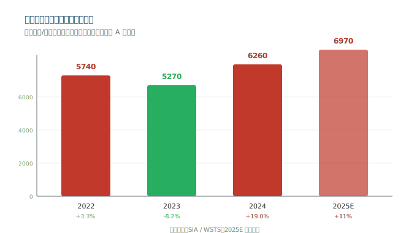
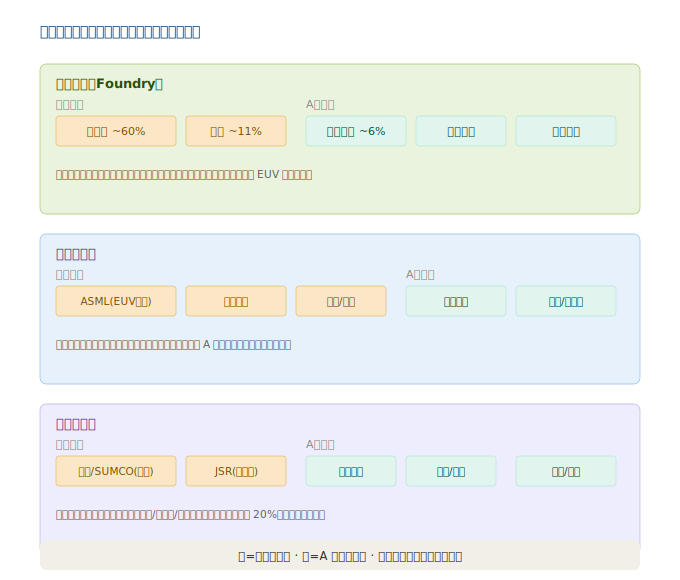

# 第三章：市场格局与竞争态势

> **版本**：v1.1｜**更新日期**：2026-07-09｜**数据来源**：neodata-financial-search（东方财富 · A股 2025 年报 + 2026Q1 季报口径）

---

## 3.1 全球市场规模

全球半导体市场呈现典型的强周期特征：2022 年见顶（约 5740 亿美元），2023 年深度回调（约 5270 亿美元，同比 -8.2%），2024 年强劲复苏（约 6305 亿美元，同比 +19.6%），2025 年创历史新高（SIA/WSTS 实际约 7917 亿美元，同比 +25.6%，AI 算力需求为主要驱动力）。

### 3.1.1 子板块市场规模（近年估算，2025 随大盘同步放大）

| 子板块 | 全球市场规模 | 中国市场规模 | 中国全球占比 | 投资含义 |
|--------|------------|------------|------------|---------|
| **半导体设备** | 约 1090 亿美元（SEMI） | 约 495 亿美元（全球最大单一市场） | ~45% | 国产自给率仅约 20%，替代空间最大 |
| **半导体材料** | 约 730 亿美元（SEMI） | 约 1300 亿元人民币 | ~28% | 前道材料多数国产化率 <30% |
| **晶圆制造（代工）** | 约 1400 亿美元 | 约 200 亿美元（含中芯/华虹/晶合等） | ~14% | 大陆代工全球份额仍低，提升空间大 |

> 数据来源：SEMI、WSTS、芯谋研究、SIA。设备与材料中国市场占比显著高于制造，说明**中国是全球最大的设备与材料消费市场，却不是生产国**——这正是国产替代的核心逻辑。

---

## 3.2 中国市场

### 3.2.1 设备国产化率与趋势

| 指标 | 数据 |
|------|------|
| 中国半导体设备国产化率（2020） | 约 7% |
| 中国半导体设备国产化率（2024） | 约 21%（集微咨询），2025 年进一步提升 |
| 2024 年中国设备招标国产化率（部分产线） | 超 30% |
| 大基金三期规模 | 3440 亿元人民币，重点投向设备与材料 |
| 目标 | 2027 年关键设备国产化率提升至 35%+ |

**核心判断**：设备国产化率从 2020 年的 7% 提升到 2024 年的约 21%，4 年提升 14 个百分点，速度超出预期。北方华创、中微公司、盛美上海等头部企业已进入主流晶圆厂供应链，国产替代进入「从 0 到 1 后加速放量」阶段。

### 3.2.2 制造产能格局

| 维度 | 中国现状 | 全球对比 |
|------|---------|---------|
| 晶圆代工份额 | 中芯国际全球 ~6%、华虹 ~1-2% | 台积电全球 ~60% |
| 先进制程（7nm 以下） | 受限（无法获取 EUV），中芯国际以 DUV 多重曝光突破 | 台积电/三星已量产 3nm |
| 成熟制程（28nm 及以上） | 自主可控，产能持续扩张 | 全球竞争加剧（价格战风险） |
| 产能利用率（2024-2025） | 中芯国际/华虹维持 85%+ 高位 | 全球同步复苏 |

---

## 3.3 全球竞争格局

### 3.3.1 制造（晶圆代工）格局

| 排名 | 公司 | 类型 | 全球份额 | 核心阵地 |
|------|------|------|---------|---------|
| 1 | 台积电 | Foundry | ~60% | 先进制程（3/5/7nm）绝对霸主 |
| 2 | 三星代工 | IDM/Foundry | ~11% | 先进制程第二，3nm GAA |
| 3 | 中芯国际 | Foundry | ~6% | 大陆第一，成熟+部分先进 |
| 4 | 联电 / 格芯 | Foundry | 各 ~5% | 成熟制程 |
| 5 | 华虹公司 | Foundry | ~1-2% | 特色工艺（功率/MCU/CIS） |

> **关键认知**：制造环节台积电一家独大，中芯国际是大陆自主化的「战略载体」。美国出口管制限制了中国获取 EUV 光刻机，因此中芯国际在先进制程上被「卡」，但成熟制程（28nm 及以上）已实现自主，是国产替代的基本盘。

### 3.3.2 设备格局（美日荷垄断）

| 设备类别 | 全球霸主 | 国产化进展 |
|---------|---------|-----------|
| 光刻机 | **ASML**（EUV 独家） | 上海微电子可产 90nm 及以下成熟制程光刻机，先进 EUV 受限 |
| 刻蚀机 | 拉姆研究、应用材料、东京电子 | **中微公司**进入台积电 5nm 供应链，国产已突破 |
| 沉积设备 | 应用材料、拉姆研究、东京电子 | **北方华创**（PVD）、**拓荆科技**（PECVD）已量产导入 |
| CMP 设备 | 应用材料、荏原 | **华海清科**国产唯一，已规模供货 |
| 清洗设备 | 东京电子、SCREEN | **盛美上海**国产龙头，技术比肩国际 |
| 量测检测 | **科磊（KLA）>50%** | **中科飞测**加速突破 |
| 测试设备 | 泰瑞达、爱德万 | **长川科技**、**华峰测控**已规模化 |

### 3.3.3 材料格局（日本主导）

| 材料 | 全球霸主 | 国产化进展 |
|------|---------|-----------|
| 硅片 | 信越化学、SUMCO（>50%） | **沪硅产业**、立昂微 300mm 硅片放量 |
| 光刻胶 | JSR、信越、东京应化、杜邦 | **彤程新材**（KrF/ArF）、南大光电（ArF）突破中 |
| 电子特气 | 法液空、林德、大阳日酸 | **华特气体**、金宏气体多品类突破 |
| 靶材 | 日矿金属、霍尼韦尔 | **江丰电子**进入台积电/三星供应链 |
| CMP 材料 | 卡博特、陶氏 | **安集科技**（液）、**鼎龙股份**（垫）国产双子星 |

### 3.3.4 格局演化核心判断

- **短期（1-2 年）**：美国管制不会放松，国产替代是确定性最强的主线；成熟制程产能扩张带动设备/材料订单。
- **中期（3-5 年）**：设备国产化率向 35%+ 迈进，材料在光刻胶、硅片等「难而大」的环节逐步突破。
- **长期**：中国有望形成「成熟制程自主 + 部分先进制程突围 + 设备材料配套」的完整产业链，但 EUV 光刻机等尖端环节仍是长期短板。

---

> **上一章**：[02-产业链深度拆解](./02-产业链深度拆解.md)
> **下一章**：[04-核心公司分析](./04-核心公司分析.md)
