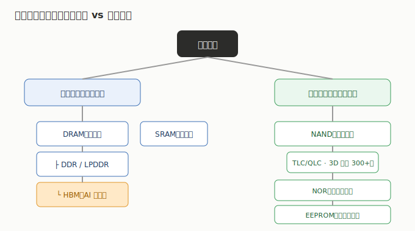
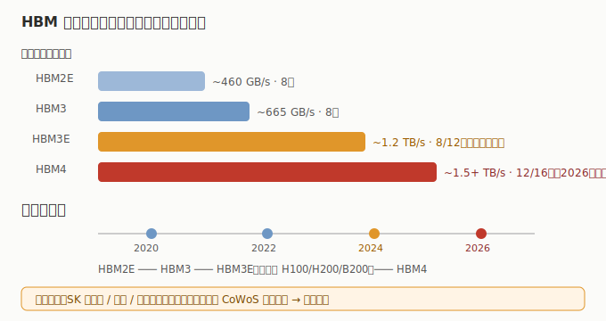

# 01 技术体系与发展脉络

> 存储芯片不是一种产品，而是一大家族。先搞清楚「谁是谁」，才能看懂为什么 HBM 这么贵、为什么 NAND 在降价、为什么 A 股多的是模组厂而非原厂。

## 1.1 两大阵营：易失性 vs 非易失性

| 类型 | 断电后数据 | 代表 | 用途 | 特点 |
|------|-----------|------|------|------|
| **易失性（Volatile）** | 丢失 | DRAM（DDR/LPDDR/**HBM**）、SRAM | CPU/GPU 的「工作内存」 | 速度快、容量相对小、需持续供电 |
| **非易失性（Non-Volatile）** | 保留 | NAND、NOR、EEPROM | 系统盘 / 代码 / 参数存储 | 速度慢于 DRAM、容量大、断电不丢 |

一句话类比：**DRAM 像你办公时摊在桌上的文件（随手翻、快，但一收工就收走）；NAND 像文件柜里的档案（慢但能长期存）；HBM 是贴着计算器（GPU）手边的小便签，离得最近、翻得最快。**

## 1.2 DRAM：系统的主存，HBM 是其「高配分支」

- **标准 DRAM（DDR/LPDDR）**：插在主板上的内存条（DDR5）、手机里的 LPDDR5。容量大、成本敏感，是 PC / 手机 / 服务器的主存。
- **HBM（高带宽内存）**：把多颗 DRAM 裸片用 TSV（硅通孔）**垂直堆叠**，再靠近 GPU/ASIC 封装。带宽可达 DDR5 的 5–10 倍，是 AI 训练卡不可或缺的内存。
  - 代际：HBM2E → **HBM3** → **HBM3E**（当前主流，供货英伟达 H100/H200/B200）→ **HBM4**（2026 起导入）。
  - 全球仅 **SK 海力士、三星、美光** 三家能量产，产能被台积电 CoWoS 封装能力共同制约。
- **制程**：DRAM 进入 1α / 1β nm 节点（约 15–14nm 级），靠制程微缩 + 架构优化提密度。

## 1.3 NAND：大容量存储，靠「堆层数」竞赛

- 用于 SSD、手机存储、数据中心大容量盘。核心是 **3D 堆叠**——把存储单元一层层垒起来，层数越多容量越大、单位成本越低。
- 层数演进：64 层 → 128 层 → 176/232 层 → **300 层上下（2025–2026 主流）**。
- 颗粒类型：SLC / MLC / **TLC**（主流）/ **QLC**（低成本大容量）。企业级 SSD（eSSD）是 AI 服务器本地缓存的关键。
- 代表：三星、铠侠、西部数据、美光、SK 海力士；A 股以模组 / 主控为主（江波龙、佰维、德明利）。

## 1.4 NOR / EEPROM：利基但高壁垒

- **NOR Flash**：代码型存储，用于 MCU、汽车电子、工业、AI 端侧设备的固件。容量小但可靠、可芯片内执行（XIP）。A 股兆易创新、普冉为全球重要供应商。
- **EEPROM**：极小容量参数存储（如内存条上的 SPD、汽车 EEPROM）。聚辰股份为全球第二、DDR5 SPD 双寡头之一。

## 1.5 演进主线：三条曲线同时发生

1. **AI 拉动 HBM**：从 HBM3E 向 HBM4 演进，带宽与容量每代翻倍，直接绑定 GPU 出货。
2. **NAND 层数竞赛**：300+ 层成主流，单位容量成本下探，企业级 SSD 随 AI 数据量膨胀。
3. **接口升级 DDR5 / LPDDR5**：PC、手机、服务器主存换代，叠加 AI 端侧（AIPC、AI 手机）单机容量提升。

> 投资含义：HBM 是「技术 + 产能」双壁垒的稀缺品（看全球三寡头 + 配套封测）；NAND/DRAM 标准品是「周期品」（看价格拐点）；NOR/EEPROM 是「利基高壁垒」（看国产替代与车规）。

---

> **版本**：v1.0（已核对）｜**更新日期**：2026-07-11｜**数据来源**：行业共识性技术框架；财务数据见各子文件（neodata-financial-search，东方财富）
