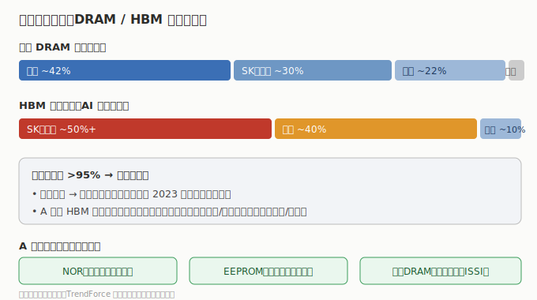

# 03 市场格局与竞争态势

> 存储是全球最「集中」的半导体赛道：DRAM 与 NAND 都呈三寡头格局，HBM 更是三家通吃。理解集中度，才能理解「涨价时利润爆炸、过剩时血亏」的周期本质。

## 3.1 DRAM：三寡头稳坐，HBM 是分水岭

- **全局 DRAM**：三星（约 40%+）、SK 海力士（约 30%+）、美光（约 20%+）三家合计 **>95%** 份额，长鑫（大陆）份额仍在个位数爬升。
- **HBM 子市场**：SK 海力士（约 50%+，英伟达主供）、三星（约 40%）、美光（约个位数到十几个百分点，快速追赶）。**HBM 是三家技术 + 产能双壁垒的高地**，也是 AI 叙事的核心。
- 三星 / SK 海力士为韩股，美光为美股；**A 股在 HBM 原厂层无直接标的**，只能通过封测（深科技/太极）与模组（江波龙/佰维）间接受益。

## 3.2 NAND：同样三寡头，但更「周期」

- 三星、铠侠（东芝内存）、西部数据、美光、SK 海力士为主要玩家，集中度略低于 DRAM。
- NAND 标准化程度高、差异化小，**价格周期属性最强**——产能过剩时全面亏损，紧平衡时暴利。A 股模组厂对 NAND 价格最敏感。

## 3.3 利基市场：A 股的舒适区

- **NOR**：旺宏（台）、华邦（台）、兆易创新（大陆，全球第二）、普冉——格局分散，大陆厂有份额。
- **EEPROM**：聚辰（全球第二）、意法、微芯——聚辰在 DDR5 SPD 与汽车 EEPROM 卡位好。
- **车规 DRAM/NOR**：北京君正（ISSI）全球车规 SRAM/DRAM 领先。

## 3.4 国产替代空间

| 环节 | 国产化率 | 代表进展 |
|------|---------|---------|
| DRAM 原厂 | 低（长鑫未上市） | 长鑫量产 DDR4/LPDDR5，追赶中 |
| NAND 原厂 | 低 | 长江存储（未上市）232+ 层，技术领先 |
| 利基设计 | 中高 | 兆易/君正/聚辰已全球前列 |
| 模组/封测 | 高 | 江波龙/佰维/深科技等成熟 |
| HBM | 极低 | 大陆处于研发早期，是最大短板 |

> 核心认知：**标准存储（DRAM/NAND）看全球三寡头的供给纪律与价格周期；利基存储（NOR/EEPROM/车规）看 A 股公司的份额与国产替代；HBM 是稀缺特权，A 股只能「蹭」封测与模组增量。**

## 3.5 竞争要点

- **原厂定价权极强**：三家寡头一旦减产/控产，价格与利润迅速修复（2023 底起的本轮复苏即典型）。
- **A 股赚「贝塔 + 替代」**：模组 / 封测 / 利基设计对全球周期高度敏感，同时受益于国产客户替代与 AI 端侧增量。
- **风险点**：原厂一旦扩产过猛，价格反转向下，模组厂与渠道（香农芯创）首当其冲。

---

> **版本**：v1.0（已核对）｜**更新日期**：2026-07-11｜**数据来源**：市场份额为行业研究（TrendForce 等）共识性估算；财务数据见各子文件（neodata-financial-search，东方财富）
