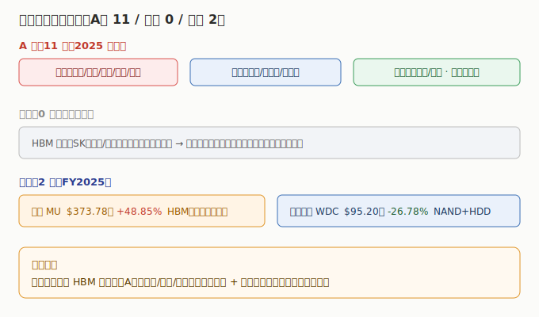

# 04 核心公司分析

> **给投资者的第一句话**：存储板块公司多、环节杂、利润弹性天差地别。本节只做「索引 + 一句话逻辑 + 真实财务」，逐家深挖在子文件里。所有财务为 **2025 年报 / 最新财年** 口径，数据来自 neodata（东方财富）核对。

## 4.1 A 股（11 家，2025 年报）

| 公司 | 代码 | 环节 | 2025 营收 | 2025 营收同比 | 2025 归母净利 | 一句话逻辑 |
|------|------|------|----------|--------------|--------------|------------|
| 兆易创新 | 603986 | 存储设计 | ¥92.03 亿 | +25.12% | ¥16.48 亿 | 利基存储龙头（NOR 全球第二 + DRAM + SLC NAND + MCU），26Q1 高增 |
| 北京君正 | 300223 | 存储设计 | ¥47.41 亿 | +12.54% | ¥3.76 亿 | 车规存储（ISSI）标杆，汽车/工业复苏 + 利基 DRAM 紧缺 |
| 东芯股份 | 688110 | 存储设计 | ¥9.21 亿 | +43.76% | 亏损 -1.95 亿 | NAND/NOR/DRAM 完整方案，仍投入亏损期，待涨价兑现盈利 |
| 普冉股份 | 688766 | 存储设计 | ¥23.20 亿 | +28.62% | ¥2.08 亿 | NOR/EEPROM 设计，景气反转 26Q1 净利暴增 |
| 聚辰股份 | 688123 | 存储设计 | ¥12.21 亿 | +18.77% | ¥3.64 亿 | EEPROM 全球第二 + DDR5 SPD 双龙头，创历史最佳 |
| 佰维存储 | 688525 | 存储模组 | ¥113.02 亿 | +68.81% | ¥8.53 亿 | AI 端侧存储（Meta 眼镜独家）+ 晶圆级先进封测 |
| 江波龙 | 301308 | 存储模组 | ¥227.66 亿 | +30.36% | ¥14.23 亿 | NAND 模组龙头（Lexar），企业级 eSSD 放量 |
| 德明利 | 001309 | 存储模组 | ¥107.89 亿 | +126.07% | ¥6.88 亿 | NAND 主控/模组，企业级 SSD 加速放量，26Q1 创历史新高 |
| 深科技 | 000021 | 存储封测 | ¥157.47 亿 | +6.21% | ¥11.36 亿 | 沛顿科技存储封测龙头，扩产承接 AI 存储封测 |
| 太极实业 | 600667 | 存储封测 | ¥306.82 亿 | -12.77% | ¥4.48 亿 | 海太（SK 海力士封测）+ 工程总包，总包拖累整体 |
| 香农芯创 | 300475 | 存储分销 | ¥352.51 亿 | +45.24% | ¥5.45 亿 | SK 海力士授权分销 + 海普存储自研，紧缺代理红利 |

> A 股 26Q1：neodata 对兆易/君正/普冉/佰维/江波龙/德明利/香农 7 家返回单季同比（详见 [A股子文件](./A股/存储芯片A股.md)）；东芯/聚辰/深科技 26Q1 neodata 未收录；太极仅取得同比。逐家深挖见 A股子文件。

## 4.2 港股（暂无纯存储标的）

| 公司 | 代码 | 环节 | 最新财年营收 | 净利 | AI 落点 |
|------|------|------|------------|------|---------|
| — | — | — | 港股无独立存储芯片上市公司 | — | HBM 双雄（SK海力士/三星）为韩股，美光为美股；详见 [港股子文件](./港股/存储芯片港股.md) |

> 港股投资者可通过港股通买 A 股存储龙头，或跨市场配置美光 / 韩股双雄。

## 4.3 美股（2 家，最新财年 FY2025，数据自洽可采信）

| 公司 | 代码 | 环节 | 最新财年 | 财年区间 | 财年营收 | 营收同比 | 财年净利 | AI/HBM 落点 |
|------|------|------|----------|----------|----------|----------|----------|------------|
| 美光 Micron | MU | DRAM/NAND/HBM | FY2025 | 截止 2025-08-28 | $373.78 亿 | +48.85% | $85.39 亿 | HBM 三寡头中唯一美股，HBM3E 供货英伟达 |
| 西部数据 WDC | WDC | NAND+HDD | FY2025 | 截止 2025-06-27 | $95.20 亿 | -26.78% | $16.15 亿 | NAND + HDD，AI 大容量存储 |

> ⚠️ 美股单季数据 neodata 接口异常（美光单季超全年、西部数据含大额非经常性损益），详见 [美股子文件](./美股/存储芯片美股.md) 的「数据质量提示」，研判以公司正式财报为准。

---

> **版本**：v1.0（已核对）｜**更新日期**：2026-07-11｜**数据来源**：neodata-financial-search（东方财富），A股 2025 年报 + 2026Q1、美股 FY2025（单季 neodata 异常已标注）；涨跌配色：正增长红、负增长/亏损绿
