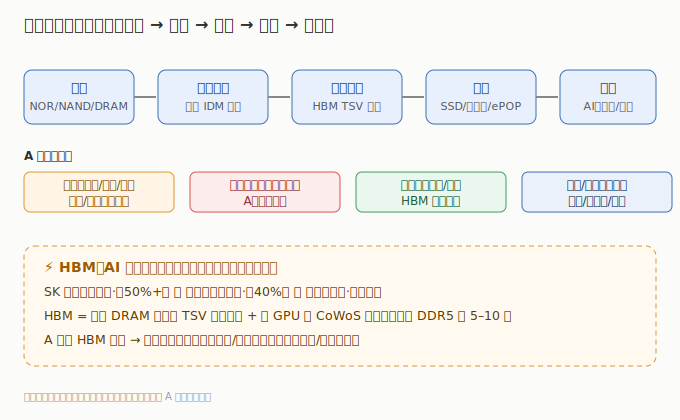

# 存储芯片行业研究

> **一句话定位**：存储芯片（Memory）是 AI 算力的「内存底座」——GPU 算得再快，HBM/DRAM 供不上数据也是空转。HBM 三寡头垄断、AI 服务器拉动的存储升级，是整条 AI 主线被低估的「硬缺口」。

AI 大模型的参数与激活值，必须放在离计算单元极近的高速内存里才能高效运转。HBM（高带宽内存）直接堆叠在 GPU 旁，决定了单卡算力上限；DRAM/NAND 则承载训练数据与模型权重。当云厂商疯狂采购 AI 服务器，存储（尤其是 HBM、高容量 DRAM、企业级 NAND）同步成为紧缺环节——**存储是 AI 主线里「量价齐升 + 国产替代」双重逻辑最清晰的环节之一**。本板块覆盖广义存储链条：设计（NOR/NAND/DRAM/EEPROM）→ 模组 → 封测 → 分销，与「AI 算力芯片」板块互补（芯片算得快，内存供得上才不卡脖子）。

---

---

## 关键数据速览（2025 年报 / 最新财年，neodata 核对）

| 公司 | 市场 | 2025 营收 | 同比 | 归母净利润 | 一句话定位 |
|------|------|----------|------|-----------|------------|
| 兆易创新 603986 | A股 | ¥92.03 亿 | +25.12% | ¥16.48 亿 | 利基存储龙头（NOR 全球第二 + DRAM + SLC NAND + MCU） |
| 江波龙 301308 | A股 | ¥227.66 亿 | +30.36% | ¥14.23 亿 | NAND 模组龙头（Lexar），企业级 eSSD 放量 |
| 佰维存储 688525 | A股 | ¥113.02 亿 | +68.81% | ¥8.53 亿 | AI 端侧存储（Meta 眼镜独家）+ 晶圆级封测 |
| 深科技 000021 | A股 | ¥157.47 亿 | +6.21% | ¥11.36 亿 | 沛顿科技，存储封测龙头，承接 AI 存储封测 |
| 香农芯创 300475 | A股 | ¥352.51 亿 | +45.24% | ¥5.45 亿 | SK 海力士授权分销 + 海普存储自研 |
| 美光 MU | 美股 | $373.78 亿 | +48.85% | $85.39 亿 | HBM 三寡头中唯一美股，HBM3E 供货英伟达 |
| 西部数据 WDC | 美股 | $95.20 亿 | -26.78% | $16.15 亿 | NAND + HDD，AI 大容量存储 |

> 港股暂无纯存储芯片上市公司（HBM 双雄 SK 海力士 / 三星为韩股，美光为美股），详见 [港股子文件](./港股/存储芯片港股.md)。完整 13 家（A股 11 + 美股 2）见 [04 章](./04-核心公司分析.md)。美股单季数据 neodata 接口异常，详见子文件标注。

---

## 市场有多大（行业研究口径）

- **全球存储市场**：DRAM + NAND 合计约 **1600–1800 亿美元**量级（2025），其中 DRAM 约 1000 亿、NAND 约 600–700 亿；HBM 作为子集约 150–200 亿美元但增速最快（AI 拉动，年增 100%+）。
- **HBM 是核心变量**：HBM 占 AI 服务器 BOM 成本约 个位数到十几个百分点，但供给被 SK 海力士 / 三星 / 美光三家垄断，2025–2027 产能持续紧缺，是存储板块估值弹性的主要来源。
- **A 股存储链条**：以模组 / 封测 / 利基设计为主，正从「价格周期受益」走向「企业级 + AI 端侧 + 国产替代」三重驱动。

> 数据来源：2026 年产业链研究报告（TrendForce / 行业口径）量级估算；HBM 增速与 AI  capex 强相关。

---

## 本章导航

- [01 技术体系与发展脉络](./01-技术体系与发展脉络.md) — DRAM/NAND/NOR/EEPROM/HBM 分类与代际演进
- [02 产业链深度拆解](./02-产业链深度拆解.md) — 设计→制造→封测→模组→终端，HBM 堆叠结构
- [03 市场格局与竞争态势](./03-市场格局与竞争态势.md) — 三寡头垄断、国产替代空间
- [04 核心公司分析](./04-核心公司分析.md) — A股 11 家 + 美股 2 家索引表
- [05 未来趋势与投资逻辑](./05-未来趋势与投资逻辑.md) — HBM 扩产、周期复苏、风险

> **版本**：v1.0（已核对）｜**更新日期**：2026-07-11｜**数据来源**：neodata-financial-search（东方财富），A股 2025 年报 + 2026Q1、美股最新财年（单季 neodata 异常已标注）；市场规模来自 2026 年产业链研究报告（行业口径）
