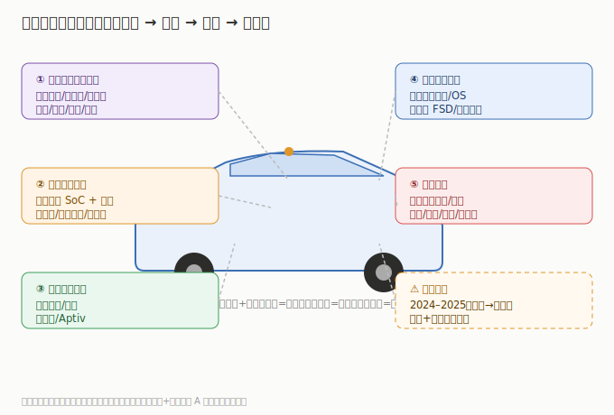

# 01 技术体系与发展脉络

> 智能驾驶不是单一技术，而是一套「感知—决策—执行—软件」的全栈系统。先搞清楚由哪些环节组成、哪个最值钱，才能看懂为什么 A股炒域控和线控、港股炒芯片和激光雷达。

## 1.1 一辆智驾车的系统构成

以城市 NOA（领航辅助驾驶）为例，核心子系统：

| 子系统 | 作用 | 关键部件 | 代表公司 | 市场 |
|--------|------|---------|---------|------|
| **感知** | 看清周围环境 | 摄像头、激光雷达、毫米波雷达、超声波 | 禾赛/速腾（激光雷达）、永新/联创（光学） | 港/美/A |
| **决策（大脑）** | AI 推理与规划 | 智驾芯片（SoC）、域控制器 | 地平线/黑芝麻（芯片）、德赛西威/科博达（域控） | 港/A |
| **执行** | 把决策变成动作 | 线控转向/制动、线控底盘 | 伯特利（线控制动）、Aptiv | A/美 |
| **软件** | 算法与体验 | 端到端大模型、OS/中间件 | 特斯拉 FSD、中科创达（座舱软件） | 美/A |
| **整车集成** | 总装与验证 | 电子电气架构、标定 | 小鹏/理想/蔚来 | 港/美 |

## 1.2 最值钱的环节：决策（芯片+域控）

- **智驾芯片（SoC）**是算力载体，决定能跑多复杂的模型；地平线征程、英伟达 Orin/Thor、Mobileye EyeQ 是主流。
- **域控制器**把芯片、散热、电源、通信集成，是 Tier1 的核心抓手——**德赛西威（英伟达 Orin 核心伙伴）是 A股确定性最高的「卖铲人」**。
- 芯片+域控单机价值量高（数千至万元级）、技术壁垒强，是板块价值量最集中的环节。

## 1.3 感知：激光雷达 vs 纯视觉

- **多传感器融合**（摄像头+激光雷达+毫米波）是主流方案，激光雷达提供精确三维测距；禾赛/速腾是国产龙头，永新光学供光学元件。
- **纯视觉**（特斯拉 FSD）只用摄像头+神经网络，省成本但依赖极致算法与数据量。
- 两条路线并行：国内车企（小鹏/理想/华为）多走融合路线，激光雷达放量直接拉动上游。

## 1.4 执行：线控是 L3+ 的刚需

- L3+ 自动驾驶要求**线控底盘**（线控制动/转向）实现电信号精准控制，替代机械液压——伯特利 WCBS（ONE-BOX）是国产突破代表，Aptiv 是全球 Tier1。
- 线控是「软件定义汽车」的执行基础，价值量随智驾等级提升。

## 1.5 软件：端到端大模型的拐点

- 2024–2025 智驾从「规则+模块」跨入**端到端神经网络**（输入感知、输出控制，中间由大模型统一），数据驱动替代人工规则。
- 特斯拉 FSD V12+、小鹏 VLA、华为 ADS 是代表；软件能力成为车企差异化核心，订阅变现（FSD）打开新收入。

## 1.6 演进主线

1. **从 L2 到城市 NOA**：辅助驾驶标配化，城市领航从演示到日常可用（2025–2026 拐点）。
2. **从模块到端到端**：算法范式切换，数据+算力成为护城河。
3. **国产替代**：芯片（地平线/黑芝麻）、激光雷达（禾赛/速腾）、域控（德赛西威）全面突破。

> 投资含义：**决策（芯片+域控）价值量最高、壁垒最强；感知（激光雷达）放量最快；执行（线控）是 L3+ 刚需；整车在港/美，A股赚零部件放量+国产替代。**

---

---

> **版本**：v1.0（已核对）｜**更新日期**：2026-07-11｜**数据来源**：行业共识性技术框架；财务数据见各子文件（neodata-financial-search，东方财富）
