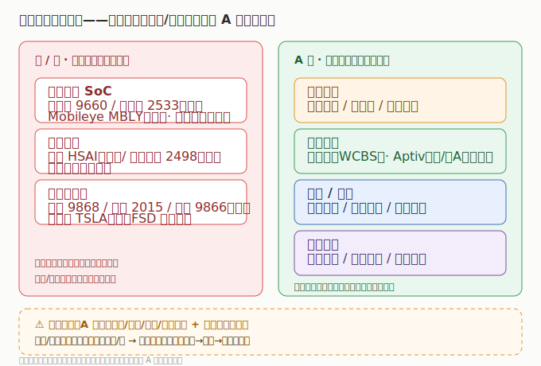

# 03 市场格局与竞争态势

> 智能驾驶格局的特殊性：智驾芯片/激光雷达的纯标的在港股/美股，域控/线控/座舱在 A股，整车横跨港/美。理解这个「分层」，才能理解为什么 A股炒零部件、核心科技在海外。

## 3.1 智驾芯片：国产突破 vs 海外双雄

- **海外**：英伟达（Orin/Thor，算力标杆）、Mobileye（EyeQ，视觉方案鼻祖）。
- **国产**：地平线（征程系列，自主 ADAS 市占 47.7% 第一）、黑芝麻智能（华山/武当系列）。
- 国产替代在 L2+ 经济型车型快速渗透，高端仍看英伟达；芯片厂仍处投入期（地平线/黑芝麻报表亏损受优先股扰动，看经调整口径）。

## 3.2 激光雷达：中国领跑

- **禾赛（美）**与**速腾聚创（港）**是全球车载激光雷达双雄，凭借自研芯片降本+规模效应，把激光雷达从「选配」推向「标配」。
- 上游光学元件（永新光学）随之放量；A股无纯激光雷达整机上市标的，赚「光学元件+模组」增量。

## 3.3 域控与线控：A股主战场

- **域控**：德赛西威（Orin 核心 Tier1，体量第一）、科博达（多域）、经纬恒润（全栈扭亏）。
- **线控**：伯特利（WCBS ONE-BOX 龙头）、Aptiv（全球 Tier1）。
- 特点：业绩已兑现、增速稳健，是板块「确定性锚」；绑定头部整车（理想/小鹏/华为系）者确定性最高。

## 3.4 整车：智驾差异化竞争

- 小鹏（算法+图灵芯片）、理想（产品+NOA）、蔚来（芯片+换电）、特斯拉（FSD 纯视觉）以智驾构筑溢价。
- 整车周期波动大，但智驾能力直接决定车型竞争力与估值——是板块的「需求牵引端」。

## 3.5 国产替代空间

| 环节 | 国产化进度 | 代表 |
|------|-----------|------|
| 智驾芯片 | 突破中，份额提升 | 地平线/黑芝麻 |
| 激光雷达 | 领先全球 | 禾赛/速腾 |
| 域控制器 | 成熟，份额高 | 德赛西威/科博达 |
| 线控制动 | 突破中 | 伯特利 |
| 座舱软件 | 成熟 | 中科创达 |

> 核心认知：**芯片/激光雷达的纯科技标的在港/美，A股赚「域控/线控/座舱/感知硬件放量+国产替代」；绑定大客户+量产能力是分水岭。**

---

---

> **版本**：v1.0（已核对）｜**更新日期**：2026-07-11｜**数据来源**：市场份额为行业研究共识性估算；财务数据见各子文件（neodata-financial-search，东方财富）
