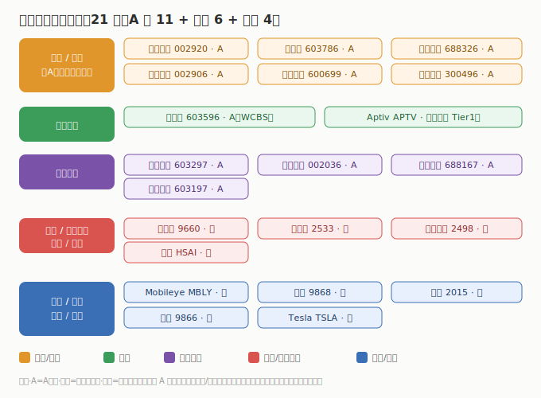

# 04 核心公司分析

> **给投资者的第一句话**：智能驾驶公司多、环节杂、市场分层是最大特征（芯片/激光雷达在港美、域控/线控在 A股、整车在港美）。本节只做「索引 + 一句话逻辑 + 真实财务」，逐家深挖在子文件里。财务为 **2025 年报 / 最新财年** 口径，数据来自 neodata（东方财富）核对。

## 4.1 A 股（11 家，2025 年报）

| 公司 | 代码 | 环节 | 2025 营收 | 2025 营收同比 | 2025 归母净利 | 一句话逻辑 |
|------|------|------|----------|--------------|--------------|------------|
| 德赛西威 | 002920 | 域控/座舱 | ¥325.57 亿 | +17.88% | ¥24.54 亿 | 英伟达 Orin 核心 Tier1，域控龙头 |
| 伯特利 | 603596 | 线控制动 | ¥120.14 亿 | +20.91% | ¥13.09 亿 | WCBS ONE-BOX 线控龙头 |
| 华阳集团 | 002906 | 座舱/HUD | ¥130.48 亿 | +28.46% | ¥7.82 亿 | AR-HUD+座舱电子核心 |
| 科博达 | 603786 | 域控/车灯 | ¥69.34 亿 | +13.80% | ¥8.29 亿 | 车身/底盘域控制器龙头 |
| 经纬恒润 | 688326 | 域控/车身 | ¥68.48 亿 | +23.59% | ¥1.00 亿 | 智驾全栈 Tier1，扭亏 |
| 均胜电子 | 600699 | 座舱/安全 | ¥611.83 亿 | +9.52% | ¥13.36 亿 | 主动安全+座舱 Tier1，体量最大 |
| 中科创达 | 300496 | 座舱软件 | ¥77.78 亿 | +44.45% | ¥4.50 亿 | 座舱 OS/中间件+智驾软件 |
| 保隆科技 | 603197 | 传感器/空悬 | ¥87.47 亿 | +24.52% | ¥2.13 亿 | 传感器+空气悬架 |
| 联创电子 | 002036 | 车载镜头 | ¥82.59 亿 | -19.12% | -¥10.11 亿 | 车载镜头，消费电子拖累 |
| 永新光学 | 603297 | 车载光学 | ¥9.65 亿 | +8.25% | ¥2.20 亿 | 激光雷达光学元件 |
| 炬光科技 | 688167 | 激光雷达发射 | ¥8.80 亿 | +41.93% | -¥0.38 亿 | VCSEL/激光光学，亏收窄 |

> A 股 26Q1：neodata 当前（2026-07-11）对 11 家 26Q1 单季数据**均未收录**，故绝对值/同比统一标「数据未收录」；以 2025 年报为最新确认值。逐家深挖见 [A股子文件](./A股/智能驾驶A股.md)。

## 4.2 港股（6 家）

| 公司 | 代码 | 环节 | 最新财年营收 | 营收同比 | 净利 | 智驾落点 |
|------|------|------|------------|----------|------|---------|
| 地平线 | 9660 | 智驾芯片 | ~¥37.58 亿 | +57.67% | 亏 -104.69 亿⚠️ | 征程 SoC，ADAS 市占第一（经调整亏约 -28.1 亿） |
| 速腾聚创 | 2498 | 激光雷达 | ~¥19.41 亿 | +17.72% | 亏 -1.46 亿 | 车载+机器人激光雷达（亏收窄 69.7%） |
| 黑芝麻智能 | 2533 | 智驾芯片 | ~¥8.22 亿 | +73.4% | 亏 -14.25 亿 | 华山/武当系列（经调整亏约 -10.8 亿） |
| 小鹏汽车 | 9868 | 智能化整车 | $106.73 亿 | +87.95% | -$1.59 亿 | 图灵芯片+VLA，智驾领先 |
| 理想汽车 | 2015 | 智能化整车 | $156.24 亿 | -22.16% | $1.56 亿（-85.98%） | 增程/纯电，城市 NOA |
| 蔚来 | 9866 | 智能化整车 | $121.71 亿 | +33.25% | -$21.66 亿 | NX9031 芯片+换电，三品牌 |

> ⚠️ 地平线/黑芝麻报表净利受优先股公允价值变动干扰（非经营），研判看「经调整净亏损」；小鹏/理想/蔚来为美股 ADR（同时港双重上市），neodata 返回美元。详见 [港股子文件](./港股/智能驾驶港股.md)。

## 4.3 美股（4 家）

| 公司 | 代码 | 环节 | 最新财年 | 财年营收 | 营收同比 | 财年净利 | 最新单季 | 单季营收 | 单季营收同比 | 智驾落点 |
|------|------|------|----------|----------|----------|----------|----------|----------|--------------|---------|
| Mobileye | MBLY | 方案+芯片 | FY2025 | $18.94 亿 | +14.51% | -$3.92 亿（亏收窄） | 2026Q1 | $5.58 亿 | +27.40% | EyeQ+视觉方案 |
| Aptiv | APTV | 线控+系统 | FY2025 | $203.98 亿 | +3.47% | $1.65 亿（-90.77%） | 2026Q1 | $50.86 亿 | +5.41% | 线控底盘+ADAS |
| 禾赛 | HSAI | 激光雷达 | FY2025 | $4.21 亿 | +45.93% | $0.61 亿（扭亏） | 2026Q1 | $0.98 亿 | +36.14% | AT/ET/Pandar |
| Tesla | TSLA | FSD | FY2025 | $948.27 亿 | -2.94% | $37.94 亿 | 2026Q1 | $223.87 亿 | +15.79% | FSD 纯视觉（集团口径） |

> ⚠️ Mobileye 2026Q1 单季净亏含 37.88 亿 $ 非经常性一次性计提（经营性约 -0.30 亿），详见 [美股子文件](./美股/智能驾驶美股.md)；Tesla 财务为集团合并口径，FSD 收入未单列、Optimus 另见人形机器人板块。

---

---

> **版本**：v1.0（已核对）｜**更新日期**：2026-07-11｜**数据来源**：neodata-financial-search（东方财富），A股 2025 年报（26Q1 未收录）、港股/美股 2025 财年+单季（Mobileye 单季异常已标注）；涨跌配色：正增长红、负增长/亏损绿
