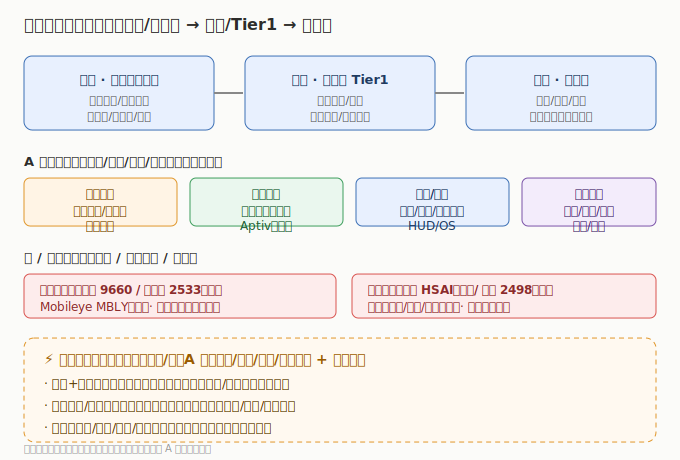

# 智能驾驶行业研究

> **一句话定位**：智能驾驶是 AI 上车的「车端 AI」——把大模型/端到端算法装进车，让车自己感知、决策、执行。它是 AI 主线在「出行」场景的落地，与「AI 算力芯片 / 存储」互补（车端需要算力与存储），又拉动 A股零部件（域控/线控/感知硬件）放量。

AI 的下一个十年不止在屏幕与机房。当大模型具备因果推理与规划能力，把它装进车，就能让车在真实道路自主行驶——这是比手机更大的 AI 落地场景。2025 年起，**端到端大模型上车**（特斯拉 FSD V12+、小鹏 VLA、华为 ADS）让智驾从「规则驱动」跨入「数据驱动」，城市 NOA 从演示走向日常可用。**智能驾驶成为车企差异化核心、AI 主线最确定的落地场景之一**。本板块覆盖智驾的「芯片—感知—决策—执行—整车」全链条，与「AI 算力芯片 / 存储 / 人形机器人」互补——车端既消耗 AI 算力，又拉动精密制造。

---

---

## 关键数据速览（2025 年报 / 最新财年，neodata 核对）

| 公司 | 市场 | 2025 营收 | 同比 | 归母/净利 | 一句话定位 |
|------|------|----------|------|-----------|------------|
| 德赛西威 002920 | A股 | ¥325.57 亿 | +17.88% | ¥24.54 亿 | 英伟达 Orin 域控龙头（Tier1） |
| 伯特利 603596 | A股 | ¥120.14 亿 | +20.91% | ¥13.09 亿 | 线控制动 WCBS 龙头 |
| 地平线 9660 | 港股 | ¥37.58 亿 | +57.67% | 亏 -104.69 亿⚠️ | 国产智驾芯片第一（经调整亏约 -28.1 亿） |
| 速腾聚创 2498 | 港股 | ¥19.41 亿 | +17.72% | 亏 -1.46 亿 | 激光雷达龙头（亏收窄 69.7%） |
| Mobileye MBLY | 美股 | $18.94 亿 | +14.51% | 亏 -3.92 亿 | EyeQ 智驾方案+芯片（Intel 分拆） |
| 禾赛 HSAI | 美股 | $4.21 亿 | +45.93% | $0.61 亿（扭亏） | 激光雷达（美股最纯标的） |

> ⚠️ 地平线/黑芝麻报表净利受优先股公允价值变动干扰（非经营），研判看「经调整净亏损」；Mobileye 2026Q1 单季净亏含 37.88 亿 $ 非经常性一次性计提（详见 [美股子文件](./美股/智能驾驶美股.md)）。A股 26Q1 数据 neodata 当前未收录，本表以 2025 年报为最新确认值。完整 11+6+4 家见 [04 章](./04-核心公司分析.md)。

---

## 市场有多大（行业研究口径）

- **渗透率拐点**：L2 级辅助驾驶已成新车标配，城市 NOA（领航辅助）从 2024 演示走向 2025–2026 日常可用，**智驾从「选配」变「标配」**是核心驱动。
- **价值量分布**：单车智驾硬件价值量随等级跃升——L2 数千元，L3+ 域控+激光雷达+线控可达 **1–3 万元**，是汽车零部件中增速最快的细分。
- **国产替代空间**：智驾芯片（地平线/黑芝麻 vs Mobileye/英伟达）、激光雷达（禾赛/速腾 vs 海外）、域控（德赛西威 vs 博世/大陆）全面国产突破，是 A股/港股核心弹性来源。
- **A 股逻辑**：整车在港/美，A股赚「域控/线控/感知硬件放量 + 国产替代」——与「人形机器人」板块「整机在海外、零部件在 A股」的逻辑同构。

> 数据来源：2026 年产业链研究报告（行业口径）量级估算；财务数据见各子文件（neodata-financial-search，东方财富）。

---

## 本章导航

- [01 技术体系与发展脉络](./01-技术体系与发展脉络.md) — 感知/决策/执行/软件全栈
- [02 产业链深度拆解](./02-产业链深度拆解.md) — 从芯片到整车的价值分布
- [03 市场格局与竞争态势](./03-市场格局与竞争态势.md) — 国产替代 vs 海外巨头
- [04 核心公司分析](./04-核心公司分析.md) — 11+6+4 索引表
- [05 未来趋势与投资逻辑](./05-未来趋势与投资逻辑.md) — 端到端拐点、投资框架、风险

> **版本**：v1.0（已核对）｜**更新日期**：2026-07-11｜**数据来源**：neodata-financial-search（东方财富），A股 2025 年报（26Q1 neodata 未收录）、港股/美股 2025 财年+单季（Mobileye 单季异常已标注）；市场规模来自 2026 年产业链研究报告（行业口径）
