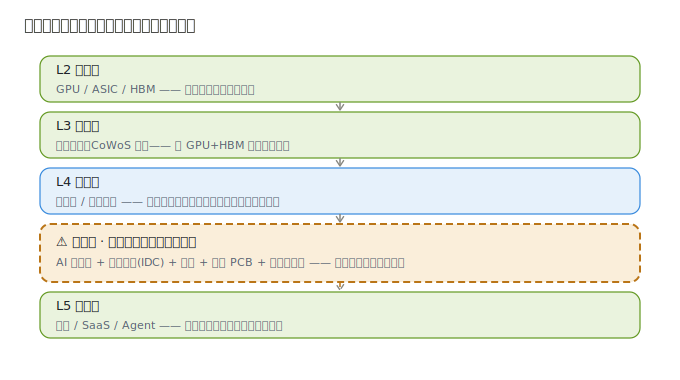
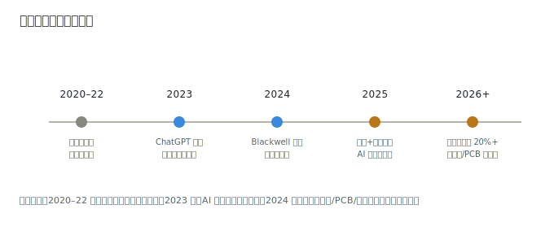

# 01 · 技术体系与发展脉络

> **给投资者的第一句话**：前面四层（芯片/封装/光模块/半导体）拼的是「算力零件」；这一层拼的是「把零件变成能用的算力」。本节把服务器、IDC、液冷、PCB、电源这几个绕口的词用大白话讲清楚——因为这一层的投资，本质是投「云厂商的 AI 军备竞赛，谁在卖铲子、谁卖的是稀缺铲子」。

---

## 1.1 一个类比：发动机 vs 整车厂 + 车库 + 水电

把整条 AI 产业链想成「造车 + 用车」：

| 产业链环节 | 汽车类比 | 在 AI 里是什么 |
|------------|----------|----------------|
| AI 算力芯片（L2） | 发动机（汽轮机） | GPU/ASIC，算力的源头 |
| 先进封装（L3） | 把发动机和变速箱铸在一起 | 把 GPU+HBM 封成完整芯片 |
| 光模块（L4 互联） | 传动轴 / 油路 | 把芯片之间、服务器之间连起来 |
| **算力基础设施（本模块）** | **整车厂 + 车库 + 空调 + 电路** | **服务器 + 数据中心 + 液冷 + PCB + 电源** |
| AI 应用（L5） | **开车的人** | **用算力干活的软件/企业** |

**投资含义**：发动机再强，没有整车厂把它装成车、没有车库停、没有空调散热、没有电路供电，车也跑不起来。算力基础设施就是「让 GPU 真正干活」的那一整套物理系统——它离「订单兑现」最近，因为云厂商买的就是这一整套。

---

## 1.2 五个核心概念（配类比）

### ① AI 服务器 / 整机柜 —— 「装好发动机的整车」

**它是什么**：把 GPU、CPU、内存、PCB、电源、网卡组装成一台能跑 AI 任务的服务器；多台再组成「整机柜（Rack）」。

**类比**：服务器就是「装好发动机的整车」。工业富联、超微（SMCI）、戴尔干的活，相当于「把英伟达的发动机攒成能下线的车」。

**为什么对投资重要**：AI 服务器是这一层**营收体量最大**的环节（工业富联一年几千亿营收里 AI 服务器已是核心增量），但也是**竞争最烈、毛利最薄**的「组装活」——拼的是供应链、交付和规模，不是技术壁垒。

### ② 数据中心（IDC）—— 「停车库 + 机房」

**它是什么**：专门放服务器、提供电、网络、制冷、安全的建筑/园区。分「自建自用」（云厂商自建超大园区）和「零售/批发租用」（第三方 IDC 如润泽、Equinix）。

**类比**：IDC 就是「车库 + 厂房」。车（服务器）得有地方停、有电用、有网连。

**为什么对投资重要**：AI 训练集群耗电极高（一个万卡集群年耗电上亿度），**IDC 是重资产、长周期、有区位壁垒的生意**。第三方 IDC 赚「机柜租金 + 运维」，IDC REIT（Equinix、Digital Realty）是美股里最稳的「收租」标的。

### ③ 液冷 —— 「给发动机降温的空调」（本模块最大增量）

**它是什么**：用液体（冷板/浸没）替代传统风扇，把 GPU 产生的巨热带走。

**类比**：高功率发动机必须上液冷，风冷压不住。一颗 AI 芯片功耗从 350W（训练卡）飙到 1000W+（Blackwell），**风冷彻底不够用，液冷从「可选项」变「必选项」**。

**为什么对投资重要**：液冷是这一层**增速最快、壁垒最高**的子环节。英维克、Vertiv、高澜做的是「稀缺部件」，单价和渗透率双升，利润弹性远大于组装服务器的。

### ④ PCB（印制电路板）—— 「整车的神经网络」

**它是什么**：服务器里承载芯片、联通信号的多层电路板。AI 服务器用**高阶 PCB**（如 UBB 通用基板、交换机板），层数多、线宽细、良率难。

**类比**：PCB 就是「整车的电路神经网」。发动机再强，神经接不好也白搭。

**为什么对投资重要**：AI 服务器 PCB 价值量比通用服务器高数倍，沪电股份、深南电路、胜宏科技是核心供应商，**国产替代 + AI 增量**双击，是 A 股弹性最大的细分之一。

### ⑤ 电源 / 供配电 —— 「加油站 + 电网」

**它是什么**：把市电转换成服务器要的低压直流，含 PSU 电源模块、UPS、配电柜。

**类比**：电源就是「加油站 + 小区电网」。AI 机柜功率密度暴增，供配电要从「普通插座」升级到「工业级电站」。

**为什么对投资重要**：Vertiv、Eaton、欧陆通、麦格米特做的是「卖水人里的卖水人」——不管你用谁家的 GPU/服务器，只要上高功率机柜，就得买高性能供配电，需求确定性极高。

---

## 1.3 为什么「液冷」突然成了必选项（关键认知）

一张图看懂本模块在产业链的位置：芯片（L2）→ 封装（L3）→ 互联（L4 光模块）→ **【本模块：服务器 → 数据中心 → 液冷/PCB/电源】** → 应用（L5）。

液冷的拐点逻辑（对投资致命）：

1. **功率密度越过风冷天花板**：单芯片功耗破 1000W，单机柜从 10kW 升到 100kW+，风冷散热效率触及物理极限。
2. **液冷从 PUE 优化变刚需**：风冷数据中心 PUE（能耗比）约 1.5，液冷可压到 1.1 以下——在电费占 IDC 运营成本 60%+ 的今天，液冷直接省真金白银。
3. **渗透率 5% → 20%+ 的拐点**：2025 起新建 AI 大集群普遍标配液冷，相关公司订单爆发式增长。

> **投资视角小结**：这一层不是「有没有需求」的问题（云厂商 capex 已说明一切），而是「**需求分配到谁、谁的部件更稀缺**」的问题。服务器是总量、液冷/PCB/电源是更优的稀缺增量。

---

## 1.4 发展脉络：从「通用服务器」到「AI 整机柜」

| 时间 | 标志事件 | 对投资的含义 |
|------|----------|----------------|
| 2020–2022 | 通用服务器饱和，行业低增长 | 传统服务器厂估值受压 |
| 2022.11 | ChatGPT 引爆算力需求 | 训练侧拉动 GPU，服务器订单回暖 |
| 2023 | 云厂商 capex 上修，H100 一卡难求 | 服务器厂接单暴增，但芯片短缺卡产能 |
| 2024 | Blackwell 量产，单机柜功率破 100kW | **液冷从可选变必选**，液冷/PCB/电源子环节起飞 |
| 2025 | 推理爆发 + 国产算力（昇腾）放量 | AI 服务器放量 + 国产替代双击，IDC 上架率回升 |
| 2026+ |  Agents/推理常态化，机柜液冷标配 | 液冷渗透率 20%+，供配电/PCB 持续高景气 |

> **投资视角小结**：2020–2022 是「通用服务器存量博弈」；2023 起是「AI 服务器增量盛宴」；2024 起分化到「液冷/PCB/电源等稀缺部件」才是利润最厚的地方。

---

> **上一章**：[算力基础设施行业研究](./算力基础设施行业研究.md)　|　**下一章**：[02-产业链深度拆解](./02-产业链深度拆解.md)

> **版本**：v1.0（已核对）｜**更新日期**：2026-07-11
> **数据来源**：neodata-financial-search（东方财富）2025 年报 + 2026Q1 / 最新财年 + 单季口径，2026-07-11 核对；概念与脉络为行业共识性表述。
