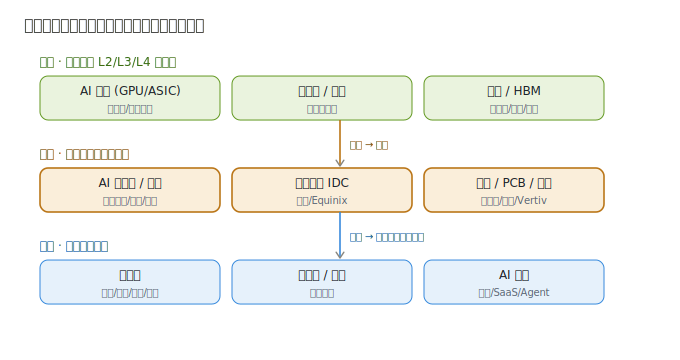

# 02 · 产业链深度拆解

> **给投资者的第一句话**：这一层没有「光刻机」那种硬科技卡脖子，但价值链高度分化——**组装服务器是苦力活，液冷/PCB/电源才是利润池**。拆解产业链，核心是要回答：**钱在哪一环被赚走、哪一环只是陪跑？**

---

## 2.1 产业链全景

算力基础设施的产业链可以拆成「**上游零件 → 中游部署 → 下游使用**」三段，本模块聚焦中游：

| 段落 | 角色 | 赚钱逻辑 | 代表公司 |
|------|------|----------|----------|
| 上游 · 零件 | 芯片（L2）、光模块（L4）、内存/HBM | 卖高壁垒零件，利润最厚 | 英伟达、台积电、中际旭创（见其他模块） |
| **中游 · 部署（本模块）** | 服务器整机、IDC、液冷、PCB、电源 | 系统集成 + 稀缺部件 + 机柜租金 | 工业富联、英维克、沪电、Vertiv、Equinix |
| 下游 · 使用 | 云厂商、互联网、政企自建算力 | 买部署好的算力跑业务 | 微软、阿里、腾讯、字节（未上市） |

> **关键事实**：下游云厂商（微软/谷歌/亚马逊/阿里/腾讯）才是**真正的金主**——它们的 AI 资本开支持续超预期，直接变成中游的订单。所以看这一层，先盯云厂商 capex，再看订单落到谁家。

---

## 2.2 中游一：AI 服务器 / 整机柜（「整车厂」）

**它是什么**：把 GPU 等零件组装成 AI 服务器，多台组成整机柜交付。

**投资要点**：
- **营收大、毛利薄**：工业富联 AI 服务器年出货几百亿美元，但整机组装净利率仅个位数——赚的是规模和供应链钱。
- **份额看绑定**：谁深度绑定英伟达/云厂商，谁吃增量。工业富联（微软/亚马逊/英伟达代工）、超微（液冷整机柜高弹性）、戴尔（企业渠道）各擅其场。
- **国产线独立**：华为昇腾生态催生「昇腾服务器」链（神州数码、华鲲振宇等），是国产替代变量。

---

## 2.3 中游二：数据中心 IDC（「车库」）

**它是什么**：提供机柜、电、网、制冷、安全的算力物理空间。

| 模式 | 怎么赚钱 | 代表 |
|------|----------|------|
| 自建自用 | 云厂商自己建超大园区，不对外 | 微软/谷歌/阿里/腾讯自建 |
| 批发型 IDC | 按整栋/大客户长租，稳定收租 | 润泽科技、Equinix、Digital Realty |
| 零售型 IDC | 小机柜灵活租，单价高波动大 | 数据港、奥飞数据 |

**投资要点**：IDC 是**重资产、长周期、有区位/能耗指标壁垒**的生意。AI 大集群推高上架率和单机柜功率，利好有稀缺能耗指标和一线资源的第三方 IDC。美股 IDC REIT（Equinix、DLR）现金流最稳。

---

## 2.4 中游三：液冷 / PCB / 电源（「稀缺部件」，利润池）

这三块是这一层**增量最大、壁垒最高**的细分，也是投资最该聚焦的：

| 环节 | 作用 | 类比 | 壁垒 | 代表 |
|------|------|------|------|------|
| **液冷** | 给高功率机柜降温 | 发动机空调 | 高（工程经验+客户认证） | 英维克、高澜、Vertiv、nVent |
| **高阶 PCB** | 服务器内承载/联通芯片 | 整车神经网 | 高（层数/良率/认证） | 沪电、深南、胜宏、鹏鼎 |
| **电源/供配电** | 把市电转成服务器要的电 | 加油站+电网 | 中高（功率密度+效率） | Vertiv、Eaton、欧陆通、麦格米特 |

**投资要点**：这三块共同特征是——**不管你用哪家 GPU/服务器，只要上高功率 AI 机柜，就得买它们**。需求确定性极高，且单价（液冷渗透率、PCB 层数、电源功率）随 AI 升级持续提升，是「卖水人里的卖水人」。

---

## 2.5 价值链在哪：一张表说清「谁苦谁赚」

| 环节 | 营收弹性 | 毛利/壁垒 | 投资定性 |
|------|----------|-----------|----------|
| AI 服务器整机 | ⭐⭐⭐⭐⭐ 最大 | ⭐⭐ 薄、拼规模 | 总量大、利润薄，看份额与绑定 |
| IDC | ⭐⭐⭐⭐ | ⭐⭐⭐ 重资产收租 | 稳现金流，看上架率与指标 |
| 液冷 | ⭐⭐⭐⭐⭐ 增速最快 | ⭐⭐⭐⭐ 高 | **稀缺增量，最优细分之一** |
| 高阶 PCB | ⭐⭐⭐⭐⭐ | ⭐⭐⭐⭐ 高 | **国产替代+AI 双击，高弹性** |
| 电源/供配电 | ⭐⭐⭐⭐ | ⭐⭐⭐⭐ 高 | **确定性卖水人，美股最厚** |

> **投资铁律**：同等 AI 题材下，**稀缺部件（液冷/PCB/电源）> 整机集成 > 纯概念 IDC**。看一家算力基础设施公司，先问它「卖的是整车还是稀缺零件」——这是判断利润厚薄的第一把尺子。

---

> **上一章**：[01-技术体系与发展脉络](./01-技术体系与发展脉络.md)　|　**下一章**：[03-市场格局与竞争态势](./03-市场格局与竞争态势.md)

> **版本**：v1.0（已核对）｜**更新日期**：2026-07-11
> **数据来源**：neodata-financial-search（东方财富）2025 年报 + 2026Q1 / 最新财年 + 单季口径，2026-07-11 核对；产业链结构为行业共识性框架。
