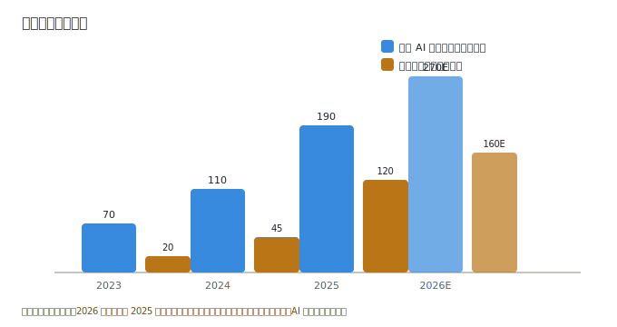
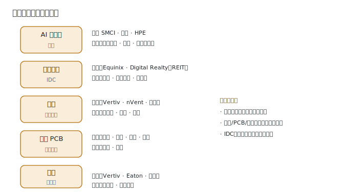
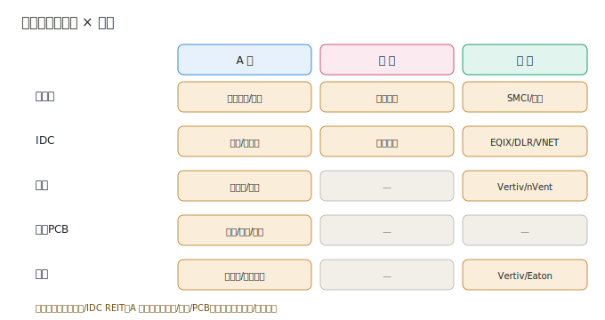

# 03 · 市场格局与竞争态势

> **给投资者的第一句话**：这一层的钱，大头被**云厂商的 capex** 决定，订单则分到了「整机厂」和「稀缺部件厂」两边。全球看美股（Vertiv/Equinix/SMCI）利润最厚，中国看 A 股（工业富联/英维克/沪电）弹性最大。本节把市场规模和竞争格局一次讲清。

---

## 3.1 市场规模（行业研究口径，2026 年报告 2025 全年估算）

| 细分市场 | 2025 规模 | 增速 | 关键趋势 |
|----------|-----------|------|----------|
| 全球 AI 服务器 | ~1900 亿美元 | +50%+ | 占整体服务器出货比重快速攀升 |
| 中国 AI 服务器 | ~2000 亿元人民币 | +40%+ | 昇腾等国产算力占比提升 |
| 全球数据中心（IDC） | ~2800 亿美元 | +10%~15% | 第三方+云自建双增 |
| 全球液冷 | ~120 亿美元 | +30%+ CAGR | 渗透率 5% → 20%+ 拐点 |

> 以上为产业链研究报告（IDC/行业口径）2025 全年估算，来源 2026 年行业研究。核心结论不变：**液冷是增速最快的子环节，AI 服务器是体量最大的增量**。

---

## 3.2 竞争格局：按环节拆解

### AI 服务器
- **全球**：超微（SMCI）、戴尔、HPE 主导；ODM 代工（鸿海/工业富联）吃下云厂商自建订单。
- **中国**：工业富联（绑定北美云厂+英伟达）、浪潮信息（国内份额领先）、华为昇腾系（神州数码等）三足。
- **集中度**：云厂商订单高度集中，绑定大客户者赢。

### 数据中心 IDC
- **全球**：Equinix、Digital Realty（REIT，全球布局）为双寡头；第三方批发型格局分散。
- **中国**：润泽（批发大客户）、宝信（钢厂资源）、数据港/奥飞（零售+批发）等，受一线能耗指标约束，有区位壁垒。

### 液冷 / PCB / 电源
- **液冷**：全球 Vertiv、nVent、施耐德；中国英维克（精密空调+液冷）、高澜、申菱。认证壁垒高，先发者占优。
- **高阶 PCB**：中国主导供应链——沪电（AI 服务器 UBB/交换机板）、深南、胜宏、鹏鼎；台系（欣兴/臻鼎）亦强。
- **电源**：全球 Vertiv、Eaton、施耐德；中国欧陆通（服务器 PSU）、麦格米特。

---

## 3.3 玩家矩阵：谁在哪个环节赚钱

| 环节 | A股代表 | 港股代表 | 美股代表 | 利润厚度 |
|------|---------|----------|----------|----------|
| AI 服务器 | 工业富联、浪潮、中科曙光、紫光 | 联想集团 | 超微 SMCI、戴尔 DELL | 中（整机薄） |
| IDC | 润泽、数据港、奥飞、宝信 | 万国数据 | Equinix、Digital Realty | 中高（收租稳） |
| 液冷 | 英维克、高澜、申菱 | — | Vertiv、nVent | 高 |
| 高阶 PCB | 沪电、深南、胜宏、鹏鼎 | — | — | 高 |
| 电源 | 欧陆通、麦格米特 | — | Vertiv、Eaton | 高 |

**投资含义**：
- **美股利润池**在供配电（Vertiv/Eaton）和 IDC REIT（Equinix/DLR）——现金流稳、确定性高。
- **A股弹性池**在 AI 服务器（工业富联）、液冷（英维克）、高阶 PCB（沪电/胜宏）——订单爆发、估值弹性大。
- **港股**主要是联想集团（全栈）和万国数据（IDC），填补中美之间的中间地带。

---

> **上一章**：[02-产业链深度拆解](./02-产业链深度拆解.md)　|　**下一章**：[04-核心公司分析](./04-核心公司分析.md)

> **版本**：v1.0（已核对）｜**更新日期**：2026-07-11
> **数据来源**：市场规模为 2026 年产业链研究报告估算（2025 全年口径）；竞争格局基于各公司 2025 年报/最新财年业务描述与 neodata 核对数据、行业共识。
