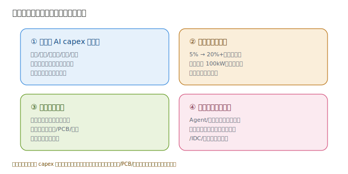

# 05 · 未来趋势与投资逻辑

> **给投资者的第一句话**：这一层的底层驱动只有一个——**云厂商的 AI 资本开支何时放缓**。只要 capex 还在上修，服务器/IDC/液冷/PCB/电源的订单就还在。本节讲清四大驱动力、三大风险，以及普通人怎么挑这一层的公司。

---

## 5.1 四大驱动力

### ① 云厂商 AI capex 持续超预期（总开关）
微软、谷歌、亚马逊、Meta、阿里、腾讯的 AI 资本开支 2024–2026 连续上修。每一轮上修，都直接变成中游订单。**盯住这六家的 capex 指引，比盯任何单一公司都重要**。

### ② 液冷渗透率拐点（5% → 20%+）
单机柜功率破 100kW，风冷失效，液冷成标配。渗透率提升是「量价齐升」——既多出液冷部件需求，单柜价值量也更高。这是这一层**确定性最高的增量**。

### ③ 国产算力崛起（昇腾生态）
美国限制下，华为昇腾等国产 AI 芯片放量，催生「昇腾服务器 + 国产 PCB/电源/液冷」独立链条。对 A 股是**国产替代双击**机会。

### ④ 推理爆发放大部署需求
训练是一次性的，推理是持续的。Agent/端侧 AI 普及后，推理算力消耗指数级放大，直接拉动服务器、IDC、供配电的长期需求——这是 2025 后最实质的需求侧信号。

---

## 5.2 三大风险

| 风险 | 是什么 | 对投资的影响 |
|------|--------|--------------|
| **capex 不及预期** | 若云厂商削减 AI 开支 | 全链条订单收缩，首当其冲是服务器/IDC |
| **产能过剩** | IDC/服务器扩产过快 | 机柜租金、整机毛利下滑，苦力环节更苦 |
| **技术路线变更** | 芯片直连/新互联颠覆 | 可能削弱某些 PCB/互联环节价值量 |

> **铁律**：这一层是「卖铲子」，但铲子也分三六九等。**稀缺部件（液冷/PCB/电源）抗周期能力强于纯整机集成**——capex 放缓时，前者有渗透率和单价撑着，后者先挨打。

---

## 5.3 怎么看这一层的公司（普通投资者框架）

按「确定性 × 弹性」两维选：

1. **求稳（确定性优先）**：美股供配电（Vertiv、Eaton）、IDC REIT（Equinix、Digital Realty）——现金流稳、受单一客户波动小。
2. **求弹性（成长优先）**：A 股液冷（英维克）、高阶 PCB（沪电/胜宏）、AI 服务器（工业富联）——订单爆发、估值弹性大，但波动也大。
3. **看国产替代**：昇腾产业链（服务器/PCB/电源）的 A 股标的，受外部限制催化。
4. **避坑**：纯概念、无真实 AI 收入占比、IDC 无稀缺能耗指标的小票——容易「涨题材、跌业绩」。

### 一句话总结

> **算力基础设施是 AI 主线里离「订单兑现」最近的一层。投资上：美股买「卖水人」的确定性，A 股买「稀缺部件」的弹性，别把组装服务器的高营收当成高利润。**

---

> **上一章**：[04-核心公司分析](./04-核心公司分析.md)　|　**返回总览**：[AI 主线投资地图](../AI主线投资地图.md)

> **版本**：v1.0（已核对）｜**更新日期**：2026-07-11
> **数据来源**：neodata-financial-search（东方财富）2025 年报 + 2026Q1 / 最新财年 + 单季口径，2026-07-11 核对；驱动力与风险为行业共识性框架。
